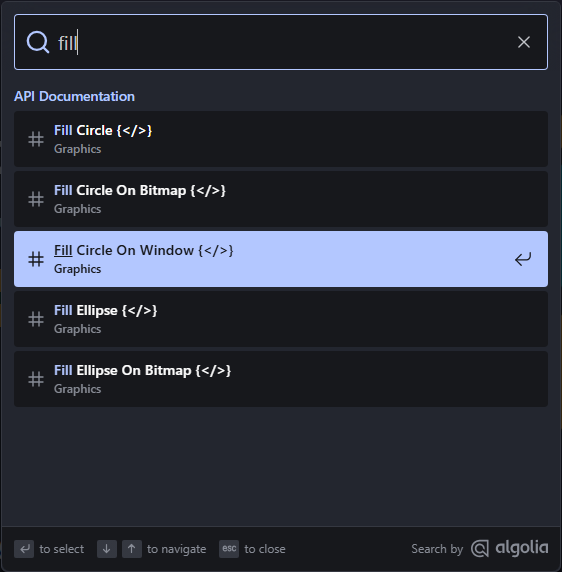

At SplashKit, we’ve been working tirelessly to bring new and exciting improvements to the SplashKit website that would improve the user experience. One recurring suggestion from both users and developers has been the need to improve the site’s search functionality. The built-in Astro Starlight search engine often falls short when it comes to helping users find relevant content efficiently.

---

## What's New?

Taking this in account, we have researched into alternatives that could replace the Astro Starlight search engine and is able to improve the accuracy in content discovery.  After careful evaluation, we’re excited to announce that we’ve integrated Algolia DocSearch into the SplashKit website.

Aloglia DocSearch is a powerful search engine that was built specifically for documentation sites, making it a great fit for the SplashKit site. It offers fast and reliable search functionality to ensure our users can quickly find the information they need. Below you can see the newly implemented search engine in action:

## How it helps

Aloglia DocSearch brings several advanced features that improved the search experience:

- Typo-Tolerance: Users do not need to type out their queries perfectly since the engine is smart enough to return relevant result even with minor spelling mistakes.
- Search Ranking Customization: We were also able to take advantage of the Algolia DocSearch’s indexing feature to prioritize and highlight the most important sections of the SplashKit site, particularly the API documentation. Using the ranking assignment to different part of the documentation ensures that the most significant results appear first

## What's Next?

Our team is always looking for ways to further improve the user experience on the site. A key part of that is the continued refinement of our search engine functionality. We recognize that the search functionality is a core component of how users interact with our site, and we are committed to making it more responsive.

## Want to Contribute?

If you’re as excited about SplashKit as we are and want to be part of our journey, check out our GitHub at [Thoth Tech](https://github.com/thoth-tech).

There are plenty of opportunites to get involved and contribute - from coding and testing to writing guides or even suggesting new ideas and offer feeedback.
Together, we can make SplashKit better.

---

Thanks for reading, and happy coding! 🎮✨