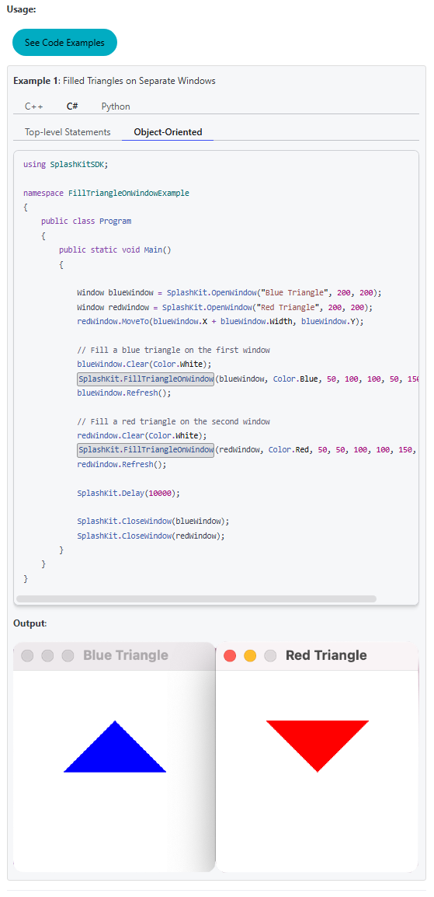
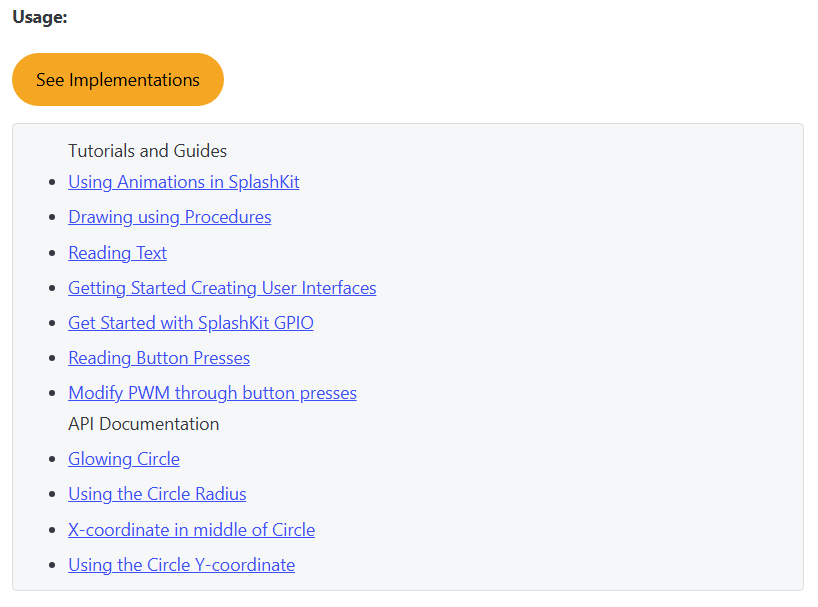

We're very excited to annouce that **new features** are coming to the *SplashKit Website*. Our team has been and is continously working hard to create a more interactive learning experience for our users.

TL;DR The SplashKit Website has created usage examples for functions to demonstrate their functionality on the [API Documentation Pages](/api); furthermore, alongside the usage examples, we have also integrate a feature to references when function is used in different examples or guides.

---

## What's New?

We understand that learning on new functions effectively can be challenging, especially when you're new to coding in general thus staying true to SplashKit's goal of helping of our users, we have implemented **Usage Examples and Implementation References**. These can also be located throughout the API documentation page and side content bar through a **`{ </> }`** icon.

### Usage Examples

Our team has been working hard to create new and exciting examples of demonstrate how each SplashKit functions work. These examples are done in multiple programming languages, including Python, C++, and C# which are provided in both top-level and object-oriented format. To further enhance understanding, we've also included visual references such as images, GIFs, and WEBM files that showcase each examples in action. You can find these examples alongside their corresponding functions on the [API Documentation Pages](/api).

#### How it helps

- Accelerates the learning process with the examples' context.
- Bridges the gap between theory and practice.
- Enhances user learning experiences.

Here's a [sneak peek](/api/graphics/#fill-triangle-on-window-record) of what you can expect on the site:

### Functions' Implementations References

As our team continues to provide usage examples for every function in SplashKit, we're also excited to introduce a new feature, Function Implementation References. This new addition will serve as a roadmap, showing you exactly where a certain function is used across different examples, tutorials, and guides. These can also be found on the [API Documentation Pages](/api) alongside their corresponding functions.

#### How it helps

- Easily discover real-world implementation of a specific function.
- Learn different use cases and contexts for each function.

Another [sneek peek](/api/windows/#open-window) of what's to be expect on the site:

## What's Next?

The SplashKit team remains dedicated to making usage examples available across the entire SplashKit SDK, ensuring a more engaging learning experiences for our users.

## Want to Contribute?

If you’re as excited about SplashKit as we are and want to be part of our journey, check out our GitHub at [Thoth Tech](https://github.com/thoth-tech).

There are plenty of opportunites to get involved and contribute - from coding and testing to writing guides or even suggesting new ideas and offer feeedback.
Together, we can make SplashKit better.

---

Thanks for reading, and happy coding! 🎮✨