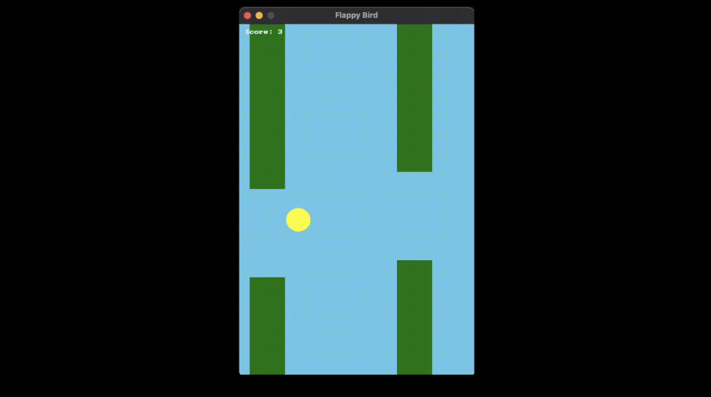

import { Tabs, TabItem } from "@astrojs/starlight/components";

**{frontmatter.description}**  
Written by: {frontmatter.author}  
_Last updated: {frontmatter.lastupdated}_

---

## Introduction

In this tutorial, we'll build a beginner friendly Flappy Bird remake using SplashKit. By the end of this tutorial, you'll have a working game that you can play and share with friends. Our Flappy Bird game will have a yellow bird that falls with gravity, green pipes that scroll from right to left, score tracking when you pass through pipes, and a game over screen when you hit pipes or the ground. The controls are simple - just press SPACE to make the bird jump!

:::note
You can download and play the game in this tutorial using the complete code file here: 
[**Download Code**](/resources/guides/graphics/basics/BeginnerGameTutorialCode.zip)
:::


## Step 1: Setting Up Our Game Window

First, let's create our game window and define the basic constants we'll need throughout our game.

<Tabs syncKey="code-language">
<TabItem label="C++">

```cpp
#include "splashkit.h"

// Game window size
const int WINDOW_WIDTH = 400;
const int WINDOW_HEIGHT = 600;

// Bird properties
const int BIRD_X = 100;
const int BIRD_SIZE = 20;
const double GRAVITY = 0.5;
const double JUMP_STRENGTH = -8;

// Pipe properties
const int PIPE_WIDTH = 60;
const int PIPE_GAP = 150;
const double PIPE_SPEED = 2.0;
const int PIPE_SPACING = 250;
```
</TabItem>
</Tabs>


**What's happening here?**
We include SplashKit to access all our game functions, define constants for our window size (400x600 pixels), set up properties for our bird including where it sits horizontally, how big it is, how gravity affects it, and how strong its jump is. We also define pipe properties like width, gap size, how fast they move, and how far apart they are.

## Step 2: Creating Our Game State Structure

Every game needs to keep track of information. Let's create a structure to hold all our game data in one organized place.

<Tabs syncKey="code-language">
<TabItem label="C++">

```cpp
// Game state structure
struct GameState {
    // Bird position and movement
    double bird_y;
    double bird_velocity;
    
    // Pipe positions (x, gap_y)
    double pipe1_x, pipe1_gap_y;
    double pipe2_x, pipe2_gap_y;
    
    // Game status
    int score;
    bool game_over;
    bool started;
    bool pipe1_passed;
    bool pipe2_passed;
    
    // Constructor
    GameState() {
        bird_y = WINDOW_HEIGHT / 2;
        bird_velocity = 0;
        pipe1_x = WINDOW_WIDTH;
        pipe1_gap_y = WINDOW_HEIGHT / 2;
        pipe2_x = WINDOW_WIDTH + PIPE_SPACING;
        pipe2_gap_y = WINDOW_HEIGHT / 2;
        score = 0;
        game_over = false;
        started = false;
        pipe1_passed = false;
        pipe2_passed = false;
    }
};
```
</TabItem>
</Tabs>

**Why do we need this?**
The `bird_y` variable tracks where our bird is vertically on the screen, while `bird_velocity` tracks how fast and in what direction our bird is moving. Since we have two pipes that scroll across the screen, we track their x position and where their gap is. The `score` keeps track of how many pipes we've passed, and `game_over` and `started` help us manage the game's different states.

## Step 3: Handling Player Input

Now let's make our game respond to player input. We'll handle the SPACE key for jumping and restarting.

<Tabs syncKey="code-language">
<TabItem label="C++">

```cpp
// Handle input
void handle_input(GameState& game) {
    if (key_typed(SPACE_KEY)) {
        if (!game.started) {
            game.started = true;
        }
        if (!game.game_over) {
            game.bird_velocity = JUMP_STRENGTH;
        }
    }
    
    if (key_typed(SPACE_KEY) && game.game_over) {
        // Reset game
        game.bird_y = WINDOW_HEIGHT / 2;
        game.bird_velocity = 0;
        game.pipe1_x = WINDOW_WIDTH;
        game.pipe1_gap_y = WINDOW_HEIGHT / 2;
        game.pipe2_x = WINDOW_WIDTH + PIPE_SPACING;
        game.pipe2_gap_y = WINDOW_HEIGHT / 2;
        game.score = 0;
        game.game_over = false;
        game.started = false;
        game.pipe1_passed = false;
        game.pipe2_passed = false;
    }
}
```
</TabItem>
</Tabs>

**What's happening here?**
When SPACE is pressed and the game hasn't started yet, we start the game. When SPACE is pressed during gameplay, we make the bird jump by setting its velocity to a negative value (upward). When SPACE is pressed after game over, we reset everything back to the beginning.

## Step 4: Updating Game Logic

This is where the magic happens! We'll update our bird's position, move the pipes, and check for collisions.

<Tabs syncKey="code-language">
<TabItem label="C++">

```cpp
// Update game logic
void update_game(GameState& game) {
    if (!game.started || game.game_over) {
        return;
    }
    
    // Apply gravity to bird
    game.bird_velocity += GRAVITY;
    game.bird_y += game.bird_velocity;
    
    // Move pipes
    game.pipe1_x -= PIPE_SPEED;
    game.pipe2_x -= PIPE_SPEED;
    
    // Reset pipes when they go off screen
    if (game.pipe1_x < -PIPE_WIDTH) {
        game.pipe1_x = WINDOW_WIDTH;
        game.pipe1_gap_y = 150 + rnd() * (WINDOW_HEIGHT - 300);
        game.pipe1_passed = false;
    }
    if (game.pipe2_x < -PIPE_WIDTH) {
        game.pipe2_x = WINDOW_WIDTH;
        game.pipe2_gap_y = 150 + rnd() * (WINDOW_HEIGHT - 300);
        game.pipe2_passed = false;
    }

    // Increase score when a pipe passes the bird's x position
    if (!game.pipe1_passed && game.pipe1_x + PIPE_WIDTH < BIRD_X) {
        game.score++;
        game.pipe1_passed = true;
    }
    if (!game.pipe2_passed && game.pipe2_x + PIPE_WIDTH < BIRD_X) {
        game.score++;
        game.pipe2_passed = true;
    }
    
    // Check collisions
    // Ground and ceiling
    if (game.bird_y < 0 || game.bird_y > WINDOW_HEIGHT - BIRD_SIZE) {
        game.game_over = true;
    }
    
    // Pipe 1 collision
    if (game.bird_y + BIRD_SIZE > game.pipe1_gap_y + PIPE_GAP/2 || 
        game.bird_y < game.pipe1_gap_y - PIPE_GAP/2) {
        if (BIRD_X + BIRD_SIZE > game.pipe1_x && 
            BIRD_X < game.pipe1_x + PIPE_WIDTH) {
            game.game_over = true;
        }
    }
    
    // Pipe 2 collision
    if (game.bird_y + BIRD_SIZE > game.pipe2_gap_y + PIPE_GAP/2 || 
        game.bird_y < game.pipe2_gap_y - PIPE_GAP/2) {
        if (BIRD_X + BIRD_SIZE > game.pipe2_x && 
            BIRD_X < game.pipe2_x + PIPE_WIDTH) {
            game.game_over = true;
        }
    }
}
```
</TabItem>
</Tabs>

**Let's break this down:**
First, we check if the game is running (started and not game over). We apply gravity by adding to the bird's velocity, then move the bird. We move both pipes to the left by subtracting the pipe speed. When pipes go off screen, we reset them to the right side with a random gap position and increase the score when a pipe is passed. We check if the bird hits the top or bottom of the screen, and we check if the bird hits either pipe by seeing if it's in the wrong vertical position when it's horizontally aligned with a pipe.

## Step 5: Drawing Everything

Now let's make our game visible! We'll draw the bird, pipes, score, and messages.

<Tabs syncKey="code-language">
<TabItem label="C++">

```cpp
// Draw everything
void draw_game(const GameState& game) {
    clear_screen(COLOR_SKY_BLUE);
    
    // Draw pipes
    // Pipe 1
    fill_rectangle(COLOR_GREEN, game.pipe1_x, 0, PIPE_WIDTH, game.pipe1_gap_y - PIPE_GAP/2);
    fill_rectangle(COLOR_GREEN, game.pipe1_x, game.pipe1_gap_y + PIPE_GAP/2, PIPE_WIDTH, WINDOW_HEIGHT);
    
    // Pipe 2
    fill_rectangle(COLOR_GREEN, game.pipe2_x, 0, PIPE_WIDTH, game.pipe2_gap_y - PIPE_GAP/2);
    fill_rectangle(COLOR_GREEN, game.pipe2_x, game.pipe2_gap_y + PIPE_GAP/2, PIPE_WIDTH, WINDOW_HEIGHT);
    
    // Draw bird
    fill_circle(COLOR_YELLOW, BIRD_X, game.bird_y, BIRD_SIZE);
    
    // Draw score
    draw_text("Score: " + std::to_string(game.score), COLOR_WHITE, 10, 10);
    
    // Draw instructions
    if (!game.started) {
        draw_text("Press SPACE to start", COLOR_WHITE, WINDOW_WIDTH/2 - 100, WINDOW_HEIGHT/2);
    } else if (game.game_over) {
        draw_text("GAME OVER!", COLOR_RED, WINDOW_WIDTH/2 - 80, WINDOW_HEIGHT/2 - 50);
        draw_text("Press Space to restart", COLOR_WHITE, WINDOW_WIDTH/2 - 80, WINDOW_HEIGHT/2);
    }
}
```
</TabItem>
</Tabs>

**What we're drawing:**
We're drawing a sky blue background with [Clear Screen](/api/graphics/#clear-screen), two green pipes for each pipe (top and bottom sections with a gap in between) using [Fill Rectangle](/api/graphics/#fill-rectangle), a yellow circle for our bird with [Fill Circle](/api/graphics/#fill-circle), the current score in white text with [Draw Text](/api/graphics/#draw-text-no-font-no-size), and instructions that change based on the game state.

## Step 6: The Main Game Loop

Finally, let's put it all together in our main function that runs the entire game.

<Tabs syncKey="code-language">
<TabItem label="C++">

```cpp
// Main function
int main() {
    open_window("Flappy Bird", WINDOW_WIDTH, WINDOW_HEIGHT);
    
    GameState game;
    
    while (!quit_requested()) {
        process_events();
        handle_input(game);
        update_game(game);
        draw_game(game);
        refresh_screen(60);
    }
    
    close_all_windows();
    return 0;
}
```
</TabItem>
</Tabs>

**The game loop explained:**
We open our game window, create our game state, and run a loop that continues until the player closes the window. Each frame that passes, we process input using [Process Events](/api/input/#process-events), and handle player inputs using the created functions, update game logic, and refresh the screen at 60 FPS. When the loop ends, we close the window.