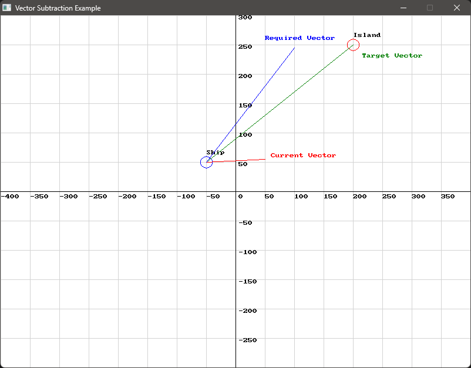

import { Tabs, TabItem } from "@astrojs/starlight/components";

**{frontmatter.description}**  

Written by: {frontmatter.author}  
_Last updated: {frontmatter.lastupdated}_

---

## Vector Arithmetic

Vector arithmetic involves the addition, subtraction, and multiplication of vectors. These operations are used in various programming scenarios, particularly in game development and physics simulations, to calculate and manipulate directions, positions, and forces.

## SplashKit Vector Functions Used in This Tutorial:

1. [Vector Add](https://splashkit.io/api/physics/#vector-add)
2. [Vector Subtract](https://splashkit.io/api/physics/#vector-subtract)
3. [Vector Multiply](https://splashkit.io/api/physics/#vector-multiply) 

## Contents

- [Vector Addition](#vector-addition)
- [Vector Subtraction](#vector-subtraction)
- [Practical Applications of Vector Addition and Subtraction](#practical-applications-of-vector-addition-and-subtraction)
- [Scenario: Character Movement with Multiple Forces](#scenario-character-movement-with-multiple-forces)
- [Scenario: Calculating ProjShipectile Trajectory](#scenario-calculating-ship-trajectory)
- [Vector Multiplication](#vector-multiplication)
- [Scenario: Spaceship Afterburners](#scenario-spaceship-afterburners)
- [Conclusion](#conclusion)


### Vector Addition
Vector addition combines two vectors into a new vector. The resulting vector represents the cumulative effect of the original vectors. This is particularly useful in scenarios where multiple forces, velocities, or displacements need to be combined.

For example, adding vectors `v1` and `v2` is computed as:

$$ \text{Resultant Vector} = v_1.x + v_2.x, v_1.y + v_2.y $$

We can make use of the `vector_add` function to compute this as follows:

```cpp
vector_2d v1 = {100, 50};
vector_2d v2 = {200, 150};
vector_2d result = vector_add(v1, v2);
```

In this example, `v1` and `v2` are added together to produce a new vector `result` with values `(300, 200)`.


<details>
<summary>Use this code in your own IDE to play with the functions for yourself!</summary>

```cpp
#include "splashkit.h"

using std::to_string;

const int GRID_SPACING = 50;

void draw_cartesian_grid()
{
    // Draw vertical lines and labels
    for (int x = 0; x < screen_width(); x += GRID_SPACING)
    {
        draw_line(COLOR_LIGHT_GRAY, x, 0, x, screen_height());
        if (x != screen_width() / 2) // Avoid overlapping with the y-axis label
        {
            draw_text(to_string(x - screen_width() / 2), COLOR_BLACK, x, screen_height() / 2 + 5);
        }
    }

    // Draw horizontal lines and labels
    for (int y = 0; y < screen_height(); y += GRID_SPACING)
    {
        draw_line(COLOR_LIGHT_GRAY, 0, y, screen_width(), y);
        if (y != screen_height() / 2) // Avoid overlapping with the x-axis label
        {
            draw_text(to_string(screen_height() / 2 - y), COLOR_BLACK, screen_width() / 2 + 5, y);
        }
    }

    // Draw x-axis and y-axis
    draw_line(COLOR_BLACK, 0, screen_height() / 2, screen_width(), screen_height() / 2); // x-axis
    draw_line(COLOR_BLACK, screen_width() / 2, 0, screen_width() / 2, screen_height());   // y-axis

    // Label the origin
    draw_text("0", COLOR_BLACK, screen_width() / 2 + 5, screen_height() / 2 + 5);
}

int main()
{
    open_window("Vector Addition", 800, 600);

    // Define vectors
    vector_2d vector_a;
    vector_a.x = 100;
    vector_a.y = 50;

    vector_2d vector_b;
    vector_b.x = 200;
    vector_b.y = 150;

    // Calculate vector addition
    vector_2d vector_sum = vector_add(vector_a, vector_b);

    // Define the origin (centre of the window)
    point_2d origin;
    origin.x = 400;
    origin.y = 300;

    // Main loop
    while (!window_close_requested("Vector Addition"))
    {
        process_events();
        clear_screen(COLOR_WHITE);

        // Draw Cartesian grid
        draw_cartesian_grid();

        // Draw the vectors as lines from the center of the screen
        draw_line(COLOR_RED, origin.x, origin.y, origin.x + vector_a.x, origin.y - vector_a.y);
        draw_line(COLOR_GREEN, origin.x, origin.y, origin.x + vector_b.x, origin.y - vector_b.y);
        draw_line(COLOR_BLUE, origin.x, origin.y, origin.x + vector_sum.x, origin.y - vector_sum.y);

        // Display vector properties on the screen
        draw_text("Vector A (R): " + vector_to_string(vector_a), COLOR_BLACK, 10, 10);
        draw_text("Vector B (G): " + vector_to_string(vector_b), COLOR_BLACK, 10, 30);
        draw_text("Sum (B): " + vector_to_string(vector_sum), COLOR_BLACK, 10, 50);

        refresh_screen(60);
    }

    return 0;
}
```
</details>

### Vector Subtraction
Conversely, vector subtraction finds the difference between two vectors, yielding a vector that points from the end of one vector to the other. This is useful for calculating relative positions, directions, or the change in velocity or force.

For example, subtracting vector `v2` from `v1` gives:

$$ \text{Resultant Vector} = v_1.x - v_2.x, v_1.y - v_2.y $$

We can make use of the `vector_subtract` function to compute this as follows:

```cpp
vector_2d v1 = {300, 200};
vector_2d v2 = {100, 50};
vector_2d result = vector_subtract(v1, v2);
```

In this example, `v2` is subtracted from `v1` to produce a new vector `result` with values `(200, 150)`.


<details>
<summary>Use this code in your own IDE to play with the functions for yourself!</summary>

```cpp
#include "splashkit.h"

using std::to_string;

const int GRID_SPACING = 50;

void draw_cartesian_grid()
{
    // Draw vertical lines and labels
    for (int x = 0; x < screen_width(); x += GRID_SPACING)
    {
        draw_line(COLOR_LIGHT_GRAY, x, 0, x, screen_height());
        if (x != screen_width() / 2) // Avoid overlapping with the y-axis label
        {
            draw_text(to_string(x - screen_width() / 2), COLOR_BLACK, x, screen_height() / 2 + 5);
        }
    }

    // Draw horizontal lines and labels
    for (int y = 0; y < screen_height(); y += GRID_SPACING)
    {
        draw_line(COLOR_LIGHT_GRAY, 0, y, screen_width(), y);
        if (y != screen_height() / 2) // Avoid overlapping with the x-axis label
        {
            draw_text(to_string(screen_height() / 2 - y), COLOR_BLACK, screen_width() / 2 + 5, y);
        }
    }

    // Draw x-axis and y-axis
    draw_line(COLOR_BLACK, 0, screen_height() / 2, screen_width(), screen_height() / 2); // x-axis
    draw_line(COLOR_BLACK, screen_width() / 2, 0, screen_width() / 2, screen_height());   // y-axis

    // Label the origin
    draw_text("0", COLOR_BLACK, screen_width() / 2 + 5, screen_height() / 2 + 5);
}

int main()
{
    open_window("Vector Subtraction", 800, 600);

    // Define vectors
    vector_2d vector_a;
    vector_a.x = 300;
    vector_a.y = 200;

    vector_2d vector_b;
    vector_b.x = 100;
    vector_b.y = 50;

    // Calculate vector subtraction
    vector_2d vector_difference = vector_subtract(vector_a, vector_b);

    // Define the origin (centre of the window)
    point_2d origin;
    origin.x = 400;
    origin.y = 300;

    // Main loop
    while (!window_close_requested("Vector Subtraction"))
    {
        process_events();
        clear_screen(COLOR_WHITE);

        // Draw Cartesian grid
        draw_cartesian_grid();

        // Draw the vectors as lines from the center of the screen
        draw_line(COLOR_RED, origin.x, origin.y, origin.x + vector_a.x, origin.y - vector_a.y);
        draw_line(COLOR_GREEN, origin.x, origin.y, origin.x + vector_b.x, origin.y - vector_b.y);
        draw_line(COLOR_ORANGE, origin.x, origin.y, origin.x + vector_difference.x, origin.y - vector_difference.y);

        // Display vector properties on the screen
        draw_text("Vector A (R): " + vector_to_string(vector_a), COLOR_BLACK, 10, 10);
        draw_text("Vector B (G): " + vector_to_string(vector_b), COLOR_BLACK, 10, 30);
        draw_text("Difference (O): " + vector_to_string(vector_difference), COLOR_BLACK, 10, 50);

        refresh_screen(60);
    }

    return 0;
}
```
</details>

### Practical Applications of Vector Addition and Subtraction

Vector addition and subtraction are fundamental operations in game development, particularly in handling movement, physics, and collision detection. For example, when simulating a character's movement in a game, multiple forces like gravity, wind, or user input can be combined using vector addition to determine the character's final trajectory. Similarly, vector subtraction can be used to calculate the relative velocity between two objects, such as a missile and a target, helping in predicting collisions or adjusting aiming mechanics.

### Scenario: Character Movement with Multiple Forces

In a platform game, a character is affected by multiple forces: user input (e.g., moving left or right), gravity, and wind.

Each of these forces can be represented as vectors:

- User Input Vector: Represents the direction and speed of movement based on player input (e.g., moving right might be `(3, 0)`).
- Gravity Vector: Acts downwards, pulling the character down (e.g., `(0, -9.8)`).
- Wind Vector: Blows horizontally, affecting the character's movement (e.g., `(-2, 0)` if it's blowing left).

By adding these vectors, you get the character’s final movement vector:

```cpp
vector_2d user_input = {35, 0}; // Moving right
vector_2d gravity = {0, -9.8};  // Gravity pulling down
vector_2d wind = {-20, 0};      // Wind blowing left

vector_2d final_movement = vector_add(vector_add(user_input, gravity), wind); // Combining all forces
```

Let's visualise this!


<details>
<summary>Use this code in your own IDE to play with the functions for yourself!</summary>

```cpp
#include "splashkit.h"

using std::to_string;

const int GRID_SPACING = 50; // Define grid spacing for the Cartesian grid

// Function to draw a vector on the screen
void draw_vector(vector_2d vec, color c, point_2d start_point, string label, double scale)
{
    point_2d end_point = {start_point.x + vec.x * scale, start_point.y - vec.y * scale}; // Adjust scale as needed
    draw_line(c, start_point.x, start_point.y, end_point.x, end_point.y);
    draw_text(label, c, end_point.x + 5, end_point.y - 15); // Adjust text position to avoid overlap
}

// Function to draw the Cartesian grid
void draw_cartesian_grid()
{
    // Draw vertical lines and labels
    for (int x = 0; x < screen_width(); x += GRID_SPACING)
    {
        draw_line(COLOR_LIGHT_GRAY, x, 0, x, screen_height());
        if (x != screen_width() / 2) // Avoid overlapping with the y-axis label
        {
            draw_text(to_string(x - screen_width() / 2), COLOR_BLACK, x, screen_height() / 2 + 5);
        }
    }

    // Draw horizontal lines and labels
    for (int y = 0; y < screen_height(); y += GRID_SPACING)
    {
        draw_line(COLOR_LIGHT_GRAY, 0, y, screen_width(), y);
        if (y != screen_height() / 2) // Avoid overlapping with the x-axis label
        {
            draw_text(to_string(screen_height() / 2 - y), COLOR_BLACK, screen_width() / 2 + 5, y);
        }
    }

    // Draw x-axis and y-axis
    draw_line(COLOR_BLACK, 0, screen_height() / 2, screen_width(), screen_height() / 2); // x-axis
    draw_line(COLOR_BLACK, screen_width() / 2, 0, screen_width() / 2, screen_height());   // y-axis

    // Label the origin
    draw_text("0", COLOR_BLACK, screen_width() / 2 + 5, screen_height() / 2 + 5);
}

int main()
{
    // Set up the window
    open_window("Vector Addition with Moving Player", 800, 600);

    // Initial position of the player (starting at 100, 100)
    point_2d player_pos = {100, 100};
    point_2d initial_pos = player_pos; // Store the initial position for final vector

    // Define the vectors
    vector_2d user_input = {35, 0}; // Moving right
    vector_2d gravity = {0, -9.8};  // Gravity pulling down
    vector_2d wind = {-20, 0};      // Wind blowing left

    // Calculate the final movement vector
    vector_2d final_movement = vector_add(vector_add(user_input, gravity), wind);

    while (!window_close_requested("Vector Addition with Moving Player"))
    {
        // Process events
        process_events();

        // Clear the screen
        clear_screen(COLOR_WHITE);

        // Draw the Cartesian grid
        draw_cartesian_grid();

        // Draw the player (a circle) at the current position
        fill_circle(COLOR_PURPLE, player_pos.x, player_pos.y, 10);

        // Draw the individual vectors acting on the player
        // Scale factor adjusted to make vectors visible
        double scale_factor = 5; // Adjust as needed

        // Draw user input vector
        draw_vector(user_input, COLOR_BLUE, player_pos, "User Input", scale_factor);
        
        // Draw gravity vector
        point_2d gravity_end = {player_pos.x, player_pos.y - gravity.y * scale_factor}; // Gravity vector should extend downwards
        draw_line(COLOR_RED, player_pos.x, player_pos.y, gravity_end.x, gravity_end.y);
        draw_text("Gravity", COLOR_RED, gravity_end.x + 5, gravity_end.y - 15); // Adjust text position to avoid overlap
        
        // Draw wind vector
        point_2d wind_end = {player_pos.x + wind.x * scale_factor, player_pos.y}; // Wind vector should extend horizontally to the left
        draw_line(COLOR_GREEN, player_pos.x, player_pos.y, wind_end.x, wind_end.y);
        draw_text("Wind", COLOR_GREEN, wind_end.x + 5, wind_end.y - 15); // Adjust text position to avoid overlap

        // Draw the final movement vector from the initial position to the current position
        point_2d final_movement_end = {player_pos.x + final_movement.x * scale_factor, player_pos.y - final_movement.y * scale_factor};
        draw_line(COLOR_CHOCOLATE, player_pos.x, player_pos.y, final_movement_end.x, final_movement_end.y);
        draw_text("Movement Direction", COLOR_ORANGE, final_movement_end.x + 5, final_movement_end.y - 15); // Adjust text position to avoid overlap

        // Update the player's position based on the final movement vector
        player_pos.x += final_movement.x;
        player_pos.y -= final_movement.y; // Inverted Y because of screen coordinates

        // Add delay to assist visualisation
        delay(250);

        // Refresh the screen
        refresh_screen(60);
    }

    return 0;
}
```
</details>

### Scenario: Calculating Ship Trajectory

In a navigation simulation game, a ship is moving towards an island, but it has to account for a current that affects its path. You need to calculate the correct heading for the ship to reach the island directly, considering the current’s influence.

- Ship's Velocity Vector: Represents the ship's intended direction and speed.
- Current's Velocity Vector: Represents the current's direction and speed affecting the ship's path.
- Target Vector: Represents the direct line from the ship's current position to the island.

The goal is to determine the required heading for the ship to counteract the current and head directly to the island.

```cpp
point_2d ship_position = {-50, 50};  // Ship starts at (-50, 50)
point_2d island_position = {200, 250}; // Island at (200, 250)

// Calculate vectors
vector_2d current_vector = {100, 5}; // Current affecting the ship
vector_2d target_vector = vector_point_to_point(ship_position, island_position);
vector_2d required_vector = vector_subtract(target_vector, current_vector);
```

Using the `vector_subtract` function from SplashKit, the `required_vector` is calculated by subtracting the `current_vector` from the `target_vector`. This `required_vector` represents the direction the ship needs to steer in order to reach the island while counteracting the current.



<details>
<summary>Use this code in your own IDE to play with the functions for yourself!</summary>

```cpp
#include "splashkit.h"
#include "string"

using std::to_string;

// Define constants
const int GRID_SPACING = 50;

// Function to draw the Cartesian grid
void draw_cartesian_grid()
{
    int width = screen_width();
    int height = screen_height();
    int center_x = width / 2;
    int center_y = height / 2;

    for (int x = 0; x <= width; x += GRID_SPACING)
    {
        draw_line(COLOR_LIGHT_GRAY, x, 0, x, height);
        if (x != center_x)
        {
            draw_text(to_string((x - center_x) / GRID_SPACING), COLOR_BLACK, x + 2, center_y + 5);
        }
    }

    for (int y = 0; y <= height; y += GRID_SPACING)
    {
        draw_line(COLOR_LIGHT_GRAY, 0, y, width, y);
        if (y != center_y)
        {
            draw_text(to_string((center_y - y) / GRID_SPACING), COLOR_BLACK, center_x + 5, y - 10);
        }
    }

    draw_line(COLOR_BLACK, 0, center_y, width, center_y); // x-axis
    draw_line(COLOR_BLACK, center_x, 0, center_x, height); // y-axis
    draw_text("0", COLOR_BLACK, center_x + 5, center_y + 15);
}

// Function to draw a vector
void draw_vector(point_2d start, vector_2d v, color c, string label, int x_offset, int y_offset)
{
    point_2d end = {start.x + v.x, start.y + v.y}; // Adjust for Cartesian coordinates: y increases downwards
    draw_line(c, 
              start.x + screen_width() / 2, screen_height() / 2 - start.y, // Convert Cartesian coordinates to screen coordinates
              end.x + screen_width() / 2, screen_height() / 2 - end.y);   // Convert Cartesian coordinates to screen coordinates
    draw_text(label, 
              c, 
              end.x + screen_width() / 2 + x_offset, 
              screen_height() / 2 - end.y + y_offset); // Convert Cartesian coordinates to screen coordinates
}

int main()
{
    open_window("Vector Point to Point Example", 800, 600);

    point_2d ship_position = {-50, 50};  // Ship starts at (-50, 50)
    point_2d island_position = {200, 250}; // Island at (200, 250)

    // Calculate vectors
    vector_2d current_vector = {100, 5}; // Current affecting the ship
    vector_2d target_vector = vector_point_to_point(ship_position, island_position);
    vector_2d required_vector = vector_subtract(target_vector, current_vector);

    while (!window_close_requested("Vector Point to Point Example"))
    {
        process_events();
        clear_screen(COLOR_WHITE);
        draw_cartesian_grid();

        // Draw island (target)
        draw_circle(COLOR_RED, island_position.x + screen_width() / 2, screen_height() / 2 - island_position.y, 10);
        draw_text("Island", COLOR_BLACK, island_position.x + screen_width() / 2, screen_height() / 2 - island_position.y - 20);

        // Draw ship
        draw_circle(COLOR_BLUE, ship_position.x + screen_width() / 2, screen_height() / 2 - ship_position.y, 10);
        draw_text("Ship", COLOR_BLACK, ship_position.x + screen_width() / 2, screen_height() / 2 - ship_position.y - 20);

        // Draw vectors
        draw_vector(ship_position, current_vector, COLOR_RED, "Current Vector", 10, -10);
        draw_vector(ship_position, target_vector, COLOR_GREEN, "Target Vector", 15, 15);
        draw_vector(ship_position, required_vector, COLOR_BLUE, "Required Vector", -50, -20);

        refresh_screen(60);
    }

    close_window("Vector Point to Point Example");
    return 0;
}
```
</details>

### Vector Multiplication

The `vector_multiply` function is used to scale a vector. This function takes two arguments: a vector `v1` and a scalar value `s`, and it returns a new vector where each component of the original vector is multiplied by the scalar.  For example, if you have a vector `v1 = {2, 3}` and you multiply it by a scalar `s = 2`, the resulting vector would be `{4, 6}`.

`vector_multiply` is particularly useful in scenarios where you need to adjust the magnitude of a vector without changing its direction. For example, when developing games, you might want to control the speed of an object by scaling its velocity vector. If an object needs to move faster or slower, multiplying its velocity vector by a scalar can achieve this.

### Scenario: Spaceship Afterburners

In a space game, if you want to double the speed of your spaceship by activating the afterburners, you can use the `vector_multiply` function to scale the velocity vector representing the spaceship's movement:

```cpp
const double SHIP_SPEED = 25.0; // Normal speed of the ship
const double AFTERBURNER_MULTIPLIER = 2.0; // Afterburner multiplier

vector_2d normal_velocity = { SHIP_SPEED, 0 }; // Normal velocity vector (moving right)

// Use vector_multiply to double the speed for afterburners
vector_2d afterburner_velocity = vector_multiply(normal_velocity, AFTERBURNER_MULTIPLIER);
```

- `SHIP_SPEED`: Defines the normal speed of the ship, set to `25.0` units per frame.
- `AFTERBURNER_MULTIPLIER`: Represents the factor by which the speed is increased when afterburners are activated. In this case, it is `2.0`, meaning the speed will be doubled.
- `normal_velocity`: The ship moves to the right with a speed of `25.0` units and no vertical movement.
- `afterburner_velocity`: This vector is calculated by multiplying the `normal_velocity` vector by the `AFTERBURNER_MULTIPLIER`. The `vector_multiply` function scales the velocity, effectively doubling the speed of the ship when the afterburners are activated.


<details>
<summary>Use this code in your own IDE to play with the functions for yourself!</summary>

```cpp
#include "splashkit.h"

using std::to_string;

// Define constants
const int GRID_SPACING = 50;
const double NORMAL_SHIP_VELOCITY = 25.0; // Normal speed of the ship
const double AFTERBURNER_MULTIPLIER = 2.0; // Afterburner multiplier

// Function to draw the cartesian grid
void draw_cartesian_grid()
{
    for (int x = 0; x < screen_width(); x += GRID_SPACING)
    {
        draw_line(COLOR_LIGHT_GRAY, x, 0, x, screen_height());
        if (x != screen_width() / 2)
        {
            draw_text(to_string(x - screen_width() / 2), COLOR_BLACK, x, screen_height() / 2 + 5);
        }
    }

    for (int y = 0; y < screen_height(); y += GRID_SPACING)
    {
        draw_line(COLOR_LIGHT_GRAY, 0, y, screen_width(), y);
        if (y != screen_height() / 2)
        {
            draw_text(to_string(screen_height() / 2 - y), COLOR_BLACK, screen_width() / 2 + 5, y);
        }
    }

    draw_line(COLOR_BLACK, 0, screen_height() / 2, screen_width(), screen_height() / 2); // x-axis
    draw_line(COLOR_BLACK, screen_width() / 2, 0, screen_width() / 2, screen_height());   // y-axis
    draw_text("0", COLOR_BLACK, screen_width() / 2 + 5, screen_height() / 2 + 5);
}

// Function to draw a vector
void draw_vector(vector_2d start, vector_2d end, color c, std::string label, int x_offset, int y_offset)
{
    draw_line(c, start.x + screen_width() / 2, screen_height() / 2 - start.y,
              end.x + screen_width() / 2, screen_height() / 2 - end.y);
    draw_text(label, c, end.x + screen_width() / 2 + x_offset, screen_height() / 2 - end.y + y_offset);
}

int main()
{
    open_window("Ship with Velocity Vector", 800, 600);

    vector_2d ship_position = { -300, 50 }; // Ship starts at (-300, 50)
    vector_2d velocity = { NORMAL_SHIP_VELOCITY, 0 }; // Normal velocity vector (moving right)
    bool afterburners_activated = false; // Flag to track afterburner activation

    while (!window_close_requested("Ship with Velocity Vector"))
    {
        process_events();
        clear_screen(COLOR_WHITE);
        draw_cartesian_grid();

        // Check if the ship has crossed the y-axis
        if (ship_position.x >= 0)
        {
            if (!afterburners_activated)
            {
                // Activate afterburners (double the speed)
                velocity = vector_multiply(velocity, AFTERBURNER_MULTIPLIER);
                afterburners_activated = true; // Set flag to true
            }
        }

        // Update ship position based on velocity
        ship_position.x += velocity.x; // Move ship according to the velocity

        // Draw ship
        draw_circle(COLOR_BLUE, ship_position.x + screen_width() / 2, screen_height() / 2 - ship_position.y, 10);
        draw_text("Ship", COLOR_BLACK, ship_position.x + screen_width() / 2, screen_height() / 2 - ship_position.y - 20);

        // Draw velocity vector
        draw_vector(ship_position, { ship_position.x + velocity.x, ship_position.y + velocity.y }, COLOR_RED, "Velocity", 10, -10);

        // Display the magnitude of the velocity vector at the top left
        draw_text("Velocity Magnitude: " + to_string(vector_magnitude(velocity)), COLOR_BLACK, 10, 10);

        // Display message if afterburners are activated
        if (afterburners_activated)
        {
            draw_text("AFTERBURNERS ACTIVATED", COLOR_GREEN, ship_position.x + screen_width() / 2 - 10, ship_position.y + screen_height() / 2 + 20);
        }

        delay(200);

        refresh_screen(60);
    }

    close_window("Ship with Velocity Vector");
    return 0;
}
```
</details>

### Conclusion

Here we have explored some simple vector arithmetic operations, including vector addition, subtraction, and multiplication. These fundamental operations are crucial in various programming scenarios, particularly in game development. By understanding and applying vector arithmetic, you can effectively calculate and manipulate directions, positions, and forces, enhancing your ability to create realistic and dynamic movements.

Mastering vector arithmetic will empower you to build more complex and interactive systems, laying a solid foundation for advanced topics in physics and game development.