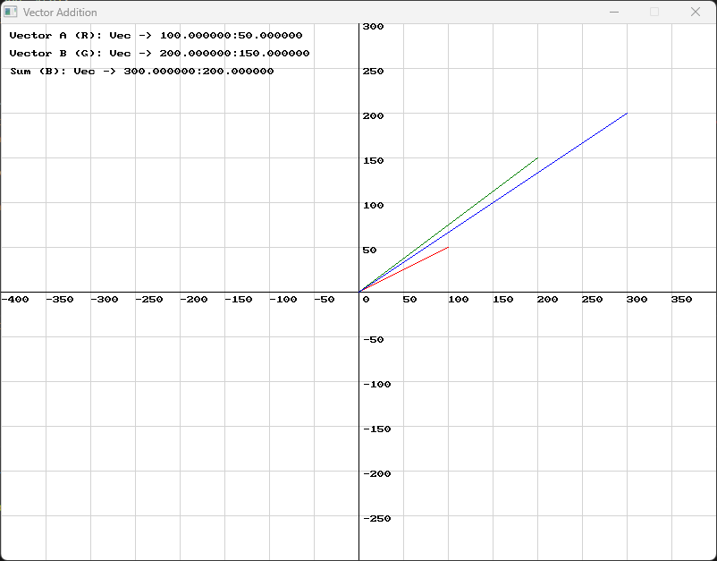
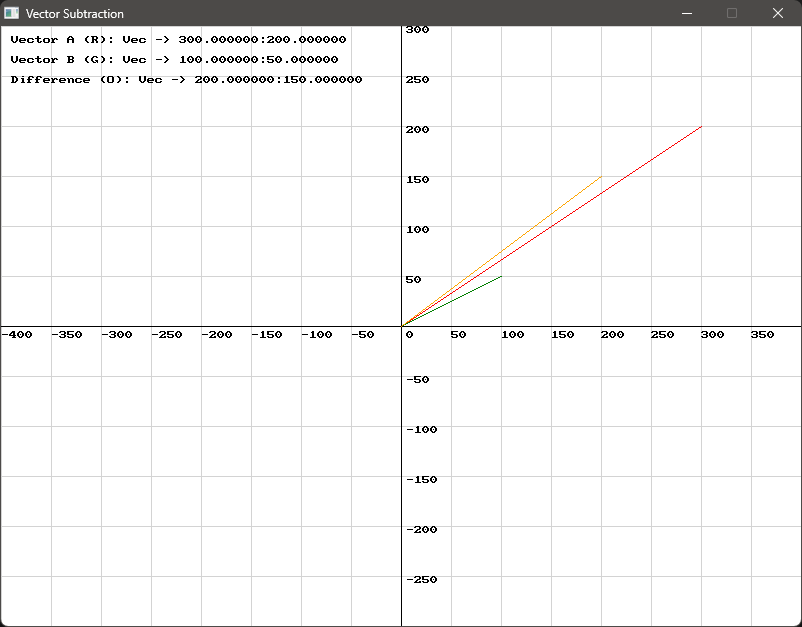

import { Tabs, TabItem } from "@astrojs/starlight/components";

**{frontmatter.description}**  

Written by: {frontmatter.author}  
_Last updated: {frontmatter.lastupdated}_

---

## Basic 2D Vectors

This tutorial introduces the fundamental concepts of vectors and their applications. You will learn how to define, visualise, and manipulate vectors using SplashKit's built-in functions. The tutorial covers essential vector operations such as calculating angle and magnitude, vector addition and subtraction, finding vector normals, and computing the dot product. Additionally, we'll explore basic reflection techniques and collision detection, all crucial for creating dynamic and interactive game mechanics. By the end, you will have a greater understanding of vectors and how to use them to enhance your games.

## SplashKit Vector Functions Used in This Tutorial:

1. [double vector_angle(const vector_2d v)](https://splashkit.io/api/physics/#vector-angle)
2. [double vector_magnitude(const vector_2d &v)](https://splashkit.io/api/physics/#vector-magnitude)
3. [vector_2d vector_add(const vector_2d &v1, const vector_2d &v2)](https://splashkit.io/api/physics/#vector-add)
4. [vector_2d vector_subtract(const vector_2d &v1, const vector_2d &v2)](https://splashkit.io/api/physics/#vector-subtract)
5. [vector_2d vector_normal(const vector_2d &v)](https://splashkit.io/api/physics/#vector-normal)
6. [double dot_product(const vector_2d &v1, const vector_2d &v2)](https://splashkit.io/api/physics/#dot-product)
7. [vector_2d vector_multiply(const vector_2d &v1, double s)](https://splashkit.io/api/physics/#vector-multiply)
8. [vector_2d vector_point_to_point(const point_2d &start, const point_2d &end_pt)](https://splashkit.io/api/physics/#vector-point-to-point)

## Contents
- [What is a Vector?](#what-is-a-vector)
- [Where and When to Use Vectors](#where-and-when-to-use-vectors)
- [Defining and Visualising the Vector](#defining-and-visualising-the-vector)
- [Calculating the Angle and Magnitude](#calculating-the-angle-and-magnitude)
- [Customising the Vector](#customising-the-vector)
- [Vector Addition](#vector-addition)
- [Vector Subtraction](#vector-subtraction)
- [Vector Normal](#vector-normal)
- [Dot Product](#dot-product)
- [Vector Multiplication](#vector-multiplication)
- [Basic Reflection](#basic-reflection)
- [Vector Point to Point](#vector-point-to-point)
- [Basic Collision](#basic-collision)

---

### What is a Vector?

A vector is a mathematical entity that has both direction and magnitude. In 2D graphics and physics, vectors are used to represent quantities like position, velocity, and force. A vector is often visualised as an arrow pointing from one point to another, where the length of the arrow represents the magnitude, and the direction it points represents the direction.

A **position vector** represents the location of a point in 2D space relative to an origin. For example, consider a point located at coordinates `(3, 4)`. This vector indicates that the point is 3 units to the right and 4 units up from the origin `(0, 0)`.

A **velocity vector** represents the speed and direction of an object's motion. For example, if an object is moving to the right and slightly upwards at a speed, it can be represented by the components `(5, 2)`. Here, the vector indicates that the object moves 5 units to the right and 2 units upwards per unit of time.

A **force vector** represents the magnitude and direction of a force acting on an object. For example, if a force is applied downwards and to the left, it might be represented as `(-3, -6)`. The components indicate that the force has a magnitude directed 3 units to the left and 6 units downwards.

### Where and When to Use Vectors

Vectors are essential in various areas of game development and computer graphics:

-   **Movement**: To represent the direction and speed of an object.
-   **Forces**: In physics simulations, vectors represent forces acting on objects.
-   **Graphics**: For drawing shapes, determining object positions, and performing transformations like scaling or rotating objects.

Let's start off by drawing a vector to demonstrate its fundamental properties and visualise its components on a Cartesian grid.

### Defining and Visualising the Vector

In this example, we define a vector `vector1` with x and y components:

```cpp
vector_2d vector1;
vector1.x = 100;
vector1.y = 50;
```

The x and y values determine the vector's direction and magnitude. Here, `x = 100` and `y = 50` set the vector to point to the coordinates (100, 50) on the Cartesian plane.

### Calculating the Angle and Magnitude

To understand the vector's properties, we calculate both the angle and the magnitude:

```cpp
double angle = vector_angle(vector1);
double magnitude = vector_magnitude(vector1);
```

-   **Angle**: The `vector_angle` function calculates the angle between the vector and the positive x-axis. This angle, measured in degrees, indicates the vector's orientation. It helps in understanding the direction in which the vector points.

-   **Magnitude**: The `vector_magnitude` function calculates the length of the vector using the formula:

    $$ {Magnitude} = \sqrt{x^2 + y^2} $$

    The magnitude represents the length of the vector from the origin to its endpoint, indicating how strong or large the vector is.


### Customising the Vector

To experiment with different vector properties, you can change the `x` and `y` values:

-   **Direction**: Alter the ratio between `x` and `y` to change the vector's direction. For instance, `x = 50` and `y = 100` will point the vector more steeply upwards.

-   **Magnitude**: To change the vector's magnitude, proportionally increase or decrease the `x` and `y` values. This will lengthen or shorten the vector accordingly.

<details>
<summary>Use this code in your own IDE to play with the functions for yourself!</summary>

```cpp
#include "splashkit.h"

using std::to_string;

const int GRID_SPACING = 50;

void draw_cartesian_grid()
{
    // Draw vertical lines and labels
    for (int x = 0; x < screen_width(); x += GRID_SPACING)
    {
        draw_line(COLOR_LIGHT_GRAY, x, 0, x, screen_height());
        if (x != screen_width() / 2) // Avoid overlapping with the y-axis label
        {
            draw_text(to_string(x - screen_width() / 2), COLOR_BLACK, x, screen_height() / 2 + 5);
        }
    }

    // Draw horizontal lines and labels
    for (int y = 0; y < screen_height(); y += GRID_SPACING)
    {
        draw_line(COLOR_LIGHT_GRAY, 0, y, screen_width(), y);
        if (y != screen_height() / 2) // Avoid overlapping with the x-axis label
        {
            draw_text(to_string(screen_height() / 2 - y), COLOR_BLACK, screen_width() / 2 + 5, y);
        }
    }

    // Draw x-axis and y-axis
    draw_line(COLOR_BLACK, 0, screen_height() / 2, screen_width(), screen_height() / 2); // x-axis
    draw_line(COLOR_BLACK, screen_width() / 2, 0, screen_width() / 2, screen_height());   // y-axis

    // Label the origin
    draw_text("0", COLOR_BLACK, screen_width() / 2 + 5, screen_height() / 2 + 5);
}

int main()
{
    open_window("Vector Angle Demo", 800, 600);

    // Define a vector
    vector_2d my_vector;
    my_vector.x = 100;
    my_vector.y = 50;

    // Calculate the angle and magnitude of the vector
    double angle = vector_angle(my_vector);
    double magnitude = vector_magnitude(my_vector);

    // Main loop
    while (!window_close_requested("Vector Angle Demo"))
    {
        process_events();
        clear_screen(COLOR_WHITE);

        // Draw Cartesian grid
        draw_cartesian_grid();

        // Draw the vector as a line from the center of the screen
        draw_line(COLOR_RED, 400, 300, 400 + my_vector.x, 300 - my_vector.y);

        // Display the angle and magnitude
        draw_text("Vector Angle: " + to_string(angle) + " degrees", COLOR_BLACK, 10, 10);
        draw_text("Vector Magnitude: " + to_string(magnitude), COLOR_BLACK, 10, 30);

        refresh_screen(60);
    }

    return 0;
}
```
</details>

### Vector Addition

Vector addition is a fundamental operation that combines two vectors to produce a third vector, which represents the cumulative effect of the two. This is particularly useful in scenarios where multiple forces or directions are involved, such as in physics simulations or complex animations.

In our program, we define two vectors and add them together using the `vector_add` function:

```cpp
// Define two vectors
vector_2d vector1 = {100, 50};
vector_2d vector2 = {50, 100};

// Calculate the sum of the vectors
vector_2d result_vector = vector_add(vector1, vector2);
```

-   **vector1**: The first vector with components `x = 100` and `y = 50`.
-   **vector2**: The second vector with components `x = 50` and `y = 100`.
-   **result_vector**: The resulting vector obtained by adding `vector1` and `vector2`.

The `vector_add` function calculates the sum of the two vectors by adding their corresponding components:

-   **x component**: result_vector.x = vector1.x + vector2.x
-   **y component**: result_vector.y = vector1.y + vector2.y

This resultant vector represents the combined effect of the two original vectors.



<details>
<summary>Use this code in your own IDE to play with the functions for yourself!</summary>

```cpp
#include "splashkit.h"

using std::to_string;

const int GRID_SPACING = 50;

void draw_cartesian_grid()
{
    // Draw vertical lines and labels
    for (int x = 0; x < screen_width(); x += GRID_SPACING)
    {
        draw_line(COLOR_LIGHT_GRAY, x, 0, x, screen_height());
        if (x != screen_width() / 2) // Avoid overlapping with the y-axis label
        {
            draw_text(to_string(x - screen_width() / 2), COLOR_BLACK, x, screen_height() / 2 + 5);
        }
    }

    // Draw horizontal lines and labels
    for (int y = 0; y < screen_height(); y += GRID_SPACING)
    {
        draw_line(COLOR_LIGHT_GRAY, 0, y, screen_width(), y);
        if (y != screen_height() / 2) // Avoid overlapping with the x-axis label
        {
            draw_text(to_string(screen_height() / 2 - y), COLOR_BLACK, screen_width() / 2 + 5, y);
        }
    }

    // Draw x-axis and y-axis
    draw_line(COLOR_BLACK, 0, screen_height() / 2, screen_width(), screen_height() / 2); // x-axis
    draw_line(COLOR_BLACK, screen_width() / 2, 0, screen_width() / 2, screen_height());   // y-axis

    // Label the origin
    draw_text("0", COLOR_BLACK, screen_width() / 2 + 5, screen_height() / 2 + 5);
}

int main()
{
    open_window("Vector Addition Demo", 800, 600);

    // Define two vectors
    vector_2d vector1 = {100, 50};
    vector_2d vector2 = {50, 100};

    // Calculate the sum of the vectors
    vector_2d result_vector = vector_add(vector1, vector2);

    // Calculate the angle and magnitude of the result vector
    double result_angle = vector_angle(result_vector);
    double result_magnitude = vector_magnitude(result_vector);

    // Main loop
    while (!window_close_requested("Vector Addition Demo"))
    {
        process_events();
        clear_screen(COLOR_WHITE);

        // Draw Cartesian grid
        draw_cartesian_grid();

        // Draw the original vectors
        draw_line(COLOR_RED, 400, 300, 400 + vector1.x, 300 - vector1.y);
        draw_line(COLOR_BLUE, 400, 300, 400 + vector2.x, 300 - vector2.y);

        // Draw the resulting vector
        draw_line(COLOR_GREEN, 400, 300, 400 + result_vector.x, 300 - result_vector.y);

        // Display the result vector's angle and magnitude
        draw_text("Result Vector Angle: " + to_string(result_angle) + " degrees", COLOR_BLACK, 10, 10);
        draw_text("Result Vector Magnitude: " + to_string(result_magnitude), COLOR_BLACK, 10, 30);

        refresh_screen(60);
    }

    return 0;
}
```
</details>

### Vector Subtraction

Like vector addition, vector subtraction is also possible, whereby we subtract one vector from another to produce a third vector, which represents the subtractive effect of the two. This is particularly useful in scenarios where you need to determine the difference in position, velocity, or any other vector quantity between two entities. For instance, in game development, vector subtraction can help calculate the relative position or movement between characters, such as finding the direction one character needs to move to reach another.

In our program, we define two vectors and subtract them from one another using the `vector_subtract` function:

```cpp
// Define two vectors
vector_2d vector1 = {100, 50};
vector_2d vector2 = {50, 100};

// Calculate the difference of the vectors
vector_2d result_vector = vector_subtract(vector1, vector2);
```

-   **vector1**: The first vector with components `x = 100` and `y = 50`.
-   **vector2**: The second vector with components `x = 50` and `y = 100`.
-   **result_vector**: The resulting vector obtained by subtracting `vector2` from `vector1`.

The `vector_subtract` function calculates the difference of the two vectors by subtracting their corresponding components:

-   **x component**: result_vector.x = vector2.x - vector1.x
-   **y component**: result_vector.y = vector2.y - vector1.y

This resultant vector represents the subtractive effect of the two original vectors.



<details>
<summary>Use this code in your own IDE to play with the functions for yourself!</summary>

```cpp
#include "splashkit.h"

using std::to_string;

const int GRID_SPACING = 50;

void draw_cartesian_grid()
{
    // Draw vertical lines and labels
    for (int x = 0; x < screen_width(); x += GRID_SPACING)
    {
        draw_line(COLOR_LIGHT_GRAY, x, 0, x, screen_height());
        if (x != screen_width() / 2) // Avoid overlapping with the y-axis label
        {
            draw_text(to_string(x - screen_width() / 2), COLOR_BLACK, x, screen_height() / 2 + 5);
        }
    }

    // Draw horizontal lines and labels
    for (int y = 0; y < screen_height(); y += GRID_SPACING)
    {
        draw_line(COLOR_LIGHT_GRAY, 0, y, screen_width(), y);
        if (y != screen_height() / 2) // Avoid overlapping with the x-axis label
        {
            draw_text(to_string(screen_height() / 2 - y), COLOR_BLACK, screen_width() / 2 + 5, y);
        }
    }

    // Draw x-axis and y-axis
    draw_line(COLOR_BLACK, 0, screen_height() / 2, screen_width(), screen_height() / 2); // x-axis
    draw_line(COLOR_BLACK, screen_width() / 2, 0, screen_width() / 2, screen_height());   // y-axis

    // Label the origin
    draw_text("0", COLOR_BLACK, screen_width() / 2 + 5, screen_height() / 2 + 5);
}

int main()
{
    open_window("Vector Subtraction Demo", 800, 600);

    // Define two vectors
    vector_2d vector1 = {100, 50};
    vector_2d vector2 = {50, 100};

    // Calculate the difference of the vectors
    vector_2d result_vector = vector_subtract(vector1, vector2);

    // Calculate the angle and magnitude of the result vector
    double result_angle = vector_angle(result_vector);
    double result_magnitude = vector_magnitude(result_vector);

    // Main loop
    while (!window_close_requested("Vector Subtraction Demo"))
    {
        process_events();
        clear_screen(COLOR_WHITE);

        // Draw Cartesian grid
        draw_cartesian_grid();

        // Draw the original vectors
        draw_line(COLOR_RED, 400, 300, 400 + vector1.x, 300 - vector1.y);
        draw_line(COLOR_BLUE, 400, 300, 400 + vector2.x, 300 - vector2.y);

        // Draw the resulting vector
        draw_line(COLOR_GREEN, 400, 300, 400 + result_vector.x, 300 - result_vector.y);

        // Display the result vector's angle and magnitude
        draw_text("Result Vector Angle: " + to_string(result_angle) + " degrees", COLOR_BLACK, 10, 10);
        draw_text("Result Vector Magnitude: " + to_string(result_magnitude), COLOR_BLACK, 10, 30);

        refresh_screen(60);
    }

    return 0;
}
```
</details>

### Vector Normal

A vector normal, often simply called a "normal," is a vector that is perpendicular to another vector or surface. In 2D graphics and physics, the normal vector is frequently used to represent the direction perpendicular to an edge or surface. Normals are particularly useful in determining the orientation of surfaces and calculating how they interact with other vectors, such as in lighting calculations, reflections, and collision detection.

We can calculate the normal vector using the `vector_normal` function:

```cpp
vector_2d vector1 = {100, 50};
vector_2d normal_vector1 = vector_normal(vector1);
```

The `vector_normal` function returns a vector that is perpendicular to the input vector. In a 2D space, there are two possible normal vectors (one clockwise and one counterclockwise). The vector_normal function in SplashKit gives the counterclockwise normal.

In game physics, the normal vector at the point of collision helps determine how objects react to impacts. For instance, a ball hitting a wall will bounce off at an angle determined by the normal of the wall at the point of contact.

### Dot Product

The dot product, also known as the scalar product, is a mathematical operation that takes two vectors and returns a single scalar value. This value indicates how much one vector extends in the direction of another. The formula for the dot product of two vectors A and B is:

$$ \textbf{A} \cdot \textbf{B} = \textbf{A}_x\textbf{B}_x + \textbf{A}_y\textbf{B}_y $$

The dot product is widely used in various fields, including:

-   **Calculating the angle between vectors**: It helps determine if two vectors are perpendicular, parallel, or neither.
-   **Projection**: Useful for projecting one vector onto another, often used in physics simulations and graphics.
-   **Determining orientation**: In 3D graphics, the dot product is used to calculate how much a surface faces a light source, which is crucial for shading and lighting.

### Vector Multiplication

Vector multiplication, specifically scaling a vector by a scalar, is another fundamental operation. This operation involves multiplying each component of a vector by a scalar value, effectively changing the vector's magnitude without altering its direction.

In SplashKit, we use the `vector_multiply` function to scale vectors:

```cpp
vector_2d vector1 = {100, 50};
double scale_factor = 2.0;

vector_2d scaled_vector = vector_multiply(vector1, scale_factor);
```

The `vector_multiply` function multiplies each component of the vector by the scalar value:

-   **x component**: scaled_vector.x = vector1.x * scale_factor
-   **y component**: scaled_vector.y = vector1.y * scale_factor

In this example, the operation effectively doubles the length of the vector if the scale factor is 2.0, but keeps the direction unchanged. Scaling vectors is crucial in various scenarios, such as adjusting the speed of moving objects or changing the intensity of forces.

### Basic Reflection

In this section, we'll explore how vectors can be used to simulate the physics of a ball bouncing off a wall. This will focus on the key vector operations `dot_product`, `vector_normal`, and `vector_multiply`, which are essential for handling reflections and collisions in games.

When the ball hits the wall, we need to reflect its velocity vector. The reflection vector is calculated using the dot product, the normal of the surface, and vector multiplication.

Recall that:

-   **`dot_product`**: The dot product of two vectors gives a scalar value that represents how much one vector projects onto another.
-   **`vector_normal`**: A normal vector is perpendicular to a surface. For a horizontal wall, the normal might be {0, -1} if the wall is at the bottom (i.e., the floor).`
-   **`vector_multiply`**: This is used to calculate the reflection vector.

To implement the reflection logic, we can use the following function:

```cpp
vector_2d reflect(const vector_2d &velocity, const vector_2d &normal)
{
    double dot = dot_product(velocity, normal);
    return vector_subtract(velocity, vector_multiply(normal, 2 * dot));
}
```

The reflect function is a key component in simulating the reflection of an object, such as the ball, when it hits a surface. This function calculates the new direction (velocity) of the object after the collision, ensuring that the object reflects off the surface realistically according to the laws of physics. 

- The normal vector is perpendicular to the surface and is crucial in calculating the reflection.
- The dot product is crucial because it helps determine how much of the velocity is in the direction of the normal.

To calculate the reflection vector, we first need to scale the normal vector.

```cpp
vector_multiply(normal, 2 * dot)
```

The normal vector is scaled by `2 * dot`. This step effectively doubles the component of the velocity that is in the direction of the normal. The result is a vector that points in the same direction as the normal but scaled to the appropriate magnitude.

```cpp
vector_subtract(velocity, vector_multiply(normal, 2 * dot));
```

The scaled normal vector is subtracted from the original velocity vector. This operation changes the direction of the velocity to simulate a reflection. The result is a vector that represents the new velocity of the object after bouncing off the surface. It retains the object's speed in the tangential direction but reverses the normal component, giving the appearance of a bounce.


<details>
<summary>Use this code in your own IDE to play with the functions for yourself!</summary>

```cpp
#include "splashkit.h"

using std::to_string;

// Define a structure for the ball
struct Ball
{
    point_2d position;
    vector_2d velocity;
    double radius;
};

// Function to draw the ball
void draw_ball(const Ball &ball)
{
    fill_circle(COLOR_RED, ball.position.x, ball.position.y, ball.radius);
}

// Function to calculate the reflection vector
vector_2d reflect(const vector_2d &velocity, const vector_2d &normal)
{
    // Calculate the dot product of the velocity and the normal
    double dot = dot_product(velocity, normal);

    // Calculate the reflection vector
    return vector_subtract(velocity, vector_multiply(normal, 2 * dot));
}

int main()
{
    open_window("Ball Reflection Demo", 800, 600);

    // Define the ball and its initial properties
    Ball ball = {{200, 300}, {2, 3}, 10};
    point_2d initial_position = ball.position;
    vector_2d initial_velocity = ball.velocity;

    // Define the normal vector for the wall (assuming a horizontal wall at y = 500)
    vector_2d wall_normal = {0, -1};

    while (!window_close_requested("Ball Reflection Demo"))
    {
        process_events();
        clear_screen(COLOR_WHITE);

        // Update the ball's position
        ball.position.x += ball.velocity.x;
        ball.position.y += ball.velocity.y;

        // Check for collision with the wall
        if (ball.position.y + ball.radius >= 500)
        {
            // Reflect the ball's velocity using the wall's normal vector
            ball.velocity = reflect(ball.velocity, wall_normal);

            // Position the ball just above the wall to avoid sticking
            ball.position.y = 500 - ball.radius;
        }

        // Check for collision with the screen boundaries
        if (ball.position.x - ball.radius < 0 || ball.position.x + ball.radius > screen_width() ||
            ball.position.y - ball.radius < 0 || ball.position.y + ball.radius > screen_height())
        {
            // Reset the ball's position and velocity to initial values
            ball.position = initial_position;
            ball.velocity = initial_velocity;
        }

        // Draw the wall
        draw_line(COLOR_BLACK, 0, 500, screen_width(), 500);

        // Draw the ball
        draw_ball(ball);

        // Display the ball's velocity
        draw_text("Velocity: (" + to_string(ball.velocity.x) + ", " + to_string(ball.velocity.y) + ")", COLOR_BLACK, 10, 10);

        delay(75);

        refresh_screen(60);
    }

    return 0;
}
```
</details>

### Vector Point to Point

The `vector_point_to_point` function creates a 2D vector from the difference between two points. This function is particularly useful in various applications, such as calculating the direction from one point to another or determining the relative position of objects in a 2D space.

The function calculates the vector by subtracting the coordinates of the start point from those of the end_pt point. Mathematically, this can be represented as:

$$ (x_{\text{end}} - x_{\text{start}}, y_{\text{end}} - y_{\text{start}}) $$

### Basic Collision

In this section, we'll extend our ball bouncing example to handle collisions between two balls. The goal is to implement basic physics concepts such as collision detection, reflection, and velocity changes. We will use the `reflect` function introduced earlier and introduce a new `normalise` function.

First, let's define a helper function, `normalise`, which converts any vector into a unit vector (a vector with a magnitude of 1).

```cpp
vector_2d normalise(const vector_2d &v)
{
    double mag = vector_magnitude(v);
    if (mag == 0)
    {
        return vector_to(0, 0);
    }
    return vector_to(v.x / mag, v.y / mag);
}
```

The `normalise` function ensures the vector has a magnitude of 1, making it a unit vector. This is useful for directional calculations, such as collision normals. Vectors can represent various physical quantities like velocity, force, or position. However, when only the direction is relevant — such as when determining the direction of a collision or the direction a ball should move — using unit vectors simplifies calculations. A unit vector retains only the directional information, making it easier to apply consistent transformations and operations. Try not to confuse this with the SplashKit `vector_normal` function:

-   **`normalise`**: Focuses on adjusting the vector's magnitude to 1, keeping its direction unchanged.
-   **`vector_normal`**: Focuses on finding a vector perpendicular to the original vector, which can be used in various geometric or physical calculations.

To simulate collisions between balls, we use the `handle_collision` function. It calculates the collision normal, determines the relative velocities, and updates the velocities of the balls accordingly.

```cpp
void handle_collision(Ball &ball1, Ball &ball2)
{
    vector_2d collision_normal = vector_point_to_point(ball1.position, ball2.position);
    collision_normal = normalise(collision_normal);

    double relative_velocity = dot_product(ball1.velocity, collision_normal) - dot_product(ball2.velocity, collision_normal);

    if (relative_velocity > 0)
    {
        vector_2d v1_normal = vector_multiply(collision_normal, dot_product(ball1.velocity, collision_normal));
        vector_2d v2_normal = vector_multiply(collision_normal, dot_product(ball2.velocity, collision_normal));

        ball1.velocity = vector_add(vector_subtract(ball1.velocity, v1_normal), v2_normal);
        ball2.velocity = vector_add(vector_subtract(ball2.velocity, v2_normal), v1_normal);
    }
}
```
-   **`vector_point_to_point`**: This function creates a vector from one point to another, representing the direction and distance between them.
-   **`vector_add` and `vector_subtract`**: These functions perform vector arithmetic, crucial for updating velocities.

The main function checks for collisions and resolves them if detected:

```cpp
double distance = point_point_distance(ball1.position, ball2.position);
if (distance <= ball1.radius + ball2.radius)
{
    handle_collision(ball1, ball2);

    double overlap = ball1.radius + ball2.radius - distance;
    vector_2d collision_normal = vector_point_to_point(ball1.position, ball2.position);
    collision_normal = normalise(collision_normal);

    // Correct the positions to resolve overlap
    ball1.position = add_vector_to_point(ball1.position, vector_multiply(collision_normal, -overlap / 2));
    ball2.position = add_vector_to_point(ball2.position, vector_multiply(collision_normal, overlap / 2));
}
```

-   **Calculate Distance**: The distance between the centers of the balls is determined using `point_point_distance`. 
-   **Collision Detection**: A collision is detected if this distance is less than or equal to the sum of their radii.
-   **Handle Collision**: The `handle_collision` function adjusts the velocities based on the collision normal and relative velocities.
-   **Resolve Overlap**: The `overlap` is the amount by which the balls intersect. The code then calculates a `collision_normal` vector to move the balls apart. The `normalise` function ensures this vector is a unit vector, providing a consistent direction for position correction. The positions are adjusted using the `add_vector_to_point` helper function to ensure the balls no longer overlap, simulating a realistic response to the collision.


<details>
<summary>Use this code in your own IDE to play with the functions for yourself!</summary>

```cpp
#include "splashkit.h"

using std::to_string;

// Define a structure for the ball
struct Ball
{
    point_2d position;
    vector_2d velocity;
    double radius;
    point_2d initial_position;
    vector_2d initial_velocity;
};

// Function to draw the ball
void draw_ball(const Ball &ball)
{
    fill_circle(COLOR_RED, ball.position.x, ball.position.y, ball.radius);
}

// Function to calculate the reflection vector
vector_2d reflect(const vector_2d &velocity, const vector_2d &normal)
{
    double dot = dot_product(velocity, normal);
    return vector_subtract(velocity, vector_multiply(normal, 2 * dot));
}

// Helper function to normalise a vector
vector_2d normalise(const vector_2d &v)
{
    double mag = vector_magnitude(v);
    if (mag == 0)
    {
        return vector_to(0, 0);
    }
    return vector_to(v.x / mag, v.y / mag);
}

// Helper function to add a vector to a point
point_2d add_vector_to_point(const point_2d &p, const vector_2d &v)
{
    return {p.x + v.x, p.y + v.y};
}

// Function to calculate the collision response between two balls
void handle_collision(Ball &ball1, Ball &ball2)
{
    vector_2d collision_normal = vector_point_to_point(ball1.position, ball2.position);
    collision_normal = normalise(collision_normal);

    double relative_velocity = dot_product(ball1.velocity, collision_normal) - dot_product(ball2.velocity, collision_normal);

    if (relative_velocity > 0)
    {
        vector_2d v1_normal = vector_multiply(collision_normal, dot_product(ball1.velocity, collision_normal));
        vector_2d v2_normal = vector_multiply(collision_normal, dot_product(ball2.velocity, collision_normal));

        ball1.velocity = vector_add(vector_subtract(ball1.velocity, v1_normal), v2_normal);
        ball2.velocity = vector_add(vector_subtract(ball2.velocity, v2_normal), v1_normal);
    }
}

// Function to reset a ball to its initial state
void reset_ball(Ball &ball)
{
    ball.position = ball.initial_position;
    ball.velocity = ball.initial_velocity;
}

int main()
{
    open_window("Ball Collision Demo", 800, 600);

    Ball ball1 = {{200, 300}, {2, 0}, 10, {200, 300}, {2, 0}};
    Ball ball2 = {{600, 300}, {-2, 0}, 10, {600, 300}, {-2, 0}};

    while (!window_close_requested("Ball Collision Demo"))
    {
        process_events();
        clear_screen(COLOR_WHITE);

        ball1.position.x += ball1.velocity.x;
        ball1.position.y += ball1.velocity.y;
        ball2.position.x += ball2.velocity.x;
        ball2.position.y += ball2.velocity.y;

        // Check if the balls have left the screen and reset if necessary
        if (ball1.position.x - ball1.radius < 0 || ball1.position.x + ball1.radius > screen_width() ||
            ball1.position.y - ball1.radius < 0 || ball1.position.y + ball1.radius > screen_height())
        {
            reset_ball(ball1);
        }

        if (ball2.position.x - ball2.radius < 0 || ball2.position.x + ball2.radius > screen_width() ||
            ball2.position.y - ball2.radius < 0 || ball2.position.y + ball2.radius > screen_height())
        {
            reset_ball(ball2);
        }

        double distance = point_point_distance(ball1.position, ball2.position);
        if (distance <= ball1.radius + ball2.radius)
        {
            handle_collision(ball1, ball2);

            double overlap = ball1.radius + ball2.radius - distance;
            vector_2d collision_normal = vector_point_to_point(ball1.position, ball2.position);
            collision_normal = normalise(collision_normal);

            // Correct the positions to resolve overlap
            ball1.position = add_vector_to_point(ball1.position, vector_multiply(collision_normal, -overlap / 2));
            ball2.position = add_vector_to_point(ball2.position, vector_multiply(collision_normal, overlap / 2));
        }

        draw_ball(ball1);
        draw_ball(ball2);

        refresh_screen(60);
    }

    return 0;
}
```
</details>

## Conclusion

In this tutorial, we explored the role vectors can play in developing physics mechanics in your programs. They are a powerful tool that can be leveraged to create dynamic and interactive game mechanics. By delving into fundamental vector operations, such as angle and magnitude calculations, vector addition and subtraction, and basic reflection and collision techniques, we have built a solid foundation for understanding vector mathematics in a two dimensional context.

SplashKit provides a powerful and intuitive set of functions for handling vectors, making it easier to implement and manipulate these concepts in your own projects. Mastery of vector operations not only enhances your ability to manage movement and physics but also empowers you to craft more engaging and realistic game experiences.

Keep practicing and exploring, and you'll be well on your way to creating even more dynamic and immersive game worlds.