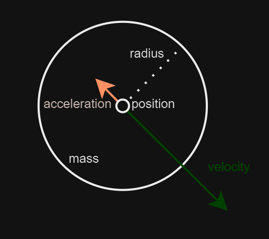
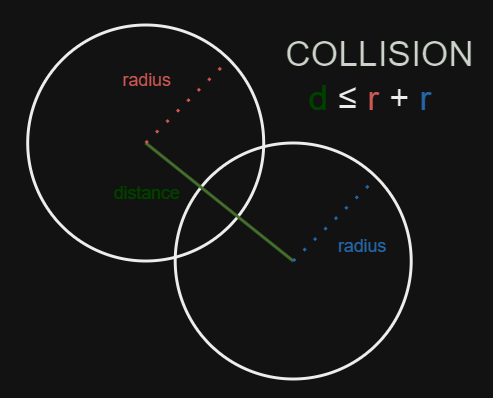
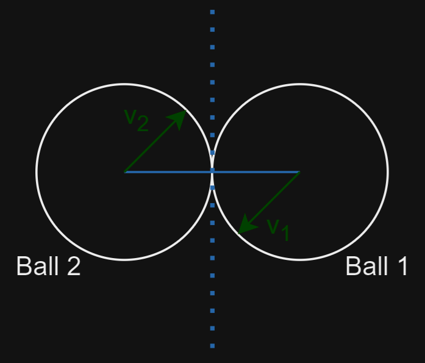

import { Tabs, TabItem } from "@astrojs/starlight/components";

**{frontmatter.description}**

Written by: {frontmatter.author}  
_Last updated: {frontmatter.lastupdated}_

---

## Resolving Collisions Using Vectors

In this tutorial, we'll explore how to detect and resolve collisions between moving objects (in this case, balls) using vector mathematics in SplashKit. We'll cover the use of vectors to calculate collisions, adjust object positions, and update velocities based on the principles of physics. This will be particularly useful if you are interested in game development or any application where collision detection is essential.

## SplashKit Vector Functions Used in This Tutorial:

1. [Vector Normal](https://splashkit.io/api/physics/#vector-normal)
2. [Dot Product](https://splashkit.io/api/physics/#dot-product)
3. [Vector Add](https://splashkit.io/api/physics/#vector-add)
4. [Vector Multiply](https://splashkit.io/api/physics/#vector-multiply)
5. [Vector Point to Point](https://splashkit.io/api/physics/#vector-point-to-point)

## Contents

- [A Quick Background on Physics](#a-quick-background-on-physics)
- [Applying Forces to Balls](#applying-forces-to-balls)
- [Handling Collision](#handling-collisions)
- [Conclusion](#conclusion)

### A Quick Background on Physics

In this tutorial, we’ll use circles to demonstrate SplashKit functions. Understanding some basic physics concepts will help you extend these ideas to your own programs. Here’s a quick overview of the properties we’ll work with:

- Position: A circle's position in the window is represented by a `point_2d`, which consists of an `{x, y}` coordinate pair.
- Velocity: Each circle has a velocity, initially set to 0, represented by a `vector_2d`. This `{x, y}` pair indicates the change in position `{x, y}` over a given time interval.
- Acceleration: Each circle also has an acceleration, initially set to 0, represented by another `vector_2d`. This `{x, y}` pair shows how the velocity `{x, y}` changes over time.
- Mass: In this tutorial, we scale the mass of each ball linearly with its radius, without considering density.

:::tip[Did you know?]
Integrating the acceleration vector over time gives us the velocity, and integrating the velocity vector over time gives us the position.
:::

To manage these properties for our circles, we'll create a `struct` that encapsulates all the necessary information. This `struct` will be used for collision detection and applying forces:

```cpp
// Structure to represent the ball objects on the screen
struct ball
{
    circle ball_circle;     // Holds the ball position and radius properties
    vector_2d velocity;     // Speed of the ball
    vector_2d acceleration; // Acceleration of the ball

    float mass; // Mass of the ball, determined by the radius. Used in calculation of momentum
    int id;     // Unique ball identifier
};
```



### Applying Forces to Balls

Let's see how applying a force affects the movement of a ball. To do this:

1. **Select a Ball**: Click on a ball to select it. This will allow you to apply a force to this specific ball.
2. **Adjust the Force**: Move the mouse around the window to adjust the magnitude and angle of the force. The direction and length of the vector from the ball's center to the mouse position determine the force's direction and magnitude.
3. **Apply the Force**: Click the mouse again to apply the force to the selected ball.

We use SplashKit's `vector_point_to_point` function to create a force vector from the ball’s center to the mouse cursor. This vector is then added to the ball's velocity vector, adjusting its movement. To keep the movement within a reasonable range, we apply a scaling factor.

```cpp
vector_2d force = vector_point_to_point(mouse_position(), selected_ball->ball_circle.center);
selected_ball->velocity = vector_multiply(vector_add(selected_ball->velocity, force), SCALING_FACTOR);
```

Recall that integrating the acceleration vector over time gives us the velocity, and integrating the velocity vector over time gives us the position. 

In our simulation, we account for the effects of friction by using a deceleration factor. This factor reduces the ball's velocity over time, simulating the slowing down due to friction. The process involves integrating the acceleration to update the velocity and then integrating the velocity to update the ball’s position.

- **Deceleration Calculation:** The deceleration factor is a negative value that simulates friction. By multiplying the current velocity by this factor, we obtain the deceleration vector.
- **Velocity Update:** The ball's velocity is updated by adding the deceleration vector to the current velocity. Since the deceleration is negative, it will decrease the velocity over time.
- **Position Update:** The ball’s position is updated by adding the velocity components to the current position. This adjusts the ball's position based on its current velocity.

```cpp
double decceleration_factor = -0.015;

b.acceleration = vector_multiply(b.velocity, decceleration_factor);
b.velocity = vector_add(b.velocity, b.acceleration);
b.ball_circle.center.x += b.velocity.x;
b.ball_circle.center.y += b.velocity.y;
```

#### Explanation: 
- `vector_multiply(b.velocity, decceleration_factor)` calculates the deceleration vector, which will be subtracted from the ball's velocity.
- `vector_add(b.velocity, b.acceleration)` updates the ball's velocity by applying the deceleration.
- `b.ball_circle.center.x += b.velocity.x` and `b.ball_circle.center.y += b.velocity.y` adjust the ball’s position based on the updated velocity.

By integrating these calculations, you ensure that the ball’s movement is influenced by friction, leading to a more realistic simulation where the ball gradually slows down and eventually stops if no additional forces are applied.

To ensure that the balls remain within the visible area of the window, we need to check that they do not extend beyond the window edges. If a ball reaches the boundary, we reposition it within the window and reverse its velocity to simulate a bounce.

- **Check Boundary Conditions**: Verify if the ball's position plus its radius extends beyond the window's edges. If it does, adjust its position to ensure it stays within the window.
- **Reverse Velocity**: To create a bouncing effect, reverse the velocity component that is responsible for pushing the ball out of bounds.

```cpp
// Check the left boundary
if (b.ball_circle.center.x - b.ball_circle.radius < 0)
{
    b.ball_circle.center.x = b.ball_circle.radius; // Reposition ball inside the left boundary
    b.velocity.x *= -1;                            // Reverse the x-velocity (bounce off the wall)
}

// Check the right boundary
if (b.ball_circle.center.x + b.ball_circle.radius > screen_width())
{
    b.ball_circle.center.x = screen_width() - b.ball_circle.radius; // Reposition ball inside the right boundary
    b.velocity.x *= -1;                                             // Reverse the x-velocity (bounce off the wall)
}

// Check the top boundary
if (b.ball_circle.center.y - b.ball_circle.radius < 0)
{
    b.ball_circle.center.y = b.ball_circle.radius; // Reposition ball inside the top boundary
    b.velocity.y *= -1;                            // Reverse the y-velocity (bounce off the wall)
}

// Check the bottom boundary
if (b.ball_circle.center.y + b.ball_circle.radius > screen_height())
{
    b.ball_circle.center.y = screen_height() - b.ball_circle.radius; // Reposition ball inside the bottom boundary
    b.velocity.y *= -1;                                              // Reverse the y-velocity (bounce off the wall)
}
```

Let's see it in action!


<details>
<summary>Use this code in your own IDE to play with the functions for yourself!</summary>

```cpp
#include "splashkit.h"
#include <vector>
#include <cmath> // For sqrt function

using std::to_string;

// Structure to represent the ball objects on the screen
struct ball
{
    circle ball_circle;     // Holds the ball position and radius properties
    vector_2d velocity;     // Speed of the ball
    vector_2d acceleration; // Acceleration of the ball

    float mass; // Mass of the ball, determined by the radius. Used in calculation of momentum
    int id;     // Unique ball identifier
};

// Function to create and return a new ball with a unique ID and a position that does not overlap with existing balls.
ball add_ball(int ball_id, const vector<ball> &existing_balls)
{
    ball new_ball;

    // Initialise ball velocity and acceleration to 0
    new_ball.velocity = {0, 0};
    new_ball.acceleration = {0, 0};
    new_ball.id = ball_id;
    new_ball.ball_circle.radius = rnd(10, 50);           // Radius of the ball
    new_ball.mass = new_ball.ball_circle.radius * 10.0f; // Calculate mass proportional to radius

    // Generate a random position within screen bounds, considering the ball's radius
    point_2d random_pos = {
        double(rnd(2 * new_ball.ball_circle.radius, screen_width() - 2 * new_ball.ball_circle.radius)),
        double(rnd(2 * new_ball.ball_circle.radius, screen_height() - 2 * new_ball.ball_circle.radius))};
    new_ball.ball_circle = circle_at(random_pos, new_ball.ball_circle.radius);

    return new_ball;
}

// Function to draw all balls on the screen.
void draw_balls(const vector<ball> &balls)
{
    for (const ball &b : balls)
    {
        draw_circle(COLOR_BLACK, b.ball_circle);
    }
}

// Function to handle user input, specifically selecting and applying forces to balls.
void handle_inputs(vector<ball> &balls)
{
    static ball *selected_ball = nullptr;

    const double SCALING_FACTOR = 0.05; // Factor to scale the applied force

    // If left mouse button clicked and no ball selected, loop through all balls to check if the mouse has clicked a valid ball, then select that ball
    if (mouse_clicked(LEFT_BUTTON))
    {
        if (!selected_ball)
        {
            for (ball &b : balls)
            {
                if (point_in_circle(mouse_position(), b.ball_circle))
                {
                    selected_ball = &b;
                    return;
                }
            }
        }

        // If ball is already selected, apply force to the ball proportional to the magnitude of the vector drawn by the mouse
        else
        {
            vector_2d force = vector_point_to_point(mouse_position(), selected_ball->ball_circle.center);
            selected_ball->velocity = vector_multiply(vector_add(selected_ball->velocity, force), SCALING_FACTOR);
            fill_circle(color_transparent(), selected_ball->ball_circle);
            selected_ball = nullptr;
        }
    }

    // If a ball is selected, draw the vector that will be applied to the ball if the mouse is clicked again.
    if (selected_ball)
    {
        fill_circle(random_color(), selected_ball->ball_circle);
        draw_line(random_color(), selected_ball->ball_circle.center, mouse_position());
    }
}

// Function to draw a Cartesian grid
void draw_cartesian_grid()
{
    const int GRID_SPACING = 50;
    int half_width = screen_width() / 2;
    int half_height = screen_height() / 2;

    // Draw vertical grid lines
    for (int x = GRID_SPACING; x < screen_width(); x += GRID_SPACING)
    {
        draw_line(COLOR_LIGHT_GRAY, x, 0, x, screen_height());
        if (x != half_width)
        {
            draw_text(to_string(x - half_width), COLOR_BLACK, x, half_height + 5);
        }
    }

    // Draw horizontal grid lines
    for (int y = GRID_SPACING; y < screen_height(); y += GRID_SPACING)
    {
        draw_line(COLOR_LIGHT_GRAY, 0, y, screen_width(), y);
        if (y != half_height)
        {
            draw_text(to_string(half_height - y), COLOR_BLACK, half_width + 5, y);
        }
    }

    // Draw axes
    draw_line(COLOR_BLACK, 0, half_height, screen_width(), half_height); // x-axis
    draw_line(COLOR_BLACK, half_width, 0, half_width, screen_height());  // y-axis
    draw_text("0", COLOR_BLACK, half_width + 5, half_height + 5);
}

void update_balls(vector<ball> &balls)
{
    for (ball &b : balls)
    {
        double deceleration_factor = -0.015;

        b.acceleration = vector_multiply(b.velocity, deceleration_factor);
        b.velocity = vector_add(b.velocity, b.acceleration);

        // Set velocity to 0 if the overall scale of the velocity gets very small
        if (abs(b.velocity.x*b.velocity.x + b.velocity.y * b.velocity.y) < 0.001f)
        {
            b.velocity = vector_multiply(b.velocity, 0);
        }

        b.ball_circle.center.x += b.velocity.x;
        b.ball_circle.center.y += b.velocity.y;

        // Check the left boundary
        if (b.ball_circle.center.x - b.ball_circle.radius < 0)
        {
            b.ball_circle.center.x = b.ball_circle.radius; // Reposition ball inside the left boundary
            b.velocity.x *= -1;                            // Reverse the x-velocity (bounce off the wall)
        }

        // Check the right boundary
        if (b.ball_circle.center.x + b.ball_circle.radius > screen_width())
        {
            b.ball_circle.center.x = screen_width() - b.ball_circle.radius; // Reposition ball inside the right boundary
            b.velocity.x *= -1;                                             // Reverse the x-velocity (bounce off the wall)
        }

        // Check the top boundary
        if (b.ball_circle.center.y - b.ball_circle.radius < 0)
        {
            b.ball_circle.center.y = b.ball_circle.radius; // Reposition ball inside the top boundary
            b.velocity.y *= -1;                            // Reverse the y-velocity (bounce off the wall)
        }

        // Check the bottom boundary
        if (b.ball_circle.center.y + b.ball_circle.radius > screen_height())
        {
            b.ball_circle.center.y = screen_height() - b.ball_circle.radius; // Reposition ball inside the bottom boundary
            b.velocity.y *= -1;                                              // Reverse the y-velocity (bounce off the wall)
        }
    }
}

int main()
{
    open_window("Ball Vectors", 800, 600);

    int num_balls = 1;

    // Vector to store all balls
    vector<ball> balls;

    for (int i = 1; i <= num_balls; ++i)
    {
        balls.push_back(add_ball(i, balls));
    }

    while (!window_close_requested("Ball Vectors"))
    {
        process_events();

        clear_screen(COLOR_WHITE);

        draw_cartesian_grid();

        draw_balls(balls);

        handle_inputs(balls);

        update_balls(balls);

        refresh_screen(60);
    }

    return 0;
}
```
</details>

### Handling Collisions

To handle collisions between multiple balls in the window, we need to determine if they have collided and then resolve the collision appropriately. 

1. Collision Detection

To check if two balls overlap, we use the Pythagorean theorem to compute the distance between their centres and compare it to the sum of their radii. If the distance is less than or equal to the sum of their radii, a collision has occurred.

```cpp
double dx = c1.center.x - c2.center.x;     // Difference in x coordinates
double dy = c1.center.y - c2.center.y;     // Difference in y coordinates
double radius_sum = c1.radius + c2.radius; // Sum of both radii

// Returns true if circles overlap. Uses pythagorean theorum.
return (dx * dx + dy * dy) <= (radius_sum * radius_sum);
```



:::note
This uses a slightly modified version of Pythagorean Theorum to determine if the circles overlap. The square root can be quite costly to compute, so to remove this, we just square both sides of the equation and leave it in the form $ a^2 + b^2 = c^2 $.
:::

If any of the balls do indeed overlap, we have a collision. Once a collision is detected, we need to resolve it by updating the positions and velocities of the colliding balls. 



Let's assume that `Ball 1` is moving along its vector `v1` and that `Ball 2` is moving along its vector `v2`. If we draw a line between the two centre points and find the `normal` to that line (i.e. a line that is perpendicular to that), this tangential line (represented by the dotted line) effectively represents a solid object from which both balls will bounce off of. The movement of the balls along the normal after a collision is called the **tangential response**.

:::note
In a perfect world, if one of the balls was stationary and the other was moving along it's velocity vector, the stationary ball would move along the line that is drawn between the centre points, and the moving ball will move along the tangential line, or the **normal**. There will always be 90 degrees between the resulting movement of the two balls. The only exception to this is if the velocity of the moving ball is in the exact same direction as the line between the centre points. 
:::

To resolve the collision and apply the forces to each of the balls, we follow the following steps:

1. Determine the amount of overlap between the two balls by calculating the distance between their centers and comparing it to the sum of their radii.

```cpp
float dx = ball_1.ball_circle.center.x - ball_2.ball_circle.center.x;
float dy = ball_1.ball_circle.center.y - ball_2.ball_circle.center.y;
float distance_squared = dx * dx + dy * dy; // Square of the distance between the centers
float distance = sqrt(distance_squared);    // Actual distance between the centers
float radius_sum = ball_1.ball_circle.radius + ball_2.ball_circle.radius;
float overlap = 0.5f * (radius_sum - distance); // Amount of overlap between the balls
```

2. Compute the normalised collision direction vector, which is a unit vector pointing from one ball’s center to the other.

```cpp
vector_2d normalised_collision = {dx / distance, dy / distance};
```

3. Displace the balls to resolve any overlap. This displacement will be along the line between the two centres of the balls. We call this the **normal response**.

```cpp
ball_1.ball_circle.center.x += overlap * normalised_collision.x;
ball_1.ball_circle.center.y += overlap * normalised_collision.y;
ball_2.ball_circle.center.x -= overlap * normalised_collision.x;
ball_2.ball_circle.center.y -= overlap * normalised_collision.y;
```

4. Calculate the normal vector to the line that connects the two balls. This will form the point from which both balls will bounce off. This is where we use SplashKit's `vector_normal` function.

```cpp
vector_2d collision_normal = vector_normal(normalised_collision);
```

5. Project the normal and tangential responses onto the collision axes.

```cpp
double ball_1_normal_dot_product = dot_product(ball_1.velocity, collision_normal);
double ball_2_normal_dot_product = dot_product(ball_2.velocity, collision_normal);

double ball_1_collision_dot_product = dot_product(ball_1.velocity, normalised_collision);
double ball_2_collision_dot_product = dot_product(ball_2.velocity, normalised_collision);
```

6. To calculate the velocities after collision, we must also factor in the mass of each ball. In physics, an elastic collision is one between two bodies in which the total kinetic energy of the bodies remains the same. We use the following formula:

$$ v_1 = \frac{u_1 (m_1 - m_2) + 2 m_2 u_2}{m_1 + m_2} $$
$$ v_2 = \frac{u_2 (m_2 - m_1) + 2 m_1 u_1}{m_1 + m_2} $$

```cpp
float ball_1_momentum = (ball_1_collision_dot_product * (ball_1.mass - ball_2.mass) + 2.0f * ball_2.mass * ball_2_collision_dot_product) / (ball_1.mass + ball_2.mass);
float ball_2_momentum = (ball_2_collision_dot_product * (ball_2.mass - ball_1.mass) + 2.0f * ball_1.mass * ball_1_collision_dot_product) / (ball_1.mass + ball_2.mass);
```

7. Finally, set the new velocities after the collision. This is simply the sum of the normal and tangential responses.

```cpp
// Set the new velocities after collision
ball_1.velocity = vector_add(vector_multiply(collision_normal, ball_1_normal_dot_product), vector_multiply(normalised_collision, ball_1_momentum));
ball_2.velocity = vector_add(vector_multiply(collision_normal, ball_2_normal_dot_product), vector_multiply(normalised_collision, ball_2_momentum));
```

Let's see it in action!


<details>
<summary>Use this code in your own IDE to play with the functions for yourself!</summary>

```cpp
#include "splashkit.h"
#include <vector>
#include <cmath>

using std::to_string;

// Structure to represent the ball objects on the screen
struct ball
{
    circle ball_circle;     // Holds the ball position and radius properties
    vector_2d velocity;     // Speed of the ball
    vector_2d acceleration; // Acceleration of the ball

    float mass; // Mass of the ball, determined by the radius. Used in calculation of momentum
    int id;     // Unique ball identifier
};

// Inline function to check if two balls overlap.
inline bool balls_overlap(const circle &c1, const circle &c2)
{
    double dx = c1.center.x - c2.center.x;     // Difference in x coordinates
    double dy = c1.center.y - c2.center.y;     // Difference in y coordinates
    double radius_sum = c1.radius + c2.radius; // Sum of both radii

    // Returns true if circles overlap. Uses pythagorean theorum.
    return (dx * dx + dy * dy) <= (radius_sum * radius_sum);
}

// Function to create and return a new ball with a unique ID and a position that does not overlap with existing balls.
ball add_ball(int ball_id, const vector<ball> &existing_balls)
{
    ball new_ball;
    bool position_found = false;

    // Initialise ball velocity and acceleration to 0
    new_ball.velocity = {0, 0};
    new_ball.acceleration = {0, 0};
    new_ball.id = ball_id;
    new_ball.ball_circle.radius = rnd(10, 50);           // Radius of the ball
    new_ball.mass = new_ball.ball_circle.radius * 10.0f; // Calculate mass proportional to radius

    // Find a position for the new ball that doesn't overlap with any existing balls
    while (!position_found)
    {
        // Generate a random position within screen bounds, considering the ball's radius
        point_2d random_pos = {
            double(rnd(2 * new_ball.ball_circle.radius, screen_width() - 2 * new_ball.ball_circle.radius)),
            double(rnd(2 * new_ball.ball_circle.radius, screen_height() - 2 * new_ball.ball_circle.radius))};
        new_ball.ball_circle = circle_at(random_pos, new_ball.ball_circle.radius);

        // Check if the new position is valid (i.e., no overlap with other balls)
        position_found = true;
        for (const ball &b : existing_balls)
        {
            if (balls_overlap(new_ball.ball_circle, b.ball_circle))
            {
                position_found = false;
                break;
            }
        }
    }

    return new_ball;
}

// Function to resolve collisions between two balls
void resolve_collision(ball &ball_1, ball &ball_2)
{
    // Calculate the difference in positions between the two balls
    float dx = ball_1.ball_circle.center.x - ball_2.ball_circle.center.x;
    float dy = ball_1.ball_circle.center.y - ball_2.ball_circle.center.y;
    float distance_squared = dx * dx + dy * dy; // Square of the distance between the centers
    float distance = sqrt(distance_squared);    // Actual distance between the centers
    float radius_sum = ball_1.ball_circle.radius + ball_2.ball_circle.radius;
    float overlap = 0.5f * (radius_sum - distance); // Amount of overlap between the balls

    // Normalise the direction vector (unit vector in the direction of the collision)
    vector_2d normalised_collision = {dx / distance, dy / distance};

    // Displace balls to resolve overlap, ensuring they no longer overlap
    ball_1.ball_circle.center.x += overlap * normalised_collision.x;
    ball_1.ball_circle.center.y += overlap * normalised_collision.y;
    ball_2.ball_circle.center.x -= overlap * normalised_collision.x;
    ball_2.ball_circle.center.y -= overlap * normalised_collision.y;

    // Calculate the normal vector (tangent) using SplashKit's vector_normal function
    vector_2d collision_normal = vector_normal(normalised_collision);

    // Project the velocities onto the collision axes
    double ball_1_normal_dot_product = dot_product(ball_1.velocity, collision_normal);
    double ball_2_normal_dot_product = dot_product(ball_2.velocity, collision_normal);

    double ball_1_collision_dot_product = dot_product(ball_1.velocity, normalised_collision);
    double ball_2_collision_dot_product = dot_product(ball_2.velocity, normalised_collision);

    // Use conservation of momentum to calculate new velocities along the normal direction
    float ball_1_momentum = (ball_1_collision_dot_product * (ball_1.mass - ball_2.mass) + 2.0f * ball_2.mass * ball_2_collision_dot_product) / (ball_1.mass + ball_2.mass);
    float ball_2_momentum = (ball_2_collision_dot_product * (ball_2.mass - ball_1.mass) + 2.0f * ball_1.mass * ball_1_collision_dot_product) / (ball_1.mass + ball_2.mass);

    // Set the new velocities after collision
    ball_1.velocity = vector_add(vector_multiply(collision_normal, ball_1_normal_dot_product), vector_multiply(normalised_collision, ball_1_momentum));
    ball_2.velocity = vector_add(vector_multiply(collision_normal, ball_2_normal_dot_product), vector_multiply(normalised_collision, ball_2_momentum));
}

// Function to resolve and draw collisions between all balls
void resolve_and_draw_collisions(vector<ball> &balls)
{
    // Loop through each pair of balls to check for collisions
    for (size_t i = 0; i < balls.size(); ++i)
    {
        for (size_t j = i + 1; j < balls.size(); ++j)
        {
            if (balls_overlap(balls[i].ball_circle, balls[j].ball_circle))
            {
                resolve_collision(balls[i], balls[j]);
                // Draw a red line between the centers of the colliding balls
                draw_line(COLOR_RED, balls[i].ball_circle.center, balls[j].ball_circle.center);
            }
        }
    }
}

// Function to draw all balls on the screen.
void draw_balls(const vector<ball> &balls)
{
    for (const ball &b : balls)
    {
        draw_circle(COLOR_BLACK, b.ball_circle);
    }
}

// Function to handle user input, specifically selecting and applying forces to balls.
void handle_inputs(vector<ball> &balls)
{
    static ball *selected_ball = nullptr;

    const double SCALING_FACTOR = 0.05; // Factor to scale the applied force

    // If left mouse button clicked and no ball selected, loop through all balls to check if the mouse has clicked a valid ball, then select that ball
    if (mouse_clicked(LEFT_BUTTON))
    {
        if (!selected_ball)
        {
            for (ball &b : balls)
            {
                if (point_in_circle(mouse_position(), b.ball_circle))
                {
                    selected_ball = &b;
                    return;
                }
            }
        }

        // If ball is already selected, apply force to the ball proportional to the magnitude of the vector drawn by the mouse
        else
        {
            vector_2d force = vector_point_to_point(mouse_position(), selected_ball->ball_circle.center);
            selected_ball->velocity = vector_multiply(vector_add(selected_ball->velocity, force), SCALING_FACTOR);
            fill_circle(color_transparent(), selected_ball->ball_circle);
            selected_ball = nullptr;
        }
    }

    // If a ball is selected, draw the vector that will be applied to the ball if the mouse is clicked again.
    if (selected_ball)
    {
        fill_circle(random_color(), selected_ball->ball_circle);
        draw_line(random_color(), selected_ball->ball_circle.center, mouse_position());
    }
}

void update_balls(vector<ball> &balls)
{
    for (ball &b : balls)
    {
        double deceleration_factor = -0.015;

        b.acceleration = vector_multiply(b.velocity, deceleration_factor);
        b.velocity = vector_add(b.velocity, b.acceleration);

        // Set velocity to 0 if the overall scale of the velocity gets very small
        if (abs(b.velocity.x*b.velocity.x + b.velocity.y * b.velocity.y) < 0.001f)
        {
            b.velocity = vector_multiply(b.velocity, 0);
        }

        b.ball_circle.center.x += b.velocity.x;
        b.ball_circle.center.y += b.velocity.y;

        // Check the left boundary
        if (b.ball_circle.center.x - b.ball_circle.radius < 0)
        {
            b.ball_circle.center.x = b.ball_circle.radius; // Reposition ball inside the left boundary
            b.velocity.x *= -1;                            // Reverse the x-velocity (bounce off the wall)
        }

        // Check the right boundary
        if (b.ball_circle.center.x + b.ball_circle.radius > screen_width())
        {
            b.ball_circle.center.x = screen_width() - b.ball_circle.radius; // Reposition ball inside the right boundary
            b.velocity.x *= -1;                                             // Reverse the x-velocity (bounce off the wall)
        }

        // Check the top boundary
        if (b.ball_circle.center.y - b.ball_circle.radius < 0)
        {
            b.ball_circle.center.y = b.ball_circle.radius; // Reposition ball inside the top boundary
            b.velocity.y *= -1;                            // Reverse the y-velocity (bounce off the wall)
        }

        // Check the bottom boundary
        if (b.ball_circle.center.y + b.ball_circle.radius > screen_height())
        {
            b.ball_circle.center.y = screen_height() - b.ball_circle.radius; // Reposition ball inside the bottom boundary
            b.velocity.y *= -1;                                              // Reverse the y-velocity (bounce off the wall)
        }
    }
}

// Function to draw a Cartesian grid
void draw_cartesian_grid()
{
    const int GRID_SPACING = 50;
    int half_width = screen_width() / 2;
    int half_height = screen_height() / 2;

    // Draw vertical grid lines
    for (int x = GRID_SPACING; x < screen_width(); x += GRID_SPACING)
    {
        draw_line(COLOR_LIGHT_GRAY, x, 0, x, screen_height());
        if (x != half_width)
        {
            draw_text(to_string(x - half_width), COLOR_BLACK, x, half_height + 5);
        }
    }

    // Draw horizontal grid lines
    for (int y = GRID_SPACING; y < screen_height(); y += GRID_SPACING)
    {
        draw_line(COLOR_LIGHT_GRAY, 0, y, screen_width(), y);
        if (y != half_height)
        {
            draw_text(to_string(half_height - y), COLOR_BLACK, half_width + 5, y);
        }
    }

    // Draw axes
    draw_line(COLOR_BLACK, 0, half_height, screen_width(), half_height); // x-axis
    draw_line(COLOR_BLACK, half_width, 0, half_width, screen_height());  // y-axis
    draw_text("0", COLOR_BLACK, half_width + 5, half_height + 5);
}

int main()
{
    open_window("Ball Vectors", 800, 600);

    int num_balls = 2;

    // Vector to store all balls
    vector<ball> balls;

    for (int i = 1; i <= num_balls; ++i)
    {
        balls.push_back(add_ball(i, balls));
    }

    while (!window_close_requested("Ball Vectors"))
    {
        process_events();

        clear_screen(COLOR_WHITE);

        draw_cartesian_grid();

        resolve_and_draw_collisions(balls);

        draw_balls(balls);

        handle_inputs(balls);

        update_balls(balls);

        refresh_screen(60);
    }

    return 0;
}
```
</details>

Play around with the number of balls, the scaling factors and circles sizes or masses to get a feel for how you can use 2D vectors and vector physics in your games. 


### Conclusion

Mastering vector mathematics will bring your 2D games to the next level. Vectors simplify calculations for movement, collision detection, and rendering, making them great for creating realistic simulations and interactive experiences. Similarly, in computer graphics, vectors are fundamental for transformations, lighting, and shading, enabling dynamic and visually appealing scenes.

Beyond game development and graphics, vectors are essential in physics simulations for modeling forces and trajectories, and in data science for feature representation and analysis. Understanding vectors enhances problem-solving capabilities and supports efficient implementations in these areas, making it a valuable skill for both academic and professional pursuits.

This tutorial covered how to detect and resolve collisions between moving objects using vectors in SplashKit. You can apply these principles to create realistic interactions in your games or simulations.