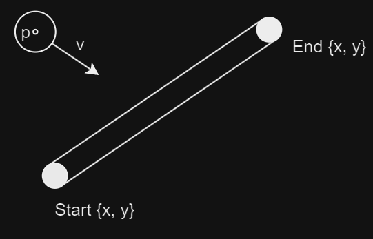
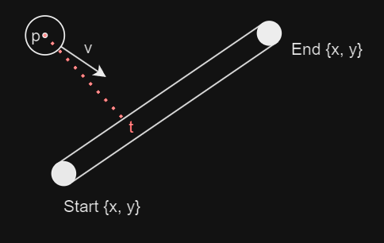
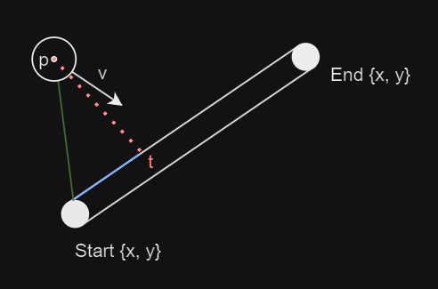

import { Tabs, TabItem } from "@astrojs/starlight/components";

**{frontmatter.description}**

Written by: {frontmatter.authors}  
_Last updated: {frontmatter.lastupdated}_

---

## Introduction to Collisions and Gravity

In 2D game development, understanding collisions and gravity is important for creating realistic interactions between objects, whether it's a character jumping, objects bouncing off one another, or objects colliding in complex environments. These physics elements are the backbone of dynamic gameplay, making games more engaging and interactive. By mastering collisions, you'll understand how objects respond when they come into contact, while implementing gravity ensures that objects behave naturally, adding a sense of weight and realism to your game world. Beyond gaming, these principles are essential in fields like simulations, robotics, and any system requiring object interaction modeling.

In this tutorial, you'll learn how to implement these concepts using SplashKit, leveraging vector math for precise collision detection and response. We will continue to look at handling elastic collisions, wall interactions, and gravity simulations, developing your program to manage object movement and physical interactions in your games. By the end, you should have a more robust understanding of 2D game physics, which you can apply to more advanced game mechanics and real-world physics simulations.


:::tip
We recommend you first familiarise yourself with the [Resolving Collisions Using Vectors](/guides/physics/4-collision-detection-using-vectors/) tutorial before proceeding with this one. This will provide you with a solid understanding of the fundamental principles of collision detection and how to effectively make use of the SplashKit physics functions.
:::

## SplashKit Vector Functions Used in This Tutorial

1. [Vector Point To Point](/api/physics/#vector-point-to-point)
2. [Vector Magnitude](/api/physics/#vector-magnitude)
3. [Unit Vector](/api/physics/#unit-vector)
4. [Vector Normal](/api/physics/#vector-normal)
5. [Vector Multiply](/api/physics/#vector-multiply)
6. [Vector Subtract](/api/physics/#vector-subtract)
7. [Vector Add](/api/physics/#vector-add)
8. [Dot Product](/api/physics/#dot-product)

## Contents

## Table of Contents

- [Introduction to Collisions and Gravity](#introduction-to-collisions-and-gravity)
- [SplashKit Vector Functions Used in This Tutorial](#splashkit-vector-functions-used-in-this-tutorial)
- [Finding the Closest Point on a Wall for Collision Detection](#finding-the-closest-point-on-a-wall-for-collision-detection)
- [Detecting Ball and Wall Overlap](#detecting-ball-and-wall-overlap)
- [Resolving Ball and Wall Collision](#resolving-ball-and-wall-collision)
- [Introducing Gravity to the Environment](#introducing-gravity-to-the-environment)
- [Observing Gravity in Action with Wall Collisions](#observing-gravity-in-action-with-wall-collisions)
- [Conclusion](#conclusion)

---

## Finding the Closest Point on a Wall for Collision Detection

When detecting collisions between a ball and a wall in a 2D game, we need to determine whether the ball has collided with the wall. While we've used the radii to represent the sizes of the objects, for collision detection purposes, we treat them as points to simplify the calculations.



The goal is to find the point along the wall, referred to as `t`, that is closest to the centre of the ball (point `p`). The closest point forms a right angle with the ball’s centre.



In these scenarios, calculating this point directly using world coordinates can be complex, so we use normalised coordinates instead. By parameterising the wall, we define its start point as 0 and its end point as 1. This allows us to determine where along the wall the closest point is located, represented by the parameter `t`.

We begin by creating a vector (the green line) from the centre of the ball to the start of the wall. The distance between the closest point and the start of the wall can be calculated using the dot product between this green vector and the vector representing the wall.



```cpp
// Vector from the start of the wall to the ball's centre
vector_2d vector_to_point = vector_point_to_point(start, point);

// Vector representing the direction and length of the wall
vector_2d line_vector = vector_point_to_point(start, end);

// Calculate the dot product between the two vectors
double dot_product_result = dot_product(vector_to_point, line_vector);
```

Next, we normalise the wall length by squaring its distance and calculate the parameter `t`, which determines how far along the wall the closest point is.

```cpp
// Square of the wall's length for normalisation
double line_length_squared = line_vector.x * line_vector.x + line_vector.y * line_vector.y;

// Calculate the normalised parameter 't' for the closest point along the wall
double t = dot_product_result / line_length_squared;
```

A final step is needed to ensure the closest point remains within the wall’s bounds. Since the vector created from the start and end points of the wall can theoretically extend in both directions infinitely, we need to clamp the value of `t` between 0 and 1. If the ball is positioned outside the wall's boundaries, the closest point will either be at the start (`t = 0`) or the end (`t = 1`).

```cpp
// Clamp 't' to ensure the closest point remains within the wall's bounds
t = fmax(0, fmin(1, t));

// Return the coordinates of the closest point on the wall
return {start.x + line_vector.x * t, start.y + line_vector.y * t};
```

By following this method, we can accurately determine the point on a wall that is closest to a ball, making it easier to detect and resolve collisions in this environment.

## Detecting Ball and Wall Overlap

When determining if a ball has collided with a wall, we need to calculate the distance between the ball’s centre and the closest point on the wall. The aim is to check if the distance between the ball's centre and the wall is less than or equal to the sum of their radii. If so, a collision is detected. We can work this out procedurally:

1. **Calculate the Closest Point on the Wall**: We first use a `closest_point_on_line` helper function (defined [above](#finding-the-closest-point-on-a-wall-for-collision-detection)) to find the closest point on the wall’s line segment to the centre of the ball. This is important because it tells us where along the wall the ball is closest to.

```cpp
// b = ball
// w = wall
point_2d closest = closest_point_on_line(b.ball_circle.centre, w.start_anchor.centre, w.end_anchor.centre);
```

2. **Compute the Distance Between the Ball's Center and the Closest Point**: Once we have the closest point, we can calculate the distance between this point and the centre of the ball. This is done by subtracting the `x` and `y` coordinates of the ball's centre from those of the closest point.

```cpp
double dx = b.ball_circle.centre.x - closest.x;
double dy = b.ball_circle.centre.y - closest.y;
double distance_squared = dx * dx + dy * dy;  // Using squared distance to avoid unnecessary square root calculations
```

3. **Check for Overlap Using Radii**: To check for a collision, we need to compare the distance between the ball’s centre and the closest point on the wall with the sum of their radii (i.e., the ball's radius and the wall's radius). If the squared distance is less than or equal to the squared sum of their radii, then the ball is overlapping with the wall.

```cpp
double radius_sum = b.ball_circle.radius + w.radius;  // The combined radius of the ball and the wall's thickness
return distance_squared <= radius_sum * radius_sum;   // True if overlapping
```

This method works by treating the problem as a basic geometric distance check. It first finds the closest point on the wall to the ball, and then checks if the distance between that point and the ball’s centre is within the radius of the ball plus the wall’s thickness. By squaring both sides, we avoid the computational overhead of calculating the square root, making the code more efficient.

## Resolving Ball and Wall Collision

Once a collision between a ball and a wall is detected, the next step is to resolve it. This process involves adjusting the position of the ball to prevent further penetration into the wall and modifying the ball's velocity to simulate a realistic collision response, including bounce and energy loss.

1. **Find the Closest Point on the Wall**: Similar to before, the first step in resolving a collision is to find the closest point on the wall’s line segment to the ball’s centre. This is the point where the ball is essentially colliding with the wall.

```cpp
point_2d closest = closest_point_on_line(b.ball_circle.centre, w.start_anchor.centre, w.end_anchor.centre);
```

2. **Calculate the Collision Normal Vector**: After finding the closest point, we calculate the direction from that point on the wall to the ball's centre. This direction is called the collision normal and is represented as a unit vector (a vector with a length of 1). It indicates the direction in which the ball should be pushed to resolve the collision.

```cpp
vector_2d collision_normal = vector_point_to_point(closest, b.ball_circle.centre);
collision_normal = unit_vector(collision_normal);
```

3. **Determine the Penetration Depth**: The penetration depth is how far the ball has moved into the wall. It’s calculated by finding the distance between the ball’s centre and the closest point on the wall and comparing it to the combined radii of the ball and the wall (the ball's radius and the wall's thickness). The difference between these two values gives us the penetration depth.

```cpp
double dx = b.ball_circle.center.x - closest.x;
double dy = b.ball_circle.center.y - closest.y;
double distance = sqrt(dx * dx + dy * dy);   // The actual distance between the ball's center and the closest point
double penetration = (b.ball_circle.radius + w.radius) - distance;
```

4. **Push the Ball Out of the Wall**: If the penetration is greater than 0, meaning the ball has overlapped with the wall, the next step is to push the ball out. This is done by moving the ball in the direction of the collision normal by the penetration amount.

```cpp
if (penetration > 0)
{
    b.ball_circle.center.x += collision_normal.x * penetration;
    b.ball_circle.center.y += collision_normal.y * penetration;
}
```

5. **Reflect and Dampen the Velocity**: After adjusting the ball’s position, we update the ball’s velocity to simulate the bounce. This is done by splitting the velocity into two components:

- Normal Component: The part of the velocity directed along the collision normal.
- Tangent Component: The part of the velocity directed tangentially to the collision.

The normal component of the velocity is reversed and dampened to simulate the loss of energy during the bounce. The tangent component remains unchanged, which allows the ball to retain some of its original motion parallel to the wall.

```cpp
double velocity_dot_normal = dot_product(b.velocity, collision_normal);
vector_2d velocity_normal = vector_multiply(collision_normal, velocity_dot_normal);
vector_2d velocity_tangent = vector_subtract(b.velocity, velocity_normal);

// Reverse and dampen the normal component of the velocity
// Damping factor is arbitrarily chosen as 0.6
b.velocity = vector_subtract(velocity_tangent, vector_multiply(velocity_normal, 0.6));
```

The ball's position is adjusted to ensure it no longer overlaps with the wall, and its velocity is updated to reflect the bounce. The damping factor reduces the ball’s speed after the collision, simulating energy loss, so the ball doesn’t bounce indefinitely.

This approach works by:

- Ensuring the ball is pushed out of the wall when a collision occurs.
- Reversing the velocity in the direction of the collision normal to simulate the bounce.
- Reducing the ball’s velocity slightly to simulate energy loss, which prevents the ball from gaining infinite energy through collisions.

## Introducing Gravity to the Environment

In a 2D game or physics simulation, gravity is an essential force that simulates the natural pull of objects towards the ground. By applying a constant downward acceleration, we can create realistic motion where objects fall, speed up as they descend, and eventually reach a terminal velocity due to air resistance or other forces.

In the context of our simulation, gravity is applied to the balls to make them fall towards the bottom of the screen, and this effect is controlled by the update_balls function.

Gravity is treated as a constant force that affects the vertical velocity of the ball. In our simulation, gravity is applied as a constant downward acceleration in the `y` direction. This acceleration is added to the ball's current velocity, causing the ball to speed up as it falls.

```cpp
const double gravity = 0.3;  // Constant downward acceleration due to gravity

for (ball &b : balls)
{
    // Apply gravity to the ball's acceleration (downward)
    b.acceleration.y = gravity;
}
```

After applying gravity to the ball’s acceleration, the next step is to update its velocity. The new velocity is calculated by adding the acceleration to the current velocity. Then, the ball's position is updated based on its new velocity, causing it to move downward.

```cpp
// Update velocity based on acceleration
b.velocity = vector_add(b.velocity, b.acceleration);

// Update ball position based on velocity
b.ball_circle.center.x += b.velocity.x;
b.ball_circle.center.y += b.velocity.y;
```

As the ball moves, it will gradually accelerate downwards, simulating the effect of gravity pulling it towards the bottom of the screen.

In real-world physics, objects falling through air eventually reach terminal velocity, the maximum speed they can achieve due to air resistance. To simulate this effect, we limit the ball's velocity to prevent it from accelerating indefinitely. The terminal velocity is calculated based on the ball's size, and if the ball’s velocity exceeds this value, it is capped.

```cpp
const double terminal_velocity_factor = 0.8;  // Adjust this factor to tune the terminal velocity
double terminal_velocity = terminal_velocity_factor * b.ball_circle.radius;

// Cap velocity to simulate terminal velocity
if (vector_magnitude(b.velocity) > terminal_velocity)
{
    b.velocity = vector_multiply(unit_vector(b.velocity), terminal_velocity);
}
```

By limiting the velocity in this way, we ensure that the ball falls at a realistic rate and doesn't continue accelerating indefinitely, which could lead to unnatural behavior in the simulation.

:::note
Key Points:
- **Gravity as a Constant Acceleration**: This continuously pulls the ball downward, causing it to accelerate over time.
- **Terminal Velocity**: A limit is set to the ball’s speed to prevent it from accelerating indefinitely, mimicking the effect of air resistance.
- **Position Update**: Each frame, the ball’s position is updated based on its velocity, allowing it to move across the screen.
:::

## Observing Gravity in Action with Wall Collisions

Now that we’ve implemented both gravity and wall collision detection, it’s time to see these mechanics in action. As the balls fall under the influence of gravity, you will notice how they accelerate towards the bottom of the screen. The walls in this simulation provide obstacles, causing the balls to bounce off them, adding an extra layer of complexity to their motion.

Remember:

- The balls experience a constant downward force due to gravity. Each frame, this force increases the balls' velocity in the `y` direction, making them fall faster as time progresses.
- Without any other forces acting on them, the balls would continue to accelerate, but we’ve implemented terminal velocity to limit how fast they can fall. This makes their descent appear more realistic, preventing them from speeding up indefinitely.

As the balls fall, they may collide with the walls. When this happens, the collision detection we implemented kicks in. The ball’s position is adjusted to prevent it from passing through the wall, and its velocity is reflected to simulate a bounce.

:::note
The bounce is not perfectly elastic. We apply a damping factor to the ball's velocity after each collision, ensuring that some energy is lost on each bounce. This prevents the balls from continuing to bounce forever and mimics the natural loss of energy in real-world collisions.
:::

As gravity pulls the balls down, and the walls create obstacles, you’ll see the balls bounce off the walls, creating dynamic interactions. The walls disrupt the straight downward path of the balls, adding a more complex and interesting motion.

Depending on the wall's position and angle, the balls may bounce to the left or right, which changes their trajectory. The interaction between gravity and wall collisions results in a realistic simulation where the balls follow a natural falling pattern, occasionally colliding and bouncing off walls.


Here you can see the balls falling due to gravity, accelerating until they reach terminal velocity, and bouncing off the walls. The collisions with the walls alter the balls’ direction, while gravity continues to pull them downward. Eventually, the balls may hit the bottom of the screen or bounce between walls, constantly interacting with both gravity and the obstacles in their environment.

<details class="custom-details">
<summary>Use this code in your own IDE to play with the functions for yourself!</summary>

```cpp
#include "splashkit.h"
#include <vector>
#include <cmath>

// Structure to represent the ball objects on the screen
struct ball
{
    circle ball_circle;     // Holds the ball position and radius properties
    vector_2d velocity;     // Speed of the ball
    vector_2d acceleration; // Acceleration of the ball

    float mass; // Mass of the ball, determined by the radius. Used in calculation of momentum
    int id;     // Unique ball identifier
};

// Structure to represent the wall objects on the screen
struct wall
{
    circle start_anchor;
    circle end_anchor;
    double radius; // Thickness of the wall (half-width of the capsule)
};

// Global variables to track selections
static wall *selected_wall = nullptr;
static bool start_anchor_selected = false;
static bool end_anchor_selected = false;
static color selected_anchor_color = COLOR_BLACK;

// Inline function to check if two balls overlap.
inline bool balls_overlap(const circle &c1, const circle &c2)
{
    double dx = c1.center.x - c2.center.x;     // Difference in x coordinates
    double dy = c1.center.y - c2.center.y;     // Difference in y coordinates
    double radius_sum = c1.radius + c2.radius; // Sum of both radii

    // Returns true if circles overlap. Uses Pythagorean theorem.
    return (dx * dx + dy * dy) <= (radius_sum * radius_sum);
}

// Function to find the closest point on a wall to a given point
// 'p' is the point we're trying to find the closest point on the line to.
// 'start' and 'end' represent the start and end points of the wall.
point_2d closest_point_on_line(const point_2d &point, const point_2d &start, const point_2d &end)
{
    // Vector from the start of the line to the given point
    vector_2d vector_to_point = vector_point_to_point(start, point);

    // Vector representing the direction and length of the wall
    vector_2d line_vector = vector_point_to_point(start, end);

    // Dot product of the two vectors
    double dot_product_result = dot_product(vector_to_point, line_vector);
    
    // Square of the length of the wall (for normalisation)
    double line_length_squared = line_vector.x * line_vector.x + line_vector.y * line_vector.y;

    // Calculate the normalised parameter 't', which determines how far along the line the closest point is
    double t = dot_product_result / line_length_squared;

    // Clamp 't' to the [0, 1] range to ensure the closest point lies within the wall
    t = fmax(0, fmin(1, t));

    // Return the coordinates of the closest point on the wall
    return {start.x + line_vector.x * t, start.y + line_vector.y * t};
}

// Function to check if a ball and a wall (capsule) overlap
bool ball_wall_overlap(const ball &b, const wall &w)
{
    // Find the closest point on the wall's wall to the ball's center
    point_2d closest = closest_point_on_line(b.ball_circle.center, w.start_anchor.center, w.end_anchor.center);

    // Calculate the distance between the ball's center and the closest point
    double dx = b.ball_circle.center.x - closest.x;
    double dy = b.ball_circle.center.y - closest.y;
    double distance_squared = dx * dx + dy * dy;

    // The effective radius is the sum of the ball's radius and the wall's radius (thickness)
    double radius_sum = b.ball_circle.radius + w.radius;

    return distance_squared <= radius_sum * radius_sum;
}

// Function to resolve collision between a ball and a wall
void resolve_ball_wall_collision(ball &b, const wall &w)
{
    const double damping_factor = 0.6; // To reduce the bounce energy

    // Find the closest point on the wall to the ball's center
    point_2d closest = closest_point_on_line(b.ball_circle.center, w.start_anchor.center, w.end_anchor.center);

    // Calculate the collision normal vector
    vector_2d collision_normal = vector_point_to_point(closest, b.ball_circle.center);
    collision_normal = unit_vector(collision_normal);

    // Calculate the penetration depth
    double dx = b.ball_circle.center.x - closest.x;
    double dy = b.ball_circle.center.y - closest.y;
    double distance = sqrt(dx * dx + dy * dy);
    double penetration = (b.ball_circle.radius + w.radius) - distance;

    if (penetration > 0)
    {
        // Push the ball out of the wall
        b.ball_circle.center.x += collision_normal.x * penetration;
        b.ball_circle.center.y += collision_normal.y * penetration;

        // Reflect the ball's velocity and apply damping
        double velocity_dot_normal = dot_product(b.velocity, collision_normal);
        vector_2d velocity_normal = vector_multiply(collision_normal, velocity_dot_normal);
        vector_2d velocity_tangent = vector_subtract(b.velocity, velocity_normal);

        // Reverse the normal component of the velocity (elastic collision) with damping
        b.velocity = vector_subtract(velocity_tangent, vector_multiply(velocity_normal, damping_factor));
    }
}

// Function to resolve collision between two balls
void resolve_collision(ball &ball_1, ball &ball_2)
{
    const double damping_factor = 0.95; // Damping to reduce kinetic energy after collision

    // Calculate the difference in positions between the two balls
    float dx = ball_1.ball_circle.center.x - ball_2.ball_circle.center.x;
    float dy = ball_1.ball_circle.center.y - ball_2.ball_circle.center.y;
    float distance_squared = dx * dx + dy * dy; // Square of the distance between the centers
    float distance = sqrt(distance_squared);    // Actual distance between the centers
    float radius_sum = ball_1.ball_circle.radius + ball_2.ball_circle.radius;
    float overlap = (radius_sum - distance); // Amount of overlap between the balls

    if (overlap > 0)
    {
        // Normalise the direction vector (unit vector in the direction of the collision)
        vector_2d normalised_collision = {dx / distance, dy / distance};

        // Displace balls to resolve overlap, ensuring they no longer overlap
        ball_1.ball_circle.center.x += overlap * 0.5 * normalised_collision.x;
        ball_1.ball_circle.center.y += overlap * 0.5 * normalised_collision.y;
        ball_2.ball_circle.center.x -= overlap * 0.5 * normalised_collision.x;
        ball_2.ball_circle.center.y -= overlap * 0.5 * normalised_collision.y;

        // Calculate the normal vector (tangent) using SplashKit's vector_normal function
        vector_2d collision_normal = vector_normal(normalised_collision);

        // Project the velocities onto the collision axes
        double ball_1_normal_dot_product = dot_product(ball_1.velocity, collision_normal);
        double ball_2_normal_dot_product = dot_product(ball_2.velocity, collision_normal);

        double ball_1_collision_dot_product = dot_product(ball_1.velocity, normalised_collision);
        double ball_2_collision_dot_product = dot_product(ball_2.velocity, normalised_collision);

        // Use conservation of momentum to calculate new velocities along the normal direction
        float ball_1_momentum = (ball_1_collision_dot_product * (ball_1.mass - ball_2.mass) + 2.0f * ball_2.mass * ball_2_collision_dot_product) / (ball_1.mass + ball_2.mass);
        float ball_2_momentum = (ball_2_collision_dot_product * (ball_2.mass - ball_1.mass) + 2.0f * ball_1.mass * ball_1_collision_dot_product) / (ball_1.mass + ball_2.mass);

        // Set the new velocities after collision with damping
        ball_1.velocity = vector_add(vector_multiply(collision_normal, ball_1_normal_dot_product), vector_multiply(normalised_collision, ball_1_momentum * damping_factor));
        ball_2.velocity = vector_add(vector_multiply(collision_normal, ball_2_normal_dot_product), vector_multiply(normalised_collision, ball_2_momentum * damping_factor));
    }
}

// Function to create and return a new ball with a unique ID and a position that does not overlap with existing balls and walls.
ball add_ball(int ball_id, const vector<ball> &existing_balls, const vector<wall> &existing_walls)
{
    ball new_ball;
    bool position_found = false;

    // Initialise ball velocity and acceleration to 0
    new_ball.velocity = {0, 0};
    new_ball.acceleration = {0, 0};
    new_ball.id = ball_id;
    new_ball.ball_circle.radius = 15;                    // Set radius to a fixed value
    new_ball.mass = new_ball.ball_circle.radius * 10.0f; // Calculate mass proportional to radius

    // Find a position for the new ball that doesn't overlap with any existing balls or walls
    while (!position_found)
    {
        // Generate a random position within screen bounds, considering the ball's radius
        point_2d random_pos = {
            double(rnd(2 * new_ball.ball_circle.radius, screen_width() - 2 * new_ball.ball_circle.radius)),
            double(rnd(2 * new_ball.ball_circle.radius, screen_height() - 2 * new_ball.ball_circle.radius))};
        new_ball.ball_circle = circle_at(random_pos, new_ball.ball_circle.radius);

        // Check if the new position is valid (i.e., no overlap with other balls)
        position_found = true;
        for (const ball &b : existing_balls)
        {
            if (balls_overlap(new_ball.ball_circle, b.ball_circle))
            {
                position_found = false;
                break;
            }
        }

        // Check if the new position overlaps with any walls
        if (position_found)
        {
            for (const wall &w : existing_walls)
            {
                if (ball_wall_overlap(new_ball, w))
                {
                    position_found = false;
                    break;
                }
            }
        }
    }

    return new_ball;
}

// Function to create and return a new wall with a unique ID and a position that does not overlap with existing balls.
wall add_wall(int wall_id, const vector<wall> &existing_walls, const vector<ball> &existing_balls)
{
    wall new_wall;
    new_wall.radius = 12.5; // Wall thickness (half-width of the capsule) - Reduced by half

    bool position_found = false;

    while (!position_found)
    {
        // Set start and end anchors at random positions
        double x_start = rnd(100, screen_width() - 100);
        double y_start = rnd(100, screen_height() - 100);
        double x_end = rnd(100, screen_width() - 100);
        double y_end = rnd(100, screen_height() - 100);

        new_wall.start_anchor = circle_at({x_start, y_start}, new_wall.radius);
        new_wall.end_anchor = circle_at({x_end, y_end}, new_wall.radius);

        // Check for overlap with existing walls (optional)
        position_found = true;
        for (const wall &w : existing_walls)
        {
            // Check if the walls are too close (this can be adjusted as needed)
            if (balls_overlap(new_wall.start_anchor, w.start_anchor) || balls_overlap(new_wall.end_anchor, w.end_anchor))
            {
                position_found = false;
                break;
            }
        }

        // Check for overlap with existing balls
        if (position_found)
        {
            for (const ball &b : existing_balls)
            {
                if (ball_wall_overlap(b, new_wall))
                {
                    position_found = false;
                    break;
                }
            }
        }
    }

    return new_wall;
}

// Function to resolve and draw collisions between all balls and walls
void resolve_and_draw_collisions(vector<ball> &balls, const vector<wall> &walls)
{
    // Loop through each pair of balls to check for collisions
    for (size_t i = 0; i < balls.size(); ++i)
    {
        for (size_t j = i + 1; j < balls.size(); ++j)
        {
            if (balls_overlap(balls[i].ball_circle, balls[j].ball_circle))
            {
                resolve_collision(balls[i], balls[j]);
            }
        }

        // Check collision with walls
        for (const wall &w : walls)
        {
            if (ball_wall_overlap(balls[i], w))
            {
                resolve_ball_wall_collision(balls[i], w);
            }
        }
    }
}

// Function to draw a wall
void draw_wall(const wall &w)
{
    // Determine the colors for the anchors
    color start_anchor_color = COLOR_BLACK;
    color end_anchor_color = COLOR_BLACK;

    if (&w == selected_wall)
    {
        if (start_anchor_selected)
        {
            start_anchor_color = COLOR_BLUE; // Selected anchor turns blue
        }
        if (end_anchor_selected)
        {
            end_anchor_color = COLOR_BLUE; // Selected anchor turns blue
        }
    }

    // Draw the start and end circles for the capsule
    fill_circle(start_anchor_color, w.start_anchor);
    fill_circle(end_anchor_color, w.end_anchor);

    // Calculate the vector from start to end anchor
    vector_2d wall_vector = vector_point_to_point(w.start_anchor.center, w.end_anchor.center);

    // Get the normal vector for the wall vector, which will be used to offset the lines for the capsule's thickness
    vector_2d wall_normal = unit_vector(vector_normal(wall_vector));

    // Calculate the wall's half thickness using the radius (capsule's half-width)
    double half_thickness = w.radius;

    // Offset points for the upper and lower lines of the capsule's body
    point_2d upper_start = point_offset_by(w.start_anchor.center, vector_multiply(wall_normal, half_thickness));
    point_2d upper_end = point_offset_by(w.end_anchor.center, vector_multiply(wall_normal, half_thickness));

    point_2d lower_start = point_offset_by(w.start_anchor.center, vector_multiply(wall_normal, -half_thickness));
    point_2d lower_end = point_offset_by(w.end_anchor.center, vector_multiply(wall_normal, -half_thickness));

    // Draw the lines that form the capsule's body
    draw_line(COLOR_BLACK, upper_start, upper_end);
    draw_line(COLOR_BLACK, lower_start, lower_end);
}

// Function to draw all balls and walls on the screen.
void draw_objects(const vector<ball> &balls, const vector<wall> &walls)
{
    for (const ball &b : balls)
    {
        fill_circle(COLOR_RED, b.ball_circle);
        draw_circle(COLOR_BLACK, b.ball_circle);
    }

    for (const wall &w : walls)
    {
        draw_wall(w);
    }
}

// Function to handle user input, specifically selecting and applying forces to balls and walls.
void handle_inputs(vector<ball> &balls, vector<wall> &walls)
{
    // If left mouse button clicked
    if (mouse_clicked(LEFT_BUTTON))
    {
        // If nothing is selected, try to select an anchor
        if (!start_anchor_selected && !end_anchor_selected)
        {
            // Try to select an anchor
            for (wall &w : walls)
            {
                // Check if the click is on the start anchor
                if (point_in_circle(mouse_position(), w.start_anchor))
                {
                    selected_wall = &w;
                    start_anchor_selected = true;
                    end_anchor_selected = false;
                    selected_anchor_color = COLOR_BLUE; // Selected anchor turns blue
                    return;
                }
                // Check if the click is on the end anchor
                else if (point_in_circle(mouse_position(), w.end_anchor))
                {
                    selected_wall = &w;
                    end_anchor_selected = true;
                    start_anchor_selected = false;
                    selected_anchor_color = COLOR_BLUE; // Selected anchor turns blue
                    return;
                }
            }
        }

        // If an anchor is selected, deselect it
        else if (start_anchor_selected || end_anchor_selected)
        {
            start_anchor_selected = false;
            end_anchor_selected = false;
            selected_wall = nullptr;
            selected_anchor_color = COLOR_BLACK;
        }
    }

    // If an anchor is selected, move it with the mouse
    if (start_anchor_selected && selected_wall)
    {
        selected_wall->start_anchor.center = mouse_position();
    }
    else if (end_anchor_selected && selected_wall)
    {
        selected_wall->end_anchor.center = mouse_position();
    }

    // Handle static collision: push balls away if they overlap with moved walls
    if ((start_anchor_selected || end_anchor_selected) && selected_wall)
    {
        for (ball &b : balls)
        {
            if (ball_wall_overlap(b, *selected_wall))
            {
                resolve_ball_wall_collision(b, *selected_wall);
            }
        }
    }
}

// Function to update ball positions and velocities
void update_balls(vector<ball> &balls)
{
    const double gravity = 0.3;                  // Constant downward acceleration due to gravity
    const double terminal_velocity_factor = 0.8; // Adjust this factor to tune the terminal velocity
    const double min_velocity = 0.01;            // Minimum velocity threshold to limit jittering

    for (ball &b : balls)
    {
        // Apply gravity to the acceleration (downward)
        b.acceleration.y = gravity;

        // Update velocity based on acceleration
        b.velocity = vector_add(b.velocity, b.acceleration);

        // Calculate terminal velocity based on the radius of the ball
        double terminal_velocity = terminal_velocity_factor * b.ball_circle.radius;

        // Cap velocity to simulate terminal velocity
        if (vector_magnitude(b.velocity) > terminal_velocity)
        {
            b.velocity = vector_multiply(unit_vector(b.velocity), terminal_velocity);
        }

        // Set velocity to 0 if it is below the minimum threshold
        if (vector_magnitude(b.velocity) < min_velocity)
        {
            b.velocity = {0, 0}; // Stop the ball from jittering when the velocity is too small
        }

        // Update ball position based on velocity
        b.ball_circle.center.x += b.velocity.x;
        b.ball_circle.center.y += b.velocity.y;

        // Handle screen wrapping
        if (b.ball_circle.center.y - b.ball_circle.radius > screen_height())
        {
            // Ball falls off the bottom of the screen, wrap it to the top
            b.ball_circle.center.y = -5 * b.ball_circle.radius;
        }

        // Check the left boundary
        if (b.ball_circle.center.x - b.ball_circle.radius < 0)
        {
            b.ball_circle.center.x = b.ball_circle.radius; // Reposition ball inside the left boundary
            b.velocity.x *= -1;                            // Reverse the x-velocity (bounce off the wall)
        }

        // Check the right boundary
        if (b.ball_circle.center.x + b.ball_circle.radius > screen_width())
        {
            b.ball_circle.center.x = screen_width() - b.ball_circle.radius; // Reposition ball inside the right boundary
            b.velocity.x *= -1;                                             // Reverse the x-velocity (bounce off the wall)
        }
    }
}

int main()
{
    open_window("Ball Vectors", 1400, 800);

    int num_balls = 40;
    int num_walls = 4;

    // Vectors to store all balls and walls
    vector<ball> balls;
    vector<wall> walls;

    for (int i = 1; i <= num_walls; ++i)
    {
        walls.push_back(add_wall(i, walls, balls));
    }

    for (int i = 1; i <= num_balls; ++i)
    {
        balls.push_back(add_ball(i, balls, walls));
    }

    while (!window_close_requested("Ball Vectors"))
    {
        process_events();

        clear_screen(COLOR_WHITE);

        resolve_and_draw_collisions(balls, walls);

        handle_inputs(balls, walls);

        update_balls(balls);

        draw_objects(balls, walls);

        refresh_screen(60);
    }

    return 0;
}
```
</details>

## Conclusion

In this tutorial, you’ve learned how to implement realistic 2D physics in SplashKit by combining gravity and wall collision detection. These core mechanics form the basis for creating dynamic and engaging gameplay, where objects behave as if they exist in a real physical space. Understanding how to detect and resolve collisions allows you to model interactions between objects, while gravity adds an essential layer of realism by simulating the force that pulls objects downward. You can use these principles to build more advanced game elements, such as platforms, projectiles, and even full-fledged simulations. Continue experimenting with how you tune collision behavior, damping, and other forces to make your games more interactive and fun.
