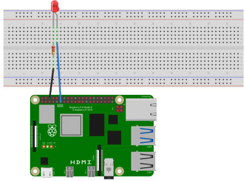
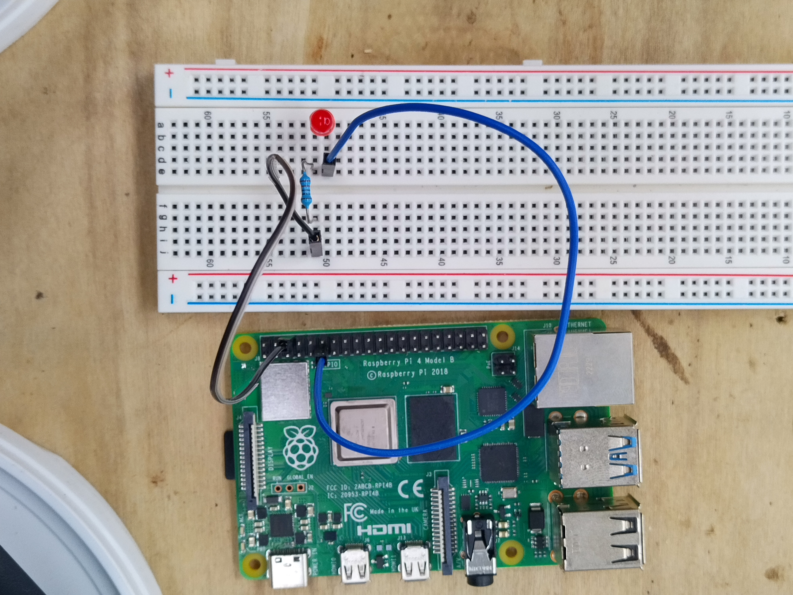

import { Tabs, TabItem, Steps } from "@astrojs/starlight/components";

**{frontmatter.description}**  
Written by: {frontmatter.author}  
_Last updated: {frontmatter.lastupdated}_

---

:::caution[Before you begin:]
When working with Raspberry Pi GPIO pins, it's crucial to handle the
setup and cleanup processes carefully.

- Always ensure that the GPIO pins are properly initialised before use and cleaned up afterwards to
  prevent any damage to your Raspberry Pi
- Be mindful of static electricity which can pose a serious risk to the sensitive electronic
  components on the board
- Before touching the Raspberry Pi or any connected components, ground yourself to eliminate any
  static charge that may have accumulated.

These precautions help to ensure your device is protected from potential harm caused by electrostatic
discharges.
:::

General-purpose input/output, or GPIO, pins are a type of pin found on many microcontrollers that
can be used for a variety of purposes. These pins can be used to receive signals from sensors, or
send them to control LEDs or motors, and so much more. The ability to effectively use these
interfaces enables a huge range of interesting projects with real-world impact. In this guide,
we cover the basics of GPIO pins and how to use them in your projects.

In a Raspberry Pi all pins are digital and individual GPIO pins are defined with two unique numbers,
the physical pin number and the Broadcom SOC Channel (BCM) pin number. They can be found on the
internet by searching for a "Raspberry Pi Pinout". In SplashKit, we use the physical pin numbers to
reference the GPIO pins.

:::tip[Digital Signals]
As mentioned previously, the GPIO pins on a Raspberry Pi are all digital, this means that it can
either be powered at a certain voltage or unpowered, which can then be read as a one or zero. In
analog signals the voltage continuously varies, however this needs particular hardware which the
Raspberry Pi lacks and is out of the scope of this guide.
:::

## Components

### Breadboard

Breadboards are reusable devices used to build and test circuits. They are made up of a number of
holes that are connected by hidden metal strips. Along the top and bottoms are the ground and power
rails, and in the middle there are two sections separated by a channel. Each hole in a section is
connected to the adjacent vertical holes. More information can be found at
[How to Use a Breadboard](https://learn.sparkfun.com/tutorials/how-to-use-a-breadboard/all).

### LED

An LED (Light Emitting Diode) is a device that emits light when an electric current passes through
it. They feature two legs, a longer positive leg (the [anode](https://en.wikipedia.org/wiki/Anode))
and a shorter negative leg (the [cathode](https://en.wikipedia.org/wiki/Cathode)). The longer leg is
often kinked so that both legs protrude the same distance from the LED. To use it we connect the positive
lead to the GPIO pin and the negative lead to a ground pin. More information can be found at
[Light-Emitting Diodes (LEDs)](https://learn.sparkfun.com/tutorials/light-emitting-diodes-leds/all)

### 220 Ω Resistor

The power that the Raspberry Pi can provide is actually too much for these LEDs. To prevent the LED
from burning out, we must add a resistor to the circuit. The resistor limits the current that
flows through the LED, preventing it from burning out. The exact value of the resistor is not
critical, but too high a value does not allow enough illumination of the LED. A resistor in the
range of 220 Ω to 1 kΩ should work well. More information on resistors can be found at
[Sparkfun - Resistors](https://learn.sparkfun.com/tutorials/resistors/all)

:::tip[Resistor Colour Code]
The colours on a resistor indicate the resistance value. Each coloured band corresponds to specific
numbers and multipliers which can be used to calculate the resistance value. More information
can be found at [Electronic Colour Code](https://en.wikipedia.org/wiki/Electronic_color_code)
:::

### Jumper Wires

Jumper Wires, or DuPont wires, are used to make a temporary connection **between** different components. They
can be M/M, M/F, or F/F. We are using M/F jumper wires in this guide.

## The Circuit

Below we can see the circuit diagram for this project. We have the anode (longer wire) of the LED connected to
GPIO Pin 11, while the cathode (shorter wire) is connected to ground pin 6 through a resistor.



And the physical circuit looks like the following image, in which we've connected an M/F jumper wire
from Pin 11 to the cathode of the LED. The anode of the LED is connected to the resistor, which is
then connected to the ground pin through another M/F jumper wire.



## Starting the Daemon

:::tip[Daemons]
A daemon is a background process that runs continuously, waiting for requests to
perform some action. In this case, the daemon is waiting for requests to change the state of the
GPIO pins. This allows us to run multiple programs that interact with the GPIO pins.
:::

Underneath SplashKit we use the [Pigpio library](https://abyz.me.uk/rpi/pigpio), specifically its
daemon. To interface with this daemon, it must be running. If it is not running we can expect
some output like the following:

```shell
gpio_init() must be called before any other GPIO functions
```

or

```shell
ERROR [default] Pigpio error: bad connect.
```

We can check if it's running by using the following command:

```shell
ps aux | grep pigpiod
```

If the daemon is not running, we can start it by using:

```shell
sudo pigpiod
```

:::note
The pigpio daemon listens on TCP port **8888** by default.  
If you need a different port, start it with `sudo pigpiod -p <port>` (e.g., `-p 8888`).  
For **remote** control from another machine, ensure this port is reachable on your network.  
See the remote access guide for networking help: https://programmers.guide/book/appendix/0-installation/4-0-remote-access-pi/
:::

To stop the daemon from running we can use the command:

```shell
sudo killall pigpiod
```

## The Code

After the daemon is running, we can then create our program. Below is an example program that
blinks an LED on and off.

<Tabs syncKey="execution-mode">
<TabItem label="Local">

<Tabs syncKey="code-language">
<TabItem label="C++">

```cpp
#include "splashkit.h"

int main()
{
    raspi_init();
    gpio_pin led_pin = PIN_11;
    raspi_set_mode(led_pin, GPIO_OUTPUT);

    open_window("dummy_window", 1, 1);
    while(!any_key_pressed())
    {
        process_events();
        raspi_write(led_pin, GPIO_HIGH);
        delay(500);
        raspi_write(led_pin, GPIO_LOW);
        delay(500);
    }

    close_all_windows();
    raspi_cleanup();
    return 0;
}
```

</TabItem>
<TabItem label="C#">

<Tabs syncKey="csharp-style">
<TabItem label="Top-level Statements">

```csharp
using SplashKitSDK;
using static SplashKitSDK.SplashKit;

RaspiInit();
GpioPin ledPin = (GpioPin) 11;
RaspiSetMode(ledPin, (GpioPinMode) 1);

OpenWindow("dummy_window", 1, 1);
while(!AnyKeyPressed())
{
    ProcessEvents();
    RaspiWrite(ledPin, (GpioPinValue) 1);
    Delay(500);
    RaspiWrite(ledPin, (GpioPinValue) 0);
    Delay(500);
}

CloseAllWindows();
RaspiCleanup();
```

</TabItem>
<TabItem label="Object-Oriented">

```csharp
using SplashKitSDK;

namespace RaspberryPiBlinkingLED
{
    public class Program
    {
        public static void Main()
        {
            SplashKit.RaspiInit();
            GpioPin ledPin = GpioPin.Pin11;
            SplashKit.RaspiSetMode(ledPin, GpioPinMode.GpioOutput);

            SplashKit.OpenWindow("dummy_window", 1, 1);
            while (!SplashKit.AnyKeyPressed())
            {
                SplashKit.ProcessEvents();
                SplashKit.RaspiWrite(ledPin, GpioPinValue.GpioHigh);
                SplashKit.Delay(500);
                SplashKit.RaspiWrite(ledPin, GpioPinValue.GpioLow);
                SplashKit.Delay(500);
            }

            SplashKit.CloseAllWindows();
            SplashKit.RaspiCleanup();
        }
    }
}
```

</TabItem>
</Tabs>
</TabItem> <!-- end Local -->

<TabItem label="Remote">

:::note
**Remote mode requires the Raspberry Pi daemon** to be running on the target Pi.  
Default port: **8888** (override with `sudo pigpiod -p <port>`).  
Make sure the Pi’s IP/port is reachable from your computer.
:::

**How Remote works:**  
All remote functions have a `remote_` prefix.  
Except for `remote_raspi_init()`, every remote function takes the **connection object as the first parameter**, followed by the same parameters as the local version.

**`remote_raspi_init(name, ip, port)`**  
- **name**: a string label for this connection (used by other APIs like `connection_named()`)  
- **ip**: the Raspberry Pi’s IP address (find via `ifconfig` on the Pi)  
- **port**: daemon TCP port (default **8888**, or the value you started pigpio with)  
Returns: a **connection** object. You can keep multiple connections to control several Pis.

<Tabs syncKey="code-language">
<TabItem label="C++">

```cpp
#include "splashkit.h"

int main()
{
    // Create a remote connection to the Pi named "pi1"
    connection conn = remote_raspi_init("pi1", "192.168.1.42", 8888);

    gpio_pin led_pin = PIN_11;
    remote_raspi_set_mode(conn, led_pin, GPIO_OUTPUT);

    open_window("dummy_window", 1, 1);
    while(!any_key_pressed())
    {
        process_events();
        remote_raspi_write(conn, led_pin, GPIO_HIGH);
        delay(500);
        remote_raspi_write(conn, led_pin, GPIO_LOW);
        delay(500);
    }

    close_all_windows();
    remote_raspi_cleanup(conn);
    return 0;
}
```

</TabItem>
<TabItem label="C#">

<Tabs syncKey="csharp-style">
<TabItem label="Top-level Statements">

```csharp
using SplashKitSDK;
using static SplashKitSDK.SplashKit;

// Make a remote connection to the Pi named "pi1"
var conn = RemoteRaspiInit("pi1", "192.168.1.42", 8888);

GpioPin ledPin = (GpioPin) 11;
RemoteRaspiSetMode(conn, ledPin, (GpioPinMode) 1);

OpenWindow("dummy_window", 1, 1);
while(!AnyKeyPressed())
{
    ProcessEvents();
    RemoteRaspiWrite(conn, ledPin, (GpioPinValue) 1);
    Delay(500);
    RemoteRaspiWrite(conn, ledPin, (GpioPinValue) 0);
    Delay(500);
}

CloseAllWindows();
RemoteRaspiCleanup(conn);
```

</TabItem>
<TabItem label="Object-Oriented">

```csharp
using SplashKitSDK;

namespace RaspberryPiBlinkingLED
{
    public class Program
    {
        public static void Main()
        {
            // Create a remote connection to the Pi named "pi1"
            var conn = SplashKit.RemoteRaspiInit("pi1", "192.168.1.42", 8888);

            GpioPin ledPin = GpioPin.Pin11;
            SplashKit.RemoteRaspiSetMode(conn, ledPin, GpioPinMode.GpioOutput);

            SplashKit.OpenWindow("dummy_window", 1, 1);
            while (!SplashKit.AnyKeyPressed())
            {
                SplashKit.ProcessEvents();
                SplashKit.RemoteRaspiWrite(conn, ledPin, GpioPinValue.GpioHigh);
                SplashKit.Delay(500);
                SplashKit.RemoteRaspiWrite(conn, ledPin, GpioPinValue.GpioLow);
                SplashKit.Delay(500);
            }

            SplashKit.CloseAllWindows();
            SplashKit.RemoteRaspiCleanup(conn);
        }
    }
}
```

</TabItem>
</Tabs>
</TabItem> <!-- end Remote -->
</Tabs> <!-- end execution-mode -->

### Understanding the code

To understand this code better, let’s break it down and explore each section.  
The **Remote** version is identical in logic; it simply uses `remote_` function names and passes the `connection` as the first parameter.

<Steps>

1. **Initialise GPIO Hardware:**  
   Locally we call [Raspi Init](/api/raspberry/#raspi-init).  
   For Remote, we first call `remote_raspi_init(name, ip, port)` to create a connection, then use the remote versions.

2. **Get User Inputs:**  
   Open a tiny window using [Open Window](/api/windows/#open-window) so SplashKit can process events. The loop runs until [Any Key Pressed](/api/input/#any-key-pressed) becomes true.

3. **Blink the LED:**  
   Inside the loop toggle with [Raspi Write](/api/raspberry/#raspi-write) locally, or `remote_raspi_write(conn, …)` remotely.

4. **Clean Up Memory:**  
   Close the window and call [Raspi Cleanup](/api/raspberry/#raspi-cleanup) locally, or `remote_raspi_cleanup(conn)` remotely.

</Steps>

:::tip[Program Shutdown]
It is crucial we plan for the program's shutdown procedure, because if we instead used `CTRL + C` to stop the program then cleanup is not performed and the GPIO pins remain in the same state they were in when the program was stopped. We do not want to unintentionally keep pins active.
:::

### Build and run the code

We can build this program with the following command:

<Tabs syncKey="code-language">
<TabItem label="C++">

```shell
g++ led_blink.cpp -l SplashKit -o led_blink
```

</TabItem>
<TabItem label="C#">

```shell
dotnet build
```

</TabItem>
</Tabs>

Then we run the program with the following command:

<Tabs syncKey="code-language">
<TabItem label="C++">

```shell
./led_blink
```

</TabItem>
<TabItem label="C#">

```shell
dotnet run
```

</TabItem>
</Tabs>

This code blinks the LED on and off as you can see below. This continues until the 10 seconds has
elapsed, and after we exit the while loop, [Raspi Cleanup](/api/raspberry/#raspi-cleanup) is
called and the GPIO pins are reset.


