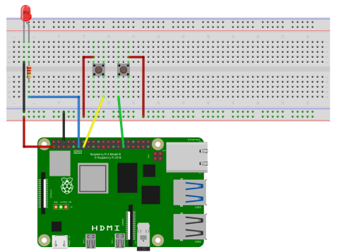
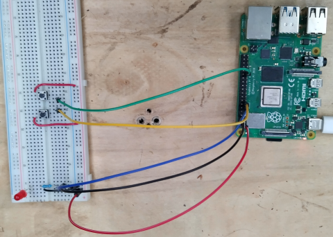

import { Tabs, TabItem, Steps } from "@astrojs/starlight/components";

**{frontmatter.description}**  
Written by: {frontmatter.author}  
_Last updated: {frontmatter.lastupdated}_

---

In this tutorial, we bring all the previous lessons together. We are reading button presses and will use these readings to modify the brightness of an LED by changing the PWM duty cycle. This tutorial brings together digital pin reading, writing and PWM modification. This is a simple demonstration of how to integrate various physical components and get them working with each other.

## Components

See [Blink LED Tutorial](/guides/raspberry-gpio/0-blink-led/#components) for more details on these components.

- Breadboard
- LED
- 220 Ω Resistor
- Jumper Wires

See [Read Button Press Tutorial](/guides/raspberry-gpio/1-read-button-press/#components) for more details on these components:

- 2 Push Buttons

## The Circuit

Below we can see the circuit diagram for this project. First we have the Raspberry Pi ground connected to the ground rail of the breadboard and a 3.3V pin connected to the power rail of the bread board. We then have an LED which is connected to the ground rail and to Pin 11 through a 220 Ω  resistor. Next we have 2 buttons, where both are connected to the powered rail on the breadboard and the otherside of the buttons are connected to pins 13 and 29.





## The Code

:::caution[Before running the code.]
This code requires the `pigpio` daemon, so make sure it is running! For more information see: [Starting the Daemon](/guides/raspberry-gpio/0-blink-led/#starting-the-daemon)
:::

Below is an example program that will detect button presses to increase or decrease the brightness of an LED.

<Tabs syncKey="code-language">
<TabItem label="C++">

<Tabs syncKey="gpio-mode">
<TabItem label="Local">
  
```cpp
#include "splashkit.h"

int main()
{
    int brightness = 128;
    const int max_brightness = 255;
    unsigned long last_read_time = 0;
    const unsigned long read_interval = 400;

    raspi_init();
    gpio_pin led_pin = PIN_11;
    gpio_pin increase_btn_pin = PIN_13;
    gpio_pin decrease_btn_pin = PIN_29;

    raspi_set_mode(led_pin, GPIO_OUTPUT);
    raspi_set_pwm_dutycycle(led_pin, brightness);

    raspi_set_mode(increase_btn_pin, GPIO_INPUT);
    raspi_set_mode(decrease_btn_pin, GPIO_INPUT);

    raspi_set_pull_up_down(increase_btn_pin, PUD_DOWN);
    raspi_set_pull_up_down(decrease_btn_pin, PUD_DOWN);

    timer run_timer = create_timer("run_timer");
    start_timer(run_timer);
    unsigned long current_time = 0;

    open_window("dummy_window", 1, 1);
    while(!any_key_pressed())
    {
        process_events();
        current_time = timer_ticks(run_timer);
        if(current_time - last_read_time > read_interval)
        {
            if(raspi_read(increase_btn_pin) == GPIO_HIGH)
            {
                brightness += 25;
                if(brightness > max_brightness)
                    brightness = max_brightness;
                raspi_set_pwm_dutycycle(led_pin, brightness);
                last_read_time = current_time;
            }
            if(raspi_read(decrease_btn_pin) == GPIO_HIGH)
            {
                brightness -= 25;
                if(brightness < 0)
                    brightness = 0;
                raspi_set_pwm_dutycycle(led_pin, brightness);
                last_read_time = current_time;
            }
        }
    }

    close_all_windows();
    stop_timer(run_timer);
    free_all_timers();
    raspi_cleanup();
    return 0;
}
```

</TabItem>
<TabItem label="Remote">

:::note[Remote GPIO Setup Required]
For remote GPIO operations, ensure the `pigpio` daemon is running on your Raspberry Pi. For detailed setup instructions, see the [Remote Access Guide](https://programmers.guide/book/appendix/0-installation/4-0-remote-access-pi/).
:::
  
```cpp
#include "splashkit.h"

int main()
{
    int brightness = 128;
    const int max_brightness = 255;
    unsigned long last_read_time = 0;
    const unsigned long read_interval = 400;

    // Initialize remote connection to Raspberry Pi
    // Parameters: connection name, IP address, port (default: 8888)
    connection pi_connection = remote_raspi_init("my_pi", "192.168.1.100", 8888);
    
    gpio_pin led_pin = PIN_11;
    gpio_pin increase_btn_pin = PIN_13;
    gpio_pin decrease_btn_pin = PIN_29;

    remote_raspi_set_mode(pi_connection, led_pin, GPIO_OUTPUT);
    remote_raspi_set_pwm_dutycycle(pi_connection, led_pin, brightness);

    remote_raspi_set_mode(pi_connection, increase_btn_pin, GPIO_INPUT);
    remote_raspi_set_mode(pi_connection, decrease_btn_pin, GPIO_INPUT);

    remote_raspi_set_pull_up_down(pi_connection, increase_btn_pin, PUD_DOWN);
    remote_raspi_set_pull_up_down(pi_connection, decrease_btn_pin, PUD_DOWN);

    timer run_timer = create_timer("run_timer");
    start_timer(run_timer);
    unsigned long current_time = 0;

    open_window("dummy_window", 1, 1);
    while(!any_key_pressed())
    {
        process_events();
        current_time = timer_ticks(run_timer);
        if(current_time - last_read_time > read_interval)
        {
            if(remote_raspi_read(pi_connection, increase_btn_pin) == GPIO_HIGH)
            {
                brightness += 25;
                if(brightness > max_brightness)
                    brightness = max_brightness;
                remote_raspi_set_pwm_dutycycle(pi_connection, led_pin, brightness);
                last_read_time = current_time;
            }
            if(remote_raspi_read(pi_connection, decrease_btn_pin) == GPIO_HIGH)
            {
                brightness -= 25;
                if(brightness < 0)
                    brightness = 0;
                remote_raspi_set_pwm_dutycycle(pi_connection, led_pin, brightness);
                last_read_time = current_time;
            }
        }
    }

    close_all_windows();
    stop_timer(run_timer);
    free_all_timers();
    remote_raspi_cleanup(pi_connection);
    return 0;
}
```

</TabItem>
</Tabs>

</TabItem>
<TabItem label="C#">

<Tabs syncKey="csharp-style">
<TabItem label="Top-level Statements">

```csharp
using static SplashKitSDK.SplashKit;

int brightness = 128;
const int maxBrightness = 255;
ulong lastReadTime = 0;
const ulong readInterval = 400;

RaspiInit();
Pins ledPin = Pins.Pin11;
Pins increaseBtnPin = Pins.Pin13;
Pins decreaseBtnPin = Pins.Pin29;

RaspiSetMode(ledPin, PinModes.GpioOutput);
RaspiSetPwmDutycycle(ledPin, brightness);

RaspiSetMode(increaseBtnPin, PinModes.GpioInput);
RaspiSetMode(decreaseBtnPin, PinModes.GpioInput);

RaspiSetPullUpDown(increaseBtnPin, PullUpDown.PudDown);
RaspiSetPullUpDown(decreaseBtnPin, PullUpDown.PudDown);

Timer runTimer = CreateTimer("run_timer");
StartTimer(runTimer);
ulong currentTime = 0;

OpenWindow("dummy_window", 1, 1);
while (!AnyKeyPressed())
{
    ProcessEvents();
    currentTime = TimerTicks(runTimer);
    if (currentTime - lastReadTime > readInterval)
    {
        if (RaspiRead(increaseBtnPin) == PinValues.GpioHigh)
        {
            brightness += 25;
            if (brightness > maxBrightness)
                brightness = maxBrightness;
            RaspiSetPwmDutycycle(ledPin, brightness);
            lastReadTime = currentTime;
        }
        if (RaspiRead(decreaseBtnPin) == PinValues.GpioHigh)
        {
            brightness -= 25;
            if (brightness < 0)
                brightness = 0;
            RaspiSetPwmDutycycle(ledPin, brightness);
            lastReadTime = currentTime;
        }
    }
}

CloseAllWindows();
StopTimer(runTimer);
FreeAllTimers();
RaspiCleanup();
```

</TabItem>
<TabItem label="Object-Oriented">

```csharp
using SplashKitSDK;

namespace PwmButtonControlExample
{
    public class Program
    {
        public static void Main()
        {
            int brightness = 128;
            const int maxBrightness = 255;
            ulong lastReadTime = 0;
            const ulong readInterval = 400;

            SplashKit.RaspiInit();
            Pins ledPin = Pins.Pin11;
            Pins increaseBtnPin = Pins.Pin13;
            Pins decreaseBtnPin = Pins.Pin29;

            SplashKit.RaspiSetMode(ledPin, PinModes.GpioOutput);
            SplashKit.RaspiSetPwmDutycycle(ledPin, brightness);

            SplashKit.RaspiSetMode(increaseBtnPin, PinModes.GpioInput);
            SplashKit.RaspiSetMode(decreaseBtnPin, PinModes.GpioInput);

            SplashKit.RaspiSetPullUpDown(increaseBtnPin, PullUpDown.PudDown);
            SplashKit.RaspiSetPullUpDown(decreaseBtnPin, PullUpDown.PudDown);

            Timer runTimer = SplashKit.CreateTimer("run_timer");
            SplashKit.StartTimer(runTimer);
            ulong currentTime = 0;

            SplashKit.OpenWindow("dummy_window", 1, 1);
            while (!SplashKit.AnyKeyPressed())
            {
                SplashKit.ProcessEvents();
                currentTime = SplashKit.TimerTicks(runTimer);
                if (currentTime - lastReadTime > readInterval)
                {
                    if (SplashKit.RaspiRead(increaseBtnPin) == PinValues.GpioHigh)
                    {
                        brightness += 25;
                        if (brightness > maxBrightness)
                            brightness = maxBrightness;
                        SplashKit.RaspiSetPwmDutycycle(ledPin, brightness);
                        lastReadTime = currentTime;
                    }
                    if (SplashKit.RaspiRead(decreaseBtnPin) == PinValues.GpioHigh)
                    {
                        brightness -= 25;
                        if (brightness < 0)
                            brightness = 0;
                        SplashKit.RaspiSetPwmDutycycle(ledPin, brightness);
                        lastReadTime = currentTime;
                    }
                }
            }

            SplashKit.CloseAllWindows();
            SplashKit.StopTimer(runTimer);
            SplashKit.FreeAllTimers();
            SplashKit.RaspiCleanup();
        }
    }
}
```

</TabItem>
</Tabs>

</TabItem>
</Tabs>

### Remote GPIO Operations

When using remote GPIO functions, you control GPIO pins on a Raspberry Pi from another computer over a network connection. This is particularly useful for:

- Developing and testing GPIO code from your main development machine
- Controlling multiple Raspberry Pis simultaneously from one program
- Running resource-intensive programs on a more powerful computer while controlling Pi hardware

#### Understanding `remote_raspi_init()`

The [`remote_raspi_init()`](https://splashkit.io/api/raspberry/#remote-raspi-init) function establishes a network connection to your Raspberry Pi. It requires three parameters:

1. **Name** (string): A unique identifier for this connection  
   - Used to reference this specific Pi with functions like [`connection_named()`](https://splashkit.io/api/networking/#connection-named)
   - Useful when controlling multiple Pis: e.g., "living_room_pi", "garage_pi"
   
2. **IP Address** (string): The network address of your Raspberry Pi  
   - Find it by running `ifconfig` or `hostname -I` on your Pi
   - Example: "192.168.1.100" or "10.0.0.50"
   
3. **Port** (integer): The port where the pigpio daemon is listening  
   - Default is `8888`
   - Change with the `-p` flag when starting the daemon: `sudo pigpiod -p <port_number>`

**Return Value**: Returns a `connection` object that must be passed as the first parameter to all other remote GPIO functions.

#### Using Remote Functions

All remote GPIO functions follow this pattern:

- They have the `remote_` prefix (e.g., `remote_raspi_set_mode`, `remote_raspi_read`)
- The **first parameter** is always the `connection` object returned by `remote_raspi_init()`
- **Remaining parameters** are identical to the local version of the function

Example comparison:

```cpp
// Local version
raspi_set_mode(PIN_11, GPIO_OUTPUT);

// Remote version  
connection pi = remote_raspi_init("my_pi", "192.168.1.100", 8888);
remote_raspi_set_mode(pi, PIN_11, GPIO_OUTPUT);
```

:::tip[Controlling Multiple Raspberry Pis]
You can control multiple Pis simultaneously by creating multiple connections:

```cpp
connection pi1 = remote_raspi_init("bedroom_pi", "192.168.1.100", 8888);
connection pi2 = remote_raspi_init("kitchen_pi", "192.168.1.101", 8888);

remote_raspi_write(pi1, PIN_11, GPIO_HIGH);  // Control first Pi
remote_raspi_write(pi2, PIN_13, GPIO_HIGH);  // Control second Pi
```
:::

### Understanding the code

Okay, now lets break down this code and look at its sections.

<Steps>

1. **Initialise Values:**

    Firtly, we set up the variables that we're going to need: `brightness` is given an inital value of 128 which is 50% of our maximum, 255. `last_read_time` is set to 0 and `read_interval` is set to 400.

    We are using this to implement a simple debounce technique, in which we wait a short period of time (the interval), in a non-blocking manner, to make sure the pushbutton is definitely pressed.

    <Tabs syncKey="code-language">
    <TabItem label="C++">

    <Tabs syncKey="gpio-mode">
    <TabItem label="Local">

    ```cpp {5-8}
    #include "splashkit.h"

    int main()
    {
        int brightness = 128;
        const int max_brightness = 255;
        unsigned long last_read_time = 0;
        const unsigned long read_interval = 400;

        raspi_init();
        gpio_pin led_pin = PIN_11;
        gpio_pin increase_btn_pin = PIN_13;
        gpio_pin decrease_btn_pin = PIN_29;

        raspi_set_mode(led_pin, GPIO_OUTPUT);
        raspi_set_pwm_dutycycle(led_pin, brightness);

        raspi_set_mode(increase_btn_pin, GPIO_INPUT);
        raspi_set_mode(decrease_btn_pin, GPIO_INPUT);
        raspi_set_pull_up_down(increase_btn_pin, PUD_DOWN);
        raspi_set_pull_up_down(decrease_btn_pin, PUD_DOWN);

        timer run_timer = create_timer("run_timer");
        start_timer(run_timer);
        unsigned long current_time = 0;

        open_window("dummy_window", 1, 1);
        while(!any_key_pressed())
        {
            process_events();
            current_time = timer_ticks(run_timer);
            if(current_time - last_read_time > read_interval)
            {
                if(raspi_read(increase_btn_pin) == GPIO_HIGH)
                {
                    brightness += 25;
                    if(brightness > max_brightness)
                        brightness = max_brightness;
                    raspi_set_pwm_dutycycle(led_pin, brightness);
                    last_read_time = current_time;
                }
                if(raspi_read(decrease_btn_pin) == GPIO_HIGH)
                {
                    brightness -= 25;
                    if(brightness < 0)
                        brightness = 0;
                    raspi_set_pwm_dutycycle(led_pin, brightness);
                    last_read_time = current_time;
                }
            }
        }

        close_all_windows();
        stop_timer(run_timer);
        free_all_timers();
        raspi_cleanup();
        return 0;
    }
    ```

    </TabItem>
    <TabItem label="Remote">

    ```cpp
    #include "splashkit.h"

    int main()
    {
        int brightness = 128;
        const int max_brightness = 255;
        unsigned long last_read_time = 0;
        const unsigned long read_interval = 400;

        connection pi_connection = remote_raspi_init("my_pi", "192.168.1.100", 8888);
        gpio_pin led_pin = PIN_11;
        gpio_pin increase_btn_pin = PIN_13;
        gpio_pin decrease_btn_pin = PIN_29;

        remote_raspi_set_mode(pi_connection, led_pin, GPIO_OUTPUT);
        remote_raspi_set_pwm_dutycycle(pi_connection, led_pin, brightness);

        remote_raspi_set_mode(pi_connection, increase_btn_pin, GPIO_INPUT);
        remote_raspi_set_mode(pi_connection, decrease_btn_pin, GPIO_INPUT);
        remote_raspi_set_pull_up_down(pi_connection, increase_btn_pin, PUD_DOWN);
        remote_raspi_set_pull_up_down(pi_connection, decrease_btn_pin, PUD_DOWN);

        timer run_timer = create_timer("run_timer");
        start_timer(run_timer);
        unsigned long current_time = 0;

        open_window("dummy_window", 1, 1);
        while(!any_key_pressed())
        {
            process_events();
            current_time = timer_ticks(run_timer);
            if(current_time - last_read_time > read_interval)
            {
                if(remote_raspi_read(pi_connection, increase_btn_pin) == GPIO_HIGH)
                {
                    brightness += 25;
                    if(brightness > max_brightness)
                        brightness = max_brightness;
                    remote_raspi_set_pwm_dutycycle(pi_connection, led_pin, brightness);
                    last_read_time = current_time;
                }
                if(remote_raspi_read(pi_connection, decrease_btn_pin) == GPIO_HIGH)
                {
                    brightness -= 25;
                    if(brightness < 0)
                        brightness = 0;
                    remote_raspi_set_pwm_dutycycle(pi_connection, led_pin, brightness);
                    last_read_time = current_time;
                }
            }
        }

        close_all_windows();
        stop_timer(run_timer);
        free_all_timers();
        remote_raspi_cleanup(pi_connection);
        return 0;
    }
    ```

    </TabItem>
    </Tabs>

    </TabItem>
    <TabItem label="C#">

    <Tabs syncKey="csharp-style">
    <TabItem label="Top-level Statements">

    ```csharp {1-4}
    using static SplashKitSDK.SplashKit;

    int brightness = 128;
    const int maxBrightness = 255;
    ulong lastReadTime = 0;
    const ulong readInterval = 400;

    RaspiInit();
    Pins ledPin = Pins.Pin11;
    Pins increaseBtnPin = Pins.Pin13;
    Pins decreaseBtnPin = Pins.Pin29;

    RaspiSetMode(ledPin, PinModes.GpioOutput);
    RaspiSetPwmDutycycle(ledPin, brightness);

    RaspiSetMode(increaseBtnPin, PinModes.GpioInput);
    RaspiSetMode(decreaseBtnPin, PinModes.GpioInput);

    RaspiSetPullUpDown(increaseBtnPin, PullUpDown.PudDown);
    RaspiSetPullUpDown(decreaseBtnPin, PullUpDown.PudDown);

    Timer runTimer = CreateTimer("run_timer");
    StartTimer(runTimer);
    ulong currentTime = 0;

    OpenWindow("dummy_window", 1, 1);
    while (!AnyKeyPressed())
    {
        ProcessEvents();
        currentTime = TimerTicks(runTimer);
        if (currentTime - lastReadTime > readInterval)
        {
            if (RaspiRead(increaseBtnPin) == PinValues.GpioHigh)
            {
                brightness += 25;
                if (brightness > maxBrightness)
                    brightness = maxBrightness;
                RaspiSetPwmDutycycle(ledPin, brightness);
                lastReadTime = currentTime;
            }
            if (RaspiRead(decreaseBtnPin) == PinValues.GpioHigh)
            {
                brightness -= 25;
                if (brightness < 0)
                    brightness = 0;
                RaspiSetPwmDutycycle(ledPin, brightness);
                lastReadTime = currentTime;
            }
        }
    }

    CloseAllWindows();
    StopTimer(runTimer);
    FreeAllTimers();
    RaspiCleanup();
    ```

    </TabItem>
    <TabItem label="Object-Oriented">

    ```csharp {7-10}
    using SplashKitSDK;

    namespace PwmButtonControlExample
    {
        public class Program
        {
            public static void Main()
            {
                int brightness = 128;
                const int maxBrightness = 255;
                ulong lastReadTime = 0;
                const ulong readInterval = 400;

                SplashKit.RaspiInit();
                Pins ledPin = Pins.Pin11;
                Pins increaseBtnPin = Pins.Pin13;
                Pins decreaseBtnPin = Pins.Pin29;

                SplashKit.RaspiSetMode(ledPin, PinModes.GpioOutput);
                SplashKit.RaspiSetPwmDutycycle(ledPin, brightness);

                SplashKit.RaspiSetMode(increaseBtnPin, PinModes.GpioInput);
                SplashKit.RaspiSetMode(decreaseBtnPin, PinModes.GpioInput);

                SplashKit.RaspiSetPullUpDown(increaseBtnPin, PullUpDown.PudDown);
                SplashKit.RaspiSetPullUpDown(decreaseBtnPin, PullUpDown.PudDown);

                Timer runTimer = SplashKit.CreateTimer("run_timer");
                SplashKit.StartTimer(runTimer);
                ulong currentTime = 0;

                SplashKit.OpenWindow("dummy_window", 1, 1);
                while (!SplashKit.AnyKeyPressed())
                {
                    SplashKit.ProcessEvents();
                    currentTime = SplashKit.TimerTicks(runTimer);
                    if (currentTime - lastReadTime > readInterval)
                    {
                        if (SplashKit.RaspiRead(increaseBtnPin) == PinValues.GpioHigh)
                        {
                            brightness += 25;
                            if (brightness > maxBrightness)
                                brightness = maxBrightness;
                            SplashKit.RaspiSetPwmDutycycle(ledPin, brightness);
                            lastReadTime = currentTime;
                        }
                        if (SplashKit.RaspiRead(decreaseBtnPin) == PinValues.GpioHigh)
                        {
                            brightness -= 25;
                            if (brightness < 0)
                                brightness = 0;
                            SplashKit.RaspiSetPwmDutycycle(ledPin, brightness);
                            lastReadTime = currentTime;
                        }
                    }
                }

                SplashKit.CloseAllWindows();
                SplashKit.StopTimer(runTimer);
                SplashKit.FreeAllTimers();
                SplashKit.RaspiCleanup();
            }
        }
    }
    ```

    </TabItem>
    </Tabs>

    </TabItem>
    </Tabs>

2. **Initialise Hardware:**

    Now we do our GPIO setup, where we call `raspi_init` and define the pins we are using.

    <Tabs syncKey="code-language">
    <TabItem label="C++">

    ```cpp {10-13}
    #include "splashkit.h"

    int main()
    {
        int brightness = 128;
        const int max_brightness = 255;
        unsigned long last_read_time = 0;
        const unsigned long read_interval = 400;

        raspi_init();
        gpio_pin led_pin = PIN_11;
        gpio_pin increase_btn_pin = PIN_13;
        gpio_pin decrease_btn_pin = PIN_29;

        raspi_set_mode(led_pin, GPIO_OUTPUT);
        raspi_set_pwm_dutycycle(led_pin, brightness);

        raspi_set_mode(increase_btn_pin, GPIO_INPUT);
        raspi_set_mode(decrease_btn_pin, GPIO_INPUT);

        raspi_set_pull_up_down(increase_btn_pin, PUD_DOWN);
        raspi_set_pull_up_down(decrease_btn_pin, PUD_DOWN);

        timer run_timer = create_timer("run_timer");
        start_timer(run_timer);
        unsigned long current_time = 0;

        open_window("dummy_window", 1, 1);
        while(!any_key_pressed())
        {
            process_events();
            current_time = timer_ticks(run_timer);
            if(current_time - last_read_time > read_interval)
            {
                if(raspi_read(increase_btn_pin) == GPIO_HIGH)
                {
                    brightness += 25;
                    if(brightness > max_brightness)
                        brightness = max_brightness;
                    raspi_set_pwm_dutycycle(led_pin, brightness);
                    last_read_time = current_time;
                }
                if(raspi_read(decrease_btn_pin) == GPIO_HIGH)
                {
                    brightness -= 25;
                    if(brightness < 0)
                        brightness = 0;
                    raspi_set_pwm_dutycycle(led_pin, brightness);
                    last_read_time = current_time;
                }
            }
        }

        close_all_windows();
        stop_timer(run_timer);
        free_all_timers();
        raspi_cleanup();
        return 0;
    }
    ```

    </TabItem>
    <TabItem label="C#">

    <Tabs syncKey="csharp-style">
    <TabItem label="Top-level Statements">

    ```csharp {8-11}
    using static SplashKitSDK.SplashKit;

    int brightness = 128;
    const int maxBrightness = 255;
    ulong lastReadTime = 0;
    const ulong readInterval = 400;

    RaspiInit();
    Pins ledPin = Pins.Pin11;
    Pins increaseBtnPin = Pins.Pin13;
    Pins decreaseBtnPin = Pins.Pin29;

    RaspiSetMode(ledPin, PinModes.GpioOutput);
    RaspiSetPwmDutycycle(ledPin, brightness);

    RaspiSetMode(increaseBtnPin, PinModes.GpioInput);
    RaspiSetMode(decreaseBtnPin, PinModes.GpioInput);

    RaspiSetPullUpDown(increaseBtnPin, PullUpDown.PudDown);
    RaspiSetPullUpDown(decreaseBtnPin, PullUpDown.PudDown);

    Timer runTimer = CreateTimer("run_timer");
    StartTimer(runTimer);
    ulong currentTime = 0;

    OpenWindow("dummy_window", 1, 1);
    while (!AnyKeyPressed())
    {
        ProcessEvents();
        currentTime = TimerTicks(runTimer);
        if (currentTime - lastReadTime > readInterval)
        {
            if (RaspiRead(increaseBtnPin) == PinValues.GpioHigh)
            {
                brightness += 25;
                if (brightness > maxBrightness)
                    brightness = maxBrightness;
                RaspiSetPwmDutycycle(ledPin, brightness);
                lastReadTime = currentTime;
            }
            if (RaspiRead(decreaseBtnPin) == PinValues.GpioHigh)
            {
                brightness -= 25;
                if (brightness < 0)
                    brightness = 0;
                RaspiSetPwmDutycycle(ledPin, brightness);
                lastReadTime = currentTime;
            }
        }
    }

    CloseAllWindows();
    StopTimer(runTimer);
    FreeAllTimers();
    RaspiCleanup();
    ```

    </TabItem>
    <TabItem label="Object-Oriented">

    ```csharp {14-17}
    using SplashKitSDK;

    namespace PwmButtonControlExample
    {
        public class Program
        {
            public static void Main()
            {
                int brightness = 128;
                const int maxBrightness = 255;
                ulong lastReadTime = 0;
                const ulong readInterval = 400;

                SplashKit.RaspiInit();
                Pins ledPin = Pins.Pin11;
                Pins increaseBtnPin = Pins.Pin13;
                Pins decreaseBtnPin = Pins.Pin29;

                SplashKit.RaspiSetMode(ledPin, PinModes.GpioOutput);
                SplashKit.RaspiSetPwmDutycycle(ledPin, brightness);

                SplashKit.RaspiSetMode(increaseBtnPin, PinModes.GpioInput);
                SplashKit.RaspiSetMode(decreaseBtnPin, PinModes.GpioInput);

                SplashKit.RaspiSetPullUpDown(increaseBtnPin, PullUpDown.PudDown);
                SplashKit.RaspiSetPullUpDown(decreaseBtnPin, PullUpDown.PudDown);

                Timer runTimer = SplashKit.CreateTimer("run_timer");
                SplashKit.StartTimer(runTimer);
                ulong currentTime = 0;

                SplashKit.OpenWindow("dummy_window", 1, 1);
                while (!SplashKit.AnyKeyPressed())
                {
                    SplashKit.ProcessEvents();
                    currentTime = SplashKit.TimerTicks(runTimer);
                    if (currentTime - lastReadTime > readInterval)
                    {
                        if (SplashKit.RaspiRead(increaseBtnPin) == PinValues.GpioHigh)
                        {
                            brightness += 25;
                            if (brightness > maxBrightness)
                                brightness = maxBrightness;
                            SplashKit.RaspiSetPwmDutycycle(ledPin, brightness);
                            lastReadTime = currentTime;
                        }
                        if (SplashKit.RaspiRead(decreaseBtnPin) == PinValues.GpioHigh)
                        {
                            brightness -= 25;
                            if (brightness < 0)
                                brightness = 0;
                            SplashKit.RaspiSetPwmDutycycle(ledPin, brightness);
                            lastReadTime = currentTime;
                        }
                    }
                }

                SplashKit.CloseAllWindows();
                SplashKit.StopTimer(runTimer);
                SplashKit.FreeAllTimers();
                SplashKit.RaspiCleanup();
            }
        }
    }
    ```

    </TabItem>
    </Tabs>

    </TabItem>
    </Tabs>

3. **Set PWM Range, Duty Cycle and GPIO Pins:**

    Next, we setup our individual pins. We're going to write to the `led_pin` so we're setting that to output, and then we're setting its dutycycle to our initial brightness setting. Then we set our buttons to be inputs and set the pull-down resistors on them so that they are no longer floating and we can be sure they read `LOW` when not pressed.

    <Tabs syncKey="code-language">
    <TabItem label="C++">

    ```cpp {15-22}
    #include "splashkit.h"

    int main()
    {
        int brightness = 128;
        const int max_brightness = 255;
        unsigned long last_read_time = 0;
        const unsigned long read_interval = 400;

        raspi_init();
        gpio_pin led_pin = PIN_11;
        gpio_pin increase_btn_pin = PIN_13;
        gpio_pin decrease_btn_pin = PIN_29;

        raspi_set_mode(led_pin, GPIO_OUTPUT);
        raspi_set_pwm_dutycycle(led_pin, brightness);

        raspi_set_mode(increase_btn_pin, GPIO_INPUT);
        raspi_set_mode(decrease_btn_pin, GPIO_INPUT);

        raspi_set_pull_up_down(increase_btn_pin, PUD_DOWN);
        raspi_set_pull_up_down(decrease_btn_pin, PUD_DOWN);

        timer run_timer = create_timer("run_timer");
        start_timer(run_timer);
        unsigned long current_time = 0;

        open_window("dummy_window", 1, 1);
        while(!any_key_pressed())
        {
            process_events();
            current_time = timer_ticks(run_timer);
            if(current_time - last_read_time > read_interval)
            {
                if(raspi_read(increase_btn_pin) == GPIO_HIGH)
                {
                    brightness += 25;
                    if(brightness > max_brightness)
                        brightness = max_brightness;
                    raspi_set_pwm_dutycycle(led_pin, brightness);
                    last_read_time = current_time;
                }
                if(raspi_read(decrease_btn_pin) == GPIO_HIGH)
                {
                    brightness -= 25;
                    if(brightness < 0)
                        brightness = 0;
                    raspi_set_pwm_dutycycle(led_pin, brightness);
                    last_read_time = current_time;
                }
            }
        }

        close_all_windows();
        stop_timer(run_timer);
        free_all_timers();
        raspi_cleanup();
        return 0;
    }
    ```

    </TabItem>
    <TabItem label="C#">

    <Tabs syncKey="csharp-style">
    <TabItem label="Top-level Statements">

    ```csharp {13-20}
    using static SplashKitSDK.SplashKit;

    int brightness = 128;
    const int maxBrightness = 255;
    ulong lastReadTime = 0;
    const ulong readInterval = 400;

    RaspiInit();
    Pins ledPin = Pins.Pin11;
    Pins increaseBtnPin = Pins.Pin13;
    Pins decreaseBtnPin = Pins.Pin29;

    RaspiSetMode(ledPin, PinModes.GpioOutput);
    RaspiSetPwmDutycycle(ledPin, brightness);

    RaspiSetMode(increaseBtnPin, PinModes.GpioInput);
    RaspiSetMode(decreaseBtnPin, PinModes.GpioInput);

    RaspiSetPullUpDown(increaseBtnPin, PullUpDown.PudDown);
    RaspiSetPullUpDown(decreaseBtnPin, PullUpDown.PudDown);

    Timer runTimer = CreateTimer("run_timer");
    StartTimer(runTimer);
    ulong currentTime = 0;

    OpenWindow("dummy_window", 1, 1);
    while (!AnyKeyPressed())
    {
        ProcessEvents();
        currentTime = TimerTicks(runTimer);
        if (currentTime - lastReadTime > readInterval)
        {
            if (RaspiRead(increaseBtnPin) == PinValues.GpioHigh)
            {
                brightness += 25;
                if (brightness > maxBrightness)
                    brightness = maxBrightness;
                RaspiSetPwmDutycycle(ledPin, brightness);
                lastReadTime = currentTime;
            }
            if (RaspiRead(decreaseBtnPin) == PinValues.GpioHigh)
            {
                brightness -= 25;
                if (brightness < 0)
                    brightness = 0;
                RaspiSetPwmDutycycle(ledPin, brightness);
                lastReadTime = currentTime;
            }
        }
    }

    CloseAllWindows();
    StopTimer(runTimer);
    FreeAllTimers();
    RaspiCleanup();
    ```

    </TabItem>
    <TabItem label="Object-Oriented">

    ```csharp {19-26}
    using SplashKitSDK;

    namespace PwmButtonControlExample
    {
        public class Program
        {
            public static void Main()
            {
                int brightness = 128;
                const int maxBrightness = 255;
                ulong lastReadTime = 0;
                const ulong readInterval = 400;

                SplashKit.RaspiInit();
                Pins ledPin = Pins.Pin11;
                Pins increaseBtnPin = Pins.Pin13;
                Pins decreaseBtnPin = Pins.Pin29;

                SplashKit.RaspiSetMode(ledPin, PinModes.GpioOutput);
                SplashKit.RaspiSetPwmDutycycle(ledPin, brightness);

                SplashKit.RaspiSetMode(increaseBtnPin, PinModes.GpioInput);
                SplashKit.RaspiSetMode(decreaseBtnPin, PinModes.GpioInput);

                SplashKit.RaspiSetPullUpDown(increaseBtnPin, PullUpDown.PudDown);
                SplashKit.RaspiSetPullUpDown(decreaseBtnPin, PullUpDown.PudDown);

                Timer runTimer = SplashKit.CreateTimer("run_timer");
                SplashKit.StartTimer(runTimer);
                ulong currentTime = 0;

                SplashKit.OpenWindow("dummy_window", 1, 1);
                while (!SplashKit.AnyKeyPressed())
                {
                    SplashKit.ProcessEvents();
                    currentTime = SplashKit.TimerTicks(runTimer);
                    if (currentTime - lastReadTime > readInterval)
                    {
                        if (SplashKit.RaspiRead(increaseBtnPin) == PinValues.GpioHigh)
                        {
                            brightness += 25;
                            if (brightness > maxBrightness)
                                brightness = maxBrightness;
                            SplashKit.RaspiSetPwmDutycycle(ledPin, brightness);
                            lastReadTime = currentTime;
                        }
                        if (SplashKit.RaspiRead(decreaseBtnPin) == PinValues.GpioHigh)
                        {
                            brightness -= 25;
                            if (brightness < 0)
                                brightness = 0;
                            SplashKit.RaspiSetPwmDutycycle(ledPin, brightness);
                            lastReadTime = currentTime;
                        }
                    }
                }

                SplashKit.CloseAllWindows();
                SplashKit.StopTimer(runTimer);
                SplashKit.FreeAllTimers();
                SplashKit.RaspiCleanup();
            }
        }
    }
    ```

    </TabItem>
    </Tabs>

    </TabItem>
    </Tabs>
        unsigned long current_time = 0;

        open_window("dummy_window", 1, 1);
        while(!any_key_pressed())
        {
            process_events();
            current_time = timer_ticks(run_timer);
            if(current_time - last_read_time > read_interval)
            {
                if(raspi_read(increase_btn_pin) == GPIO_HIGH)
                {
                    brightness += 25;
                    if(brightness > max_brightness)
                        brightness = max_brightness;
                    raspi_set_pwm_dutycycle(led_pin, brightness);
                    last_read_time = current_time;
                }
                if(raspi_read(decrease_btn_pin) == GPIO_HIGH)
                {
                    brightness -= 25;
                    if(brightness < 0)
                        brightness = 0;
                    raspi_set_pwm_dutycycle(led_pin, brightness);
                    last_read_time = current_time;
                }
            }
        }

        close_all_windows();
        stop_timer(run_timer);
        free_all_timers();
        raspi_cleanup();
        return 0;
    }
    ```

    </TabItem>
    </Tabs>

4. **Get User Inputs (with debouncing):**

    So we can debounce our buttons we'll create timers and a variable to hold the current time. Like in previous tutorials, we define how our program is going to end to ensure cleanup. In this case we are opening up our dummy window and watching for any key presses.

    <Tabs syncKey="code-language">
    <TabItem label="C++">

    ```cpp {24-26,28-31,52}
    #include "splashkit.h"

    int main()
    {
        int brightness = 128;
        const int max_brightness = 255;
        unsigned long last_read_time = 0;
        const unsigned long read_interval = 400;

        raspi_init();
        gpio_pin led_pin = PIN_11;
        gpio_pin increase_btn_pin = PIN_13;
        gpio_pin decrease_btn_pin = PIN_29;

        raspi_set_mode(led_pin, GPIO_OUTPUT);
        raspi_set_pwm_dutycycle(led_pin, brightness);

        raspi_set_mode(increase_btn_pin, GPIO_INPUT);
        raspi_set_mode(decrease_btn_pin, GPIO_INPUT);

        raspi_set_pull_up_down(increase_btn_pin, PUD_DOWN);
        raspi_set_pull_up_down(decrease_btn_pin, PUD_DOWN);

        timer run_timer = create_timer("run_timer");
        start_timer(run_timer);
        unsigned long current_time = 0;

        open_window("dummy_window", 1, 1);
        while(!any_key_pressed())
        {
            process_events();
            current_time = timer_ticks(run_timer);
            if(current_time - last_read_time > read_interval)
            {
                if(raspi_read(increase_btn_pin) == GPIO_HIGH)
                {
                    brightness += 25;
                    if(brightness > max_brightness)
                        brightness = max_brightness;
                    raspi_set_pwm_dutycycle(led_pin, brightness);
                    last_read_time = current_time;
                }
                if(raspi_read(decrease_btn_pin) == GPIO_HIGH)
                {
                    brightness -= 25;
                    if(brightness < 0)
                        brightness = 0;
                    raspi_set_pwm_dutycycle(led_pin, brightness);
                    last_read_time = current_time;
                }
            }
        }

        close_all_windows();
        stop_timer(run_timer);
        free_all_timers();
        raspi_cleanup();
        return 0;
    }
    ```

    </TabItem>
    <TabItem label="C#">

    <Tabs syncKey="csharp-style">
    <TabItem label="Top-level Statements">

    ```csharp {22-24,26-29,50}
    using static SplashKitSDK.SplashKit;

    int brightness = 128;
    const int maxBrightness = 255;
    ulong lastReadTime = 0;
    const ulong readInterval = 400;

    RaspiInit();
    Pins ledPin = Pins.Pin11;
    Pins increaseBtnPin = Pins.Pin13;
    Pins decreaseBtnPin = Pins.Pin29;

    RaspiSetMode(ledPin, PinModes.GpioOutput);
    RaspiSetPwmDutycycle(ledPin, brightness);

    RaspiSetMode(increaseBtnPin, PinModes.GpioInput);
    RaspiSetMode(decreaseBtnPin, PinModes.GpioInput);

    RaspiSetPullUpDown(increaseBtnPin, PullUpDown.PudDown);
    RaspiSetPullUpDown(decreaseBtnPin, PullUpDown.PudDown);

    Timer runTimer = CreateTimer("run_timer");
    StartTimer(runTimer);
    ulong currentTime = 0;

    OpenWindow("dummy_window", 1, 1);
    while (!AnyKeyPressed())
    {
        ProcessEvents();
        currentTime = TimerTicks(runTimer);
        if (currentTime - lastReadTime > readInterval)
        {
            if (RaspiRead(increaseBtnPin) == PinValues.GpioHigh)
            {
                brightness += 25;
                if (brightness > maxBrightness)
                    brightness = maxBrightness;
                RaspiSetPwmDutycycle(ledPin, brightness);
                lastReadTime = currentTime;
            }
            if (RaspiRead(decreaseBtnPin) == PinValues.GpioHigh)
            {
                brightness -= 25;
                if (brightness < 0)
                    brightness = 0;
                RaspiSetPwmDutycycle(ledPin, brightness);
                lastReadTime = currentTime;
            }
        }
    }

    CloseAllWindows();
    StopTimer(runTimer);
    FreeAllTimers();
    RaspiCleanup();
    ```

    </TabItem>
    <TabItem label="Object-Oriented">

    ```csharp {28-30,32-35,56}
    using SplashKitSDK;

    namespace PwmButtonControlExample
    {
        public class Program
        {
            public static void Main()
            {
                int brightness = 128;
                const int maxBrightness = 255;
                ulong lastReadTime = 0;
                const ulong readInterval = 400;

                SplashKit.RaspiInit();
                Pins ledPin = Pins.Pin11;
                Pins increaseBtnPin = Pins.Pin13;
                Pins decreaseBtnPin = Pins.Pin29;

                SplashKit.RaspiSetMode(ledPin, PinModes.GpioOutput);
                SplashKit.RaspiSetPwmDutycycle(ledPin, brightness);

                SplashKit.RaspiSetMode(increaseBtnPin, PinModes.GpioInput);
                SplashKit.RaspiSetMode(decreaseBtnPin, PinModes.GpioInput);

                SplashKit.RaspiSetPullUpDown(increaseBtnPin, PullUpDown.PudDown);
                SplashKit.RaspiSetPullUpDown(decreaseBtnPin, PullUpDown.PudDown);

                Timer runTimer = SplashKit.CreateTimer("run_timer");
                SplashKit.StartTimer(runTimer);
                ulong currentTime = 0;

                SplashKit.OpenWindow("dummy_window", 1, 1);
                while (!SplashKit.AnyKeyPressed())
                {
                    SplashKit.ProcessEvents();
                    currentTime = SplashKit.TimerTicks(runTimer);
                    if (currentTime - lastReadTime > readInterval)
                    {
                        if (SplashKit.RaspiRead(increaseBtnPin) == PinValues.GpioHigh)
                        {
                            brightness += 25;
                            if (brightness > maxBrightness)
                                brightness = maxBrightness;
                            SplashKit.RaspiSetPwmDutycycle(ledPin, brightness);
                            lastReadTime = currentTime;
                        }
                        if (SplashKit.RaspiRead(decreaseBtnPin) == PinValues.GpioHigh)
                        {
                            brightness -= 25;
                            if (brightness < 0)
                                brightness = 0;
                            SplashKit.RaspiSetPwmDutycycle(ledPin, brightness);
                            lastReadTime = currentTime;
                        }
                    }
                }

                SplashKit.CloseAllWindows();
                SplashKit.StopTimer(runTimer);
                SplashKit.FreeAllTimers();
                SplashKit.RaspiCleanup();
            }
        }
    }
    ```

    </TabItem>
    </Tabs>

    </TabItem>
    </Tabs>

5. **Change LED Brightness:**

    Below is the main section of this code. At the start of every loop we are getting the current time from `timer_ticks`. We are then checking if more time has elapsed since the last button read than the interval that we set earlier.

    If this is the case, then it's time to check the buttons. We then read both buttons and if they're high then we'll either increase or decrease the brightness appropriately, set the duty cycle to this new brightness and record the last read time as the current time.

    <Tabs syncKey="code-language">
    <TabItem label="C++">

    ```cpp {32-51}
    #include "splashkit.h"

    int main()
    {
        int brightness = 128;
        const int max_brightness = 255;
        unsigned long last_read_time = 0;
        const unsigned long read_interval = 400;

        raspi_init();
        gpio_pin led_pin = PIN_11;
        gpio_pin increase_btn_pin = PIN_13;
        gpio_pin decrease_btn_pin = PIN_29;

        raspi_set_mode(led_pin, GPIO_OUTPUT);
        raspi_set_pwm_dutycycle(led_pin, brightness);

        raspi_set_mode(increase_btn_pin, GPIO_INPUT);
        raspi_set_mode(decrease_btn_pin, GPIO_INPUT);

        raspi_set_pull_up_down(increase_btn_pin, PUD_DOWN);
        raspi_set_pull_up_down(decrease_btn_pin, PUD_DOWN);

        timer run_timer = create_timer("run_timer");
        start_timer(run_timer);
        unsigned long current_time = 0;

        open_window("dummy_window", 1, 1);
        while(!any_key_pressed())
        {
            process_events();
            current_time = timer_ticks(run_timer);
            if(current_time - last_read_time > read_interval)
            {
                if(raspi_read(increase_btn_pin) == GPIO_HIGH)
                {
                    brightness += 25;
                    if(brightness > max_brightness)
                        brightness = max_brightness;
                    raspi_set_pwm_dutycycle(led_pin, brightness);
                    last_read_time = current_time;
                }
                if(raspi_read(decrease_btn_pin) == GPIO_HIGH)
                {
                    brightness -= 25;
                    if(brightness < 0)
                        brightness = 0;
                    raspi_set_pwm_dutycycle(led_pin, brightness);
                    last_read_time = current_time;
                }
            }
        }

        close_all_windows();
        stop_timer(run_timer);
        free_all_timers();
        raspi_cleanup();
        return 0;
    }
    ```

    </TabItem>
    <TabItem label="C#">

    <Tabs syncKey="csharp-style">
    <TabItem label="Top-level Statements">

    ```csharp {30-49}
    using static SplashKitSDK.SplashKit;

    int brightness = 128;
    const int maxBrightness = 255;
    ulong lastReadTime = 0;
    const ulong readInterval = 400;

    RaspiInit();
    Pins ledPin = Pins.Pin11;
    Pins increaseBtnPin = Pins.Pin13;
    Pins decreaseBtnPin = Pins.Pin29;

    RaspiSetMode(ledPin, PinModes.GpioOutput);
    RaspiSetPwmDutycycle(ledPin, brightness);

    RaspiSetMode(increaseBtnPin, PinModes.GpioInput);
    RaspiSetMode(decreaseBtnPin, PinModes.GpioInput);

    RaspiSetPullUpDown(increaseBtnPin, PullUpDown.PudDown);
    RaspiSetPullUpDown(decreaseBtnPin, PullUpDown.PudDown);

    Timer runTimer = CreateTimer("run_timer");
    StartTimer(runTimer);
    ulong currentTime = 0;

    OpenWindow("dummy_window", 1, 1);
    while (!AnyKeyPressed())
    {
        ProcessEvents();
        currentTime = TimerTicks(runTimer);
        if (currentTime - lastReadTime > readInterval)
        {
            if (RaspiRead(increaseBtnPin) == PinValues.GpioHigh)
            {
                brightness += 25;
                if (brightness > maxBrightness)
                    brightness = maxBrightness;
                RaspiSetPwmDutycycle(ledPin, brightness);
                lastReadTime = currentTime;
            }
            if (RaspiRead(decreaseBtnPin) == PinValues.GpioHigh)
            {
                brightness -= 25;
                if (brightness < 0)
                    brightness = 0;
                RaspiSetPwmDutycycle(ledPin, brightness);
                lastReadTime = currentTime;
            }
        }
    }

    CloseAllWindows();
    StopTimer(runTimer);
    FreeAllTimers();
    RaspiCleanup();
    ```

    </TabItem>
    <TabItem label="Object-Oriented">

    ```csharp {36-55}
    using SplashKitSDK;

    namespace PwmButtonControlExample
    {
        public class Program
        {
            public static void Main()
            {
                int brightness = 128;
                const int maxBrightness = 255;
                ulong lastReadTime = 0;
                const ulong readInterval = 400;

                SplashKit.RaspiInit();
                Pins ledPin = Pins.Pin11;
                Pins increaseBtnPin = Pins.Pin13;
                Pins decreaseBtnPin = Pins.Pin29;

                SplashKit.RaspiSetMode(ledPin, PinModes.GpioOutput);
                SplashKit.RaspiSetPwmDutycycle(ledPin, brightness);

                SplashKit.RaspiSetMode(increaseBtnPin, PinModes.GpioInput);
                SplashKit.RaspiSetMode(decreaseBtnPin, PinModes.GpioInput);

                SplashKit.RaspiSetPullUpDown(increaseBtnPin, PullUpDown.PudDown);
                SplashKit.RaspiSetPullUpDown(decreaseBtnPin, PullUpDown.PudDown);

                Timer runTimer = SplashKit.CreateTimer("run_timer");
                SplashKit.StartTimer(runTimer);
                ulong currentTime = 0;

                SplashKit.OpenWindow("dummy_window", 1, 1);
                while (!SplashKit.AnyKeyPressed())
                {
                    SplashKit.ProcessEvents();
                    currentTime = SplashKit.TimerTicks(runTimer);
                    if (currentTime - lastReadTime > readInterval)
                    {
                        if (SplashKit.RaspiRead(increaseBtnPin) == PinValues.GpioHigh)
                        {
                            brightness += 25;
                            if (brightness > maxBrightness)
                                brightness = maxBrightness;
                            SplashKit.RaspiSetPwmDutycycle(ledPin, brightness);
                            lastReadTime = currentTime;
                        }
                        if (SplashKit.RaspiRead(decreaseBtnPin) == PinValues.GpioHigh)
                        {
                            brightness -= 25;
                            if (brightness < 0)
                                brightness = 0;
                            SplashKit.RaspiSetPwmDutycycle(ledPin, brightness);
                            lastReadTime = currentTime;
                        }
                    }
                }

                SplashKit.CloseAllWindows();
                SplashKit.StopTimer(runTimer);
                SplashKit.FreeAllTimers();
                SplashKit.RaspiCleanup();
            }
        }
    }
    ```

    </TabItem>
    </Tabs>

    </TabItem>
    </Tabs>

6. **Clean Up Memory:**

    As usual, once our program has run, we cleanup all our resources and safely exit the program.

    <Tabs syncKey="code-language">
    <TabItem label="C++">

    ```cpp {54-57}
    #include "splashkit.h"

    int main()
    {
        int brightness = 128;
        const int max_brightness = 255;
        unsigned long last_read_time = 0;
        const unsigned long read_interval = 400;

        raspi_init();
        gpio_pin led_pin = PIN_11;
        gpio_pin increase_btn_pin = PIN_13;
        gpio_pin decrease_btn_pin = PIN_29;

        raspi_set_mode(led_pin, GPIO_OUTPUT);
        raspi_set_pwm_dutycycle(led_pin, brightness);

        raspi_set_mode(increase_btn_pin, GPIO_INPUT);
        raspi_set_mode(decrease_btn_pin, GPIO_INPUT);

        raspi_set_pull_up_down(increase_btn_pin, PUD_DOWN);
        raspi_set_pull_up_down(decrease_btn_pin, PUD_DOWN);

        timer run_timer = create_timer("run_timer");
        start_timer(run_timer);
        unsigned long current_time = 0;

        open_window("dummy_window", 1, 1);
        while(!any_key_pressed())
        {
            process_events();
            current_time = timer_ticks(run_timer);
            if(current_time - last_read_time > read_interval)
            {
                if(raspi_read(increase_btn_pin) == GPIO_HIGH)
                {
                    brightness += 25;
                    if(brightness > max_brightness)
                        brightness = max_brightness;
                    raspi_set_pwm_dutycycle(led_pin, brightness);
                    last_read_time = current_time;
                }
                if(raspi_read(decrease_btn_pin) == GPIO_HIGH)
                {
                    brightness -= 25;
                    if(brightness < 0)
                        brightness = 0;
                    raspi_set_pwm_dutycycle(led_pin, brightness);
                    last_read_time = current_time;
                }
            }
        }

        close_all_windows();
        stop_timer(run_timer);
        free_all_timers();
        raspi_cleanup();
        return 0;
    }
    ```

    </TabItem>
    <TabItem label="C#">

    <Tabs syncKey="csharp-style">
    <TabItem label="Top-level Statements">

    ```csharp {50-53}
    using static SplashKitSDK.SplashKit;

    int brightness = 128;
    const int maxBrightness = 255;
    ulong lastReadTime = 0;
    const ulong readInterval = 400;

    RaspiInit();
    Pins ledPin = Pins.Pin11;
    Pins increaseBtnPin = Pins.Pin13;
    Pins decreaseBtnPin = Pins.Pin29;

    RaspiSetMode(ledPin, PinModes.GpioOutput);
    RaspiSetPwmDutycycle(ledPin, brightness);

    RaspiSetMode(increaseBtnPin, PinModes.GpioInput);
    RaspiSetMode(decreaseBtnPin, PinModes.GpioInput);

    RaspiSetPullUpDown(increaseBtnPin, PullUpDown.PudDown);
    RaspiSetPullUpDown(decreaseBtnPin, PullUpDown.PudDown);

    Timer runTimer = CreateTimer("run_timer");
    StartTimer(runTimer);
    ulong currentTime = 0;

    OpenWindow("dummy_window", 1, 1);
    while (!AnyKeyPressed())
    {
        ProcessEvents();
        currentTime = TimerTicks(runTimer);
        if (currentTime - lastReadTime > readInterval)
        {
            if (RaspiRead(increaseBtnPin) == PinValues.GpioHigh)
            {
                brightness += 25;
                if (brightness > maxBrightness)
                    brightness = maxBrightness;
                RaspiSetPwmDutycycle(ledPin, brightness);
                lastReadTime = currentTime;
            }
            if (RaspiRead(decreaseBtnPin) == PinValues.GpioHigh)
            {
                brightness -= 25;
                if (brightness < 0)
                    brightness = 0;
                RaspiSetPwmDutycycle(ledPin, brightness);
                lastReadTime = currentTime;
            }
        }
    }

    CloseAllWindows();
    StopTimer(runTimer);
    FreeAllTimers();
    RaspiCleanup();
    ```

    </TabItem>
    <TabItem label="Object-Oriented">

    ```csharp {56-59}
    using SplashKitSDK;

    namespace PwmButtonControlExample
    {
        public class Program
        {
            public static void Main()
            {
                int brightness = 128;
                const int maxBrightness = 255;
                ulong lastReadTime = 0;
                const ulong readInterval = 400;

                SplashKit.RaspiInit();
                Pins ledPin = Pins.Pin11;
                Pins increaseBtnPin = Pins.Pin13;
                Pins decreaseBtnPin = Pins.Pin29;

                SplashKit.RaspiSetMode(ledPin, PinModes.GpioOutput);
                SplashKit.RaspiSetPwmDutycycle(ledPin, brightness);

                SplashKit.RaspiSetMode(increaseBtnPin, PinModes.GpioInput);
                SplashKit.RaspiSetMode(decreaseBtnPin, PinModes.GpioInput);

                SplashKit.RaspiSetPullUpDown(increaseBtnPin, PullUpDown.PudDown);
                SplashKit.RaspiSetPullUpDown(decreaseBtnPin, PullUpDown.PudDown);

                Timer runTimer = SplashKit.CreateTimer("run_timer");
                SplashKit.StartTimer(runTimer);
                ulong currentTime = 0;

                SplashKit.OpenWindow("dummy_window", 1, 1);
                while (!SplashKit.AnyKeyPressed())
                {
                    SplashKit.ProcessEvents();
                    currentTime = SplashKit.TimerTicks(runTimer);
                    if (currentTime - lastReadTime > readInterval)
                    {
                        if (SplashKit.RaspiRead(increaseBtnPin) == PinValues.GpioHigh)
                        {
                            brightness += 25;
                            if (brightness > maxBrightness)
                                brightness = maxBrightness;
                            SplashKit.RaspiSetPwmDutycycle(ledPin, brightness);
                            lastReadTime = currentTime;
                        }
                        if (SplashKit.RaspiRead(decreaseBtnPin) == PinValues.GpioHigh)
                        {
                            brightness -= 25;
                            if (brightness < 0)
                                brightness = 0;
                            SplashKit.RaspiSetPwmDutycycle(ledPin, brightness);
                            lastReadTime = currentTime;
                        }
                    }
                }

                SplashKit.CloseAllWindows();
                SplashKit.StopTimer(runTimer);
                SplashKit.FreeAllTimers();
                SplashKit.RaspiCleanup();
            }
        }
    }
    ```

    </TabItem>
    </Tabs>

    </TabItem>
    </Tabs>

</Steps>

If we run this we should see an output like the following GIF.


## Further Information

### Modifying PWM Range

As described in the previous tutorial, we can change the range of possible PWM values and have finer control over the brightness of the LED. In this tutorial, we use the typical PWM range of 0-255, but we could expand this to a higher resolution, like 1023, for more precise control of the exact brightness levels. Experiment with adjustments to the PWM range, modifying the parameters in your code, and observe how these changes affect the LED's response to button presses. Each step increase in the PWM range will allow for more nuanced adjustments and provide smoother transitions between light levels. Conversely, a decrease in the PWM range will limit these transitions, and make each button press cause a more noticeable change in brightness.
