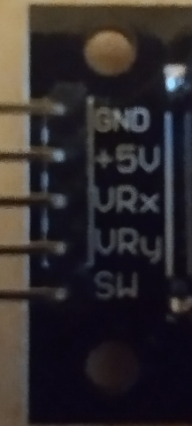
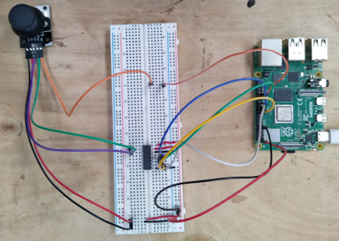

import { Tabs, TabItem } from "@astrojs/starlight/components";

**{frontmatter.description}**  
Written by: {frontmatter.author}  
_Last updated: {frontmatter.lastupdated}_

---

In previous tutorials we've covered reading and writing digital signals, and emulating analog signals through the use of Pulse-Width Modulation. In this tutorial we are reading analog signals using SplashKit's built-in ADC (Analog-to-Digital Converter) functionality. SplashKit now provides native support for I2C-based ADC devices, making it much easier to read analog values from sensors without manual SPI communication.

## Components

- Breadboard
- Jumper Wires

- Analog Sensor (e.g., Potentiometer or Joystick Module)

  For this tutorial, we'll use a simple potentiometer or joystick module that provides analog output. These devices output a varying voltage that corresponds to their position or state. A potentiometer provides a single analog channel, while a joystick typically provides two analog channels (X and Y axes) plus a digital button.

  

- ADS7830 or PCF8591 I2C ADC Module

  SplashKit supports I2C-based ADC devices like the ADS7830 and PCF8591. These chips communicate via I2C protocol, making them easier to use than SPI-based alternatives. The ADS7830 is an 8-bit, 8-channel ADC, while the PCF8591 is an 8-bit, 4-channel ADC with additional DAC functionality.

  **ADS7830 Features:**
  - 8-bit resolution (0-255 values)
  - 8 analog input channels
  - I2C interface
  - Default address: 0x48

  **PCF8591 Features:**
  - 8-bit resolution (0-255 values)
  - 4 analog input channels
  - 1 analog output channel (DAC)
  - I2C interface
  - Default address: 0x48

  The wiring for I2C devices is much simpler than SPI:

  | ADC Pin | Raspberry Pi Pin |
  |---------|------------------|
  | VCC     | 3.3V             |
  | GND     | GND              |
  | SDA     | Pin 3 (SDA)      |
  | SCL     | Pin 5 (SCL)      |

  To communicate with these devices, we use I2C. I2C is a two-wire communication protocol that's simpler than SPI and allows multiple devices on the same bus. More information can be found at [I2C Communication Protocol](https://en.wikipedia.org/wiki/I%C2%B2C).

## Raspberry Pi Setup

Before building the circuit, ensure your Raspberry Pi is properly configured for I2C communication:

### Enable I2C Interface

1. Open the Raspberry Pi configuration tool:
   ```bash
   sudo raspi-config
   ```

2. Navigate to **Interface Options** → **I2C** → **Yes**

3. Reboot your Raspberry Pi:
   ```bash
   sudo reboot
   ```

### Verify I2C is Working

After connecting your ADC device, you can verify it's detected:

```bash
# Install I2C tools (if not already installed)
sudo apt update
sudo apt install i2c-tools

# Scan for I2C devices (most ADCs appear at address 0x48)
i2cdetect -y 1
```

You should see your ADC device listed at its address (typically 0x48).

### Install SplashKit

If you haven't already, install SplashKit on your Raspberry Pi:

```bash
# Download and install SplashKit
bash <(curl -s https://raw.githubusercontent.com/splashkit/skm/master/install-scripts/skm-install.sh)

# Add SplashKit to your PATH (add to ~/.bashrc for permanent)
export PATH=$PATH:~/.splashkit
```

## The Circuit

The circuit for this tutorial is much simpler than the previous SPI-based approach. We connect the I2C ADC device to the Raspberry Pi's I2C pins, and connect our analog sensor to one of the ADC's input channels.



**Basic I2C ADC Connections:**

| ADC Pin | Raspberry Pi Pin | Physical Pin | Function |
|---------|------------------|--------------|----------|
| VCC     | 3.3V             | Pin 1        | Power    |
| GND     | Ground           | Pin 6        | Ground   |
| SDA     | GPIO 2 (SDA)     | Pin 3        | Data     |
| SCL     | GPIO 3 (SCL)     | Pin 5        | Clock    |

**For a joystick module connections:**

| Joystick Pin | Connection          | Purpose                    |
|--------------|---------------------|----------------------------|
| VRx          | ADC Channel 0       | X-axis analog reading     |
| VRy          | ADC Channel 1       | Y-axis analog reading     |
| SW           | Raspberry Pi Pin 29 | Digital button input      |
| +5V or VCC   | Raspberry Pi 3.3V   | Power supply              |
| GND          | Raspberry Pi GND    | Common ground             |

:::tip[Wiring Tips]
- Keep analog wires as short as possible to reduce noise
- Use twisted pair cables for longer connections
- Ensure all devices share a common ground connection
- Double-check power supply voltage (3.3V for most sensors)
:::

**Key Advantages of I2C over SPI:**

- **Fewer Wires:** Only 4 connections needed vs 6+ for SPI
- **Multiple Devices:** Multiple ADCs can share the same I2C bus
- **Addressing:** Each device has a unique address (no chip select pins)
- **Built-in Protocol:** Error detection and acknowledgment built-in

## The Code

:::caution[Before running the code.]
This code requires GPIO permissions. Make sure you run the program with appropriate permissions (usually `sudo`) or ensure your user is in the `gpio` group.
:::

With SplashKit's built-in ADC support, reading analog values becomes much simpler. We no longer need to manually handle SPI communication or bit manipulation.

<Tabs syncKey="code-language">
<TabItem label="C++">
  
  ```cpp
  #include "splashkit.h"

  using namespace std;

  int main()
  {
      const int button_read_interval = 100;
      unsigned long last_read = 0;
      const int axis_offset = 128; // For 8-bit ADC (0-255), center is around 128

      int num_presses = 0;
      int x = 0, y = 0;

      // Initialize Raspberry Pi GPIO
      raspi_init();
      
      // Set up digital button pin
      pins button_pin = PIN_29;
      raspi_set_mode(button_pin, GPIO_INPUT);
      raspi_set_pull_up_down(button_pin, PUD_UP);

      // Open ADC device (ADS7830 or PCF8591)
      adc_device adc = open_adc("joystick_adc", ADS7830);
      if (adc == nullptr) {
          write_line("Failed to open ADC device!");
          return -1;
      }

      // Create timer for button debouncing
      timer interval_timer = create_timer("read_interval");
      start_timer(interval_timer);

      // Create a minimal window for SplashKit event processing
      open_window("ADC Reader", 1, 1);
      
      while(!any_key_pressed())
      {
          process_events();
          unsigned long curr_time = timer_ticks(interval_timer);

          // Button reading with debouncing
          if(curr_time - last_read > button_read_interval)
          {
              last_read = curr_time;

              if(raspi_read(button_pin) == GPIO_LOW)
              {
                  num_presses++;
              }
          }

          // Read analog values from ADC channels
          x = read_adc(adc, 0) - axis_offset;
          y = read_adc(adc, 1) - axis_offset;

          // Clear screen and display values
          write("\033[2J\033[H");
          write("X: ");
          write(x);
          write(" Y: ");
          write_line(y);
          write("Button Presses: ");
          write_line(num_presses);

          delay(10); // Small delay to reduce CPU usage
      }

      // Cleanup
      close_all_windows();
      free_all_timers();
      close_adc(adc);
      raspi_cleanup();
      return 0;
  }
  ```cpp

</TabItem>
<TabItem label="C#">

<Tabs syncKey="csharp-style">
<TabItem label="Top-level Statements">

```csharp
using static SplashKitSDK.SplashKit;

const int buttonReadInterval = 100;
uint lastRead = 0;
const int axisOffset = 128; // For 8-bit ADC (0-255), center is around 128

int numPresses = 0;
int x = 0, y = 0;

// Initialize Raspberry Pi GPIO
RaspiInit();

// Set up digital button pin
Pins buttonPin = Pins.Pin29;
RaspiSetMode(buttonPin, PinModes.GpioInput);
RaspiSetPullUpDown(buttonPin, PullUpDown.PudUp);

// Open ADC device (ADS7830 or PCF8591)
AdcDevice adc = OpenAdc("joystick_adc", AdcType.Ads7830);
if (adc == null)
{
    WriteLine("Failed to open ADC device!");
    return;
}

// Create timer for button debouncing
Timer intervalTimer = CreateTimer("read_interval");
StartTimer(intervalTimer);

// Create a minimal window for SplashKit event processing
OpenWindow("ADC Reader", 1, 1);

while (!AnyKeyPressed())
{
    ProcessEvents();
    uint currTime = TimerTicks(intervalTimer);

    // Button reading with debouncing
    if (currTime - lastRead > buttonReadInterval)
    {
        lastRead = currTime;

        if (RaspiRead(buttonPin) == PinValues.GpioLow)
        {
            numPresses++;
        }
    }

    // Read analog values from ADC channels
    x = ReadAdc(adc, 0) - axisOffset;
    y = ReadAdc(adc, 1) - axisOffset;

    // Clear screen and display values
    Write("\u001b[2J\u001b[H");
    Write("X: ");
    Write(x);
    Write(" Y: ");
    WriteLine(y);
    Write("Button Presses: ");
    WriteLine(numPresses);

    Delay(10); // Small delay to reduce CPU usage
}

// Cleanup
CloseAllWindows();
FreeAllTimers();
CloseAdc(adc);
RaspiCleanup();
```

</TabItem>
<TabItem label="Object-Oriented">

```csharp
using SplashKitSDK;

namespace AdcReaderApp
{
    public class Program
    {
        public static void Main()
        {
            const int buttonReadInterval = 100;
            uint lastRead = 0;
            const int axisOffset = 128; // For 8-bit ADC (0-255), center is around 128

            int numPresses = 0;
            int x = 0, y = 0;

            // Initialize Raspberry Pi GPIO
            SplashKit.RaspiInit();

            // Set up digital button pin
            Pins buttonPin = Pins.Pin29;
            SplashKit.RaspiSetMode(buttonPin, PinModes.GpioInput);
            SplashKit.RaspiSetPullUpDown(buttonPin, PullUpDown.PudUp);

            // Open ADC device (ADS7830 or PCF8591)
            AdcDevice adc = SplashKit.OpenAdc("joystick_adc", AdcType.Ads7830);
            if (adc == null)
            {
                SplashKit.WriteLine("Failed to open ADC device!");
                return;
            }

            // Create timer for button debouncing
            Timer intervalTimer = SplashKit.CreateTimer("read_interval");
            SplashKit.StartTimer(intervalTimer);

            // Create a minimal window for SplashKit event processing
            SplashKit.OpenWindow("ADC Reader", 1, 1);

            while (!SplashKit.AnyKeyPressed())
            {
                SplashKit.ProcessEvents();
                uint currTime = SplashKit.TimerTicks(intervalTimer);

                // Button reading with debouncing
                if (currTime - lastRead > buttonReadInterval)
                {
                    lastRead = currTime;

                    if (SplashKit.RaspiRead(buttonPin) == PinValues.GpioLow)
                    {
                        numPresses++;
                    }
                }

                // Read analog values from ADC channels
                x = SplashKit.ReadAdc(adc, 0) - axisOffset;
                y = SplashKit.ReadAdc(adc, 1) - axisOffset;

                // Clear screen and display values
                SplashKit.Write("\u001b[2J\u001b[H");
                SplashKit.Write("X: ");
                SplashKit.Write(x);
                SplashKit.Write(" Y: ");
                SplashKit.WriteLine(y);
                SplashKit.Write("Button Presses: ");
                SplashKit.WriteLine(numPresses);

                SplashKit.Delay(10); // Small delay to reduce CPU usage
            }

            // Cleanup
            SplashKit.CloseAllWindows();
            SplashKit.FreeAllTimers();
            SplashKit.CloseAdc(adc);
            SplashKit.RaspiCleanup();
        }
    }
}
```csharp

</TabItem>
</Tabs>

</TabItem>
<TabItem label="Python">

```python
from splashkit import *

def main():
    button_read_interval = 100
    last_read = 0
    axis_offset = 128  # For 8-bit ADC (0-255), center is around 128

    num_presses = 0
    x = 0
    y = 0

    # Initialize Raspberry Pi GPIO
    raspi_init()

    # Set up digital button pin
    button_pin = Pins.pin_29
    raspi_set_mode(button_pin, PinModes.gpio_input)
    raspi_set_pull_up_down(button_pin, PullUpDown.pud_up)

    # Open ADC device (ADS7830 or PCF8591)
    adc = open_adc("joystick_adc", AdcType.ads7830)
    if adc is None:
        write_line("Failed to open ADC device!")
        return

    # Create timer for button debouncing
    interval_timer = create_timer("read_interval")
    start_timer(interval_timer)

    # Create a minimal window for SplashKit event processing
    open_window("ADC Reader", 1, 1)

    while not any_key_pressed():
        process_events()
        curr_time = timer_ticks(interval_timer)

        # Button reading with debouncing
        if curr_time - last_read > button_read_interval:
            last_read = curr_time

            if raspi_read(button_pin) == PinValues.gpio_low:
                num_presses += 1

        # Read analog values from ADC channels
        x = read_adc(adc, 0) - axis_offset
        y = read_adc(adc, 1) - axis_offset

        # Clear screen and display values
        write("\033[2J\033[H")
        write("X: ")
        write(x)
        write(" Y: ")
        write_line(y)
        write("Button Presses: ")
        write_line(num_presses)

        delay(10)  # Small delay to reduce CPU usage

    # Cleanup
    close_all_windows()
    free_all_timers()
    close_adc(adc)
    raspi_cleanup()

if __name__ == "__main__":
    main()
```python

</TabItem>
</Tabs>

The code above demonstrates how much simpler it is to work with ADC devices using SplashKit's built-in support. Let's break down the key improvements and how the code works.

### Key Improvements with SplashKit ADC

**Simplified Setup:**

- No manual SPI communication required
- No bit manipulation for control bytes
- Built-in device management

**Error Handling:**

- Automatic device detection and validation
- Clear error reporting if ADC device fails to open

**Cross-Language Support:**

- Consistent API across C++, C#, and Python
- Same functionality with language-appropriate naming conventions

### Code Breakdown

Let's examine the key parts of this implementation:

1. **ADC Device Initialization**

    <Tabs syncKey="code-language">
    <TabItem label="C++">

      ```cpp
      adc_device adc = open_adc("joystick_adc", ADS7830);
      if (adc == nullptr) {
          write_line("Failed to open ADC device!");
          return -1;
      }
      ```

    </TabItem>
    <TabItem label="C#">

    <Tabs syncKey="csharp-style">
    <TabItem label="Top-level Statements">

      ```csharp
      AdcDevice adc = OpenAdc("joystick_adc", AdcType.Ads7830);
      if (adc == null)
      {
          WriteLine("Failed to open ADC device!");
          return;
      }
      ```

    </TabItem>
    <TabItem label="Object-Oriented">

      ```csharp
      AdcDevice adc = SplashKit.OpenAdc("joystick_adc", AdcType.Ads7830);
      if (adc == null)
      {
          SplashKit.WriteLine("Failed to open ADC device!");
          return;
      }
      ```

    </TabItem>
    </Tabs>

    </TabItem>
    <TabItem label="Python">

      ```python
      adc = open_adc("joystick_adc", AdcType.ads7830)
      if adc is None:
          write_line("Failed to open ADC device!")
          return
      ```

    </TabItem>
    </Tabs>

    We open the ADC device with a name and specify the type. SplashKit handles all the I2C communication setup automatically. The function returns a device handle we can use for reading, or `null`/`nullptr`/`None` if the device couldn't be opened.

2. **Reading Analog Values**

    <Tabs syncKey="code-language">
    <TabItem label="C++">

      ```cpp
      x = read_adc(adc, 0) - axis_offset;
      y = read_adc(adc, 1) - axis_offset;
      ```

    </TabItem>
    <TabItem label="C#">

    <Tabs syncKey="csharp-style">
    <TabItem label="Top-level Statements">

      ```csharp
      x = ReadAdc(adc, 0) - axisOffset;
      y = ReadAdc(adc, 1) - axisOffset;
      ```

    </TabItem>
    <TabItem label="Object-Oriented">

      ```csharp
      x = SplashKit.ReadAdc(adc, 0) - axisOffset;
      y = SplashKit.ReadAdc(adc, 1) - axisOffset;
      ```

    </TabItem>
    </Tabs>

    </TabItem>
    <TabItem label="Python">

      ```python
      x = read_adc(adc, 0) - axis_offset
      y = read_adc(adc, 1) - axis_offset
      ```

    </TabItem>
    </Tabs>

    Reading analog values is now a single function call. The `read_adc()` function returns an 8-bit value (0-255) representing the analog input. We subtract an offset to center the values around zero for joystick applications. The second parameter is the channel number (0-7 for ADS7830, 0-3 for PCF8591).

3. **Proper Cleanup**

    <Tabs syncKey="code-language">
    <TabItem label="C++">

      ```cpp
      close_adc(adc);
      raspi_cleanup();
      ```

    </TabItem>
    <TabItem label="C#">

    <Tabs syncKey="csharp-style">
    <TabItem label="Top-level Statements">

      ```csharp
      CloseAdc(adc);
      RaspiCleanup();
      ```

    </TabItem>
    <TabItem label="Object-Oriented">

      ```csharp
      SplashKit.CloseAdc(adc);
      SplashKit.RaspiCleanup();
      ```

    </TabItem>
    </Tabs>

    </TabItem>
    <TabItem label="Python">

      ```python
      close_adc(adc)
      raspi_cleanup()
      ```

    </TabItem>
    </Tabs>

    Always remember to close the ADC device when finished to free system resources.

### Expected Output

When you run this program, you should see output similar to:

```text
X: -15 Y: 23
Button Presses: 0
```

The values will change as you move the joystick or adjust your analog sensor. The range is approximately -128 to +127 for an 8-bit ADC centered around 128.

### Alternative ADC Devices

SplashKit supports multiple ADC types. You can easily switch between them by changing the ADC type parameter:

<Tabs syncKey="code-language">
<TabItem label="C++">

```cpp
// For ADS7830 (8-channel, 8-bit)
adc_device adc = open_adc("my_adc", ADS7830);

// For PCF8591 (4-channel, 8-bit with DAC)
adc_device adc = open_adc("my_adc", PCF8591);
```

</TabItem>
<TabItem label="C#">

<Tabs syncKey="csharp-style">
<TabItem label="Top-level Statements">

```csharp
// For ADS7830 (8-channel, 8-bit)
AdcDevice adc = OpenAdc("my_adc", AdcType.Ads7830);

// For PCF8591 (4-channel, 8-bit with DAC)
AdcDevice adc = OpenAdc("my_adc", AdcType.Pcf8591);
```

</TabItem>
<TabItem label="Object-Oriented">

```csharp
// For ADS7830 (8-channel, 8-bit)
AdcDevice adc = SplashKit.OpenAdc("my_adc", AdcType.Ads7830);

// For PCF8591 (4-channel, 8-bit with DAC)
AdcDevice adc = SplashKit.OpenAdc("my_adc", AdcType.Pcf8591);
```

</TabItem>
</Tabs>

</TabItem>
<TabItem label="Python">

```python
# For ADS7830 (8-channel, 8-bit)
adc = open_adc("my_adc", AdcType.ads7830)

# For PCF8591 (4-channel, 8-bit with DAC)
adc = open_adc("my_adc", AdcType.pcf8591)
```

</TabItem>
</Tabs>

### Further Information

#### Benefits of SplashKit's ADC Support

**Simplified Development:**

- No need to understand low-level communication protocols
- Automatic device detection and setup
- Consistent API across different ADC types
- Built-in error handling

**Improved Reliability:**

- Tested communication protocols
- Proper resource management
- Standardized device initialization

**Better Code Maintainability:**

- Less complex code to debug
- Cross-language compatibility
- Clear, readable function names

#### Supported ADC Devices

SplashKit currently supports several I2C-based ADC devices:

**ADS7830:**

- 8-bit resolution
- 8 single-ended channels
- I2C interface
- Popular for multi-sensor applications

**PCF8591:**

- 8-bit resolution
- 4 analog input channels
- 1 analog output channel (DAC)
- Good for basic analog I/O

#### Migration from SPI-based ADCs

If you're currently using SPI-based ADCs like the MCP3008, consider migrating to I2C-based solutions for the following benefits:

1. **Simpler Wiring:** Only 4 wires needed (VCC, GND, SDA, SCL)
2. **Multiple Devices:** Multiple I2C devices can share the same bus
3. **Built-in Support:** Native SplashKit functions handle all communication
4. **Better Integration:** Seamless integration with other SplashKit GPIO functions

#### Troubleshooting

**Device Not Found:**

- Check I2C wiring connections (ensure SDA and SCL are not swapped)
- Verify device address using `i2cdetect -y 1` command
- Ensure I2C is enabled on your Raspberry Pi (`sudo raspi-config` → Interface Options → I2C)
- Check if ADC module has correct power (3.3V, not 5V)

**Incorrect Readings:**

- Verify sensor connections to correct ADC channels
- Check power supply voltage (most sensors work with 3.3V reference)
- Ensure proper grounding between all devices
- Test with known voltage sources (e.g., potentiometer at mid-position)
- Check if sensor output voltage range matches ADC input range

**Noisy or Unstable Readings:**

- Add small capacitors (0.1μF) between sensor output and ground
- Use shorter wire connections when possible
- Keep analog wires away from digital switching circuits
- Consider using shielded cables for longer runs

**Permission Issues:**

- Run program with `sudo` or add user to `gpio` and `i2c` groups:
  ```bash
  sudo usermod -a -G gpio,i2c $USER
  ```
- Reboot after adding user to groups
- Check I2C device permissions: `ls -la /dev/i2c*`

**Performance Issues:**

- Reduce polling frequency if CPU usage is high
- Use interrupts or timers for more efficient reading
- Consider averaging multiple readings for smoother values

#### Advanced Usage Tips

**Multiple ADC Devices:**

You can connect multiple ADC devices on the same I2C bus by using different addresses:

<Tabs syncKey="code-language">
<TabItem label="C++">

```cpp
// First ADC at default address (0x48)
adc_device adc1 = open_adc("sensors_adc", ADS7830);

// Second ADC with different address (requires hardware configuration)
adc_device adc2 = open_adc_at_address("additional_adc", ADS7830, 0x49);
```

</TabItem>
<TabItem label="C#">

```csharp
// First ADC at default address (0x48)
AdcDevice adc1 = OpenAdc("sensors_adc", AdcType.Ads7830);

// Second ADC with different address
AdcDevice adc2 = OpenAdcAtAddress("additional_adc", AdcType.Ads7830, 0x49);
```

</TabItem>
<TabItem label="Python">

```python
# First ADC at default address (0x48)
adc1 = open_adc("sensors_adc", AdcType.ads7830)

# Second ADC with different address
adc2 = open_adc_at_address("additional_adc", AdcType.ads7830, 0x49)
```

</TabItem>
</Tabs>

**Calibration and Scaling:**

For better accuracy, calibrate your sensors:

<Tabs syncKey="code-language">
<TabItem label="C++">

```cpp
// Read raw ADC value
int raw_value = read_adc(adc, 0);

// Convert to voltage (assuming 3.3V reference, 8-bit ADC)
float voltage = (raw_value / 255.0) * 3.3;

// Convert to sensor-specific units (e.g., temperature)
float temperature_c = (voltage - 0.5) * 100; // Example for TMP36 sensor
```

</TabItem>
<TabItem label="C#">

```csharp
// Read raw ADC value
int rawValue = ReadAdc(adc, 0);

// Convert to voltage (assuming 3.3V reference, 8-bit ADC)
float voltage = (rawValue / 255.0f) * 3.3f;

// Convert to sensor-specific units
float temperatureC = (voltage - 0.5f) * 100f; // Example for TMP36 sensor
```

</TabItem>
<TabItem label="Python">

```python
# Read raw ADC value
raw_value = read_adc(adc, 0)

# Convert to voltage (assuming 3.3V reference, 8-bit ADC)
voltage = (raw_value / 255.0) * 3.3

# Convert to sensor-specific units
temperature_c = (voltage - 0.5) * 100  # Example for TMP36 sensor
```

</TabItem>
</Tabs>

## Summary

In this tutorial, you've learned how to read analog signals using SplashKit's built-in ADC functionality. Key takeaways include:

- **Simplified Communication**: I2C-based ADCs are much easier to work with than SPI alternatives
- **Native SplashKit Support**: Built-in functions handle all low-level communication
- **Cross-Language Compatibility**: Same functionality available in C++, C#, and Python
- **Easy Expansion**: Multiple devices can share the same I2C bus

### What's Next?

Now that you can read analog signals, consider these next projects:

- **Environmental Monitor**: Combine temperature, humidity, and light sensors
- **Data Logger**: Store sensor readings to files with timestamps
- **Remote Monitoring**: Send sensor data over network connections
- **Control Systems**: Use analog readings to control PWM outputs (closed-loop control)

### Related Tutorials

- [Blink LED](../0-blink-led): Basic GPIO output control
- [Read Button Press](../1-read-button-press): Digital input handling
- [PWM Control LED](../2-pwm-control-led): Analog output simulation
- [PWM Button Control](../3-pwm-button-control): Combining digital and analog signals

### Additional Resources

- [SplashKit ADC API Documentation](/api/raspberry/#open-adc-functions)
- [I2C Protocol Overview](https://en.wikipedia.org/wiki/I%C2%B2C)
- [Raspberry Pi I2C Configuration](https://www.raspberrypi.org/documentation/configuration/raspi-config.md)
- [ADC Device Datasheets](https://www.ti.com/lit/ds/symlink/ads7830.pdf)
