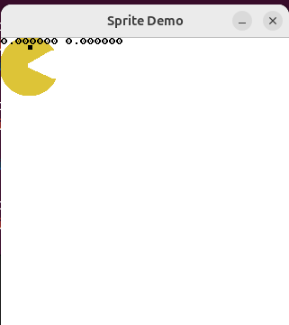
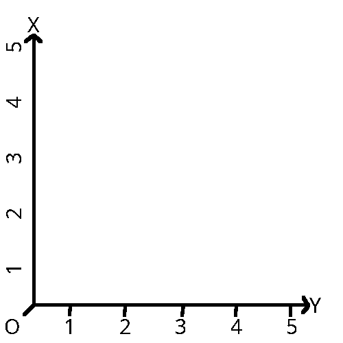
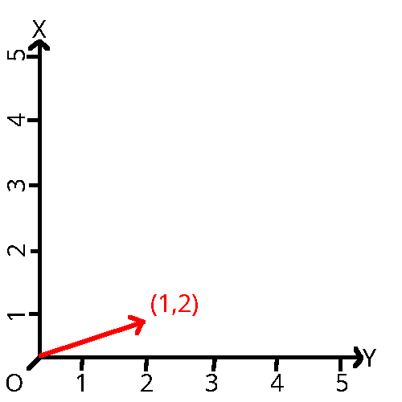
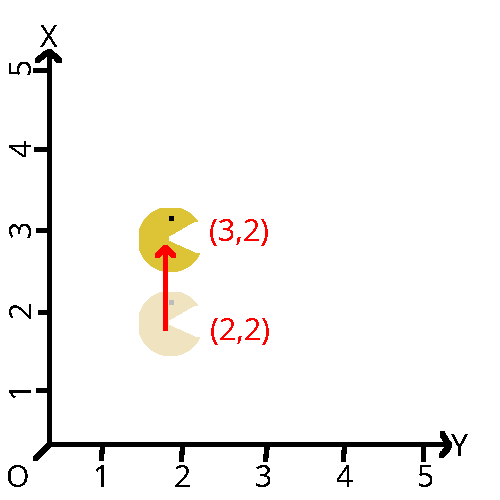

import { Tabs, TabItem } from "@astrojs/starlight/components";
import { Code } from '@astrojs/starlight/components';

**{frontmatter.description}**  
Written by: {frontmatter.author}  
_Last updated: {frontmatter.lastupdated}_

---

In this article you will see how to get started with Sprites in SplashKit, with some simple drawing operations. Once you have this working you will be able to start exploring the different features you can work with. This article assumes that you have some basic understanding of how to use Splashkit.

## Sprites
A sprite is a two dimensional grid of pixels collected into an image-object called a bitmap. Each pixel of the bitmap is mapped to specific coordinates. When viewed together this gives the illusion of a single contiguous image. You, as the programmer, do not need to manage sprites at this level of granularity however.

In Splashkit a sprite is a structure (struct). You will not manipulate the variables of this struct directly, rather we manipulate data through [functions](/api/sprites). These functions include everything you need to manipulate the sprite programatically.

Some important attributes of a sprite include:
* **Position:** The cartesian co-ordinates of the sprite in space. In game terms these will be relative to the plane you are drawing the sprite to, and are measured from the center of the sprite.

* **Movement vector:** A vector that describes in what direction the sprite is moving (if at all)

* **Velocity vector:** How *fast* the sprite is moving.

* **Layer:** This signals to your program in what order the sprite should be drawn to the screen. 

There are many others, but for now we will focus on the basics.

### Creating a Sprite
Before we can manipulate the sprite we have to define it. Splashkit does not require you to define a sprite's bitmap pixel by pixel. Instead we can use common image file types. [Lossless](https://en.wikipedia.org/wiki/Lossless_compression) file types such as .png are preferred. 

For this tutorial we will use this circular fellow, but feel free to draw your own sprite if you prefer! 


Now we will import this bitmap into our program and associate it with a sprite. Copy this code into your text editor, compile and run it:
<Tabs syncKey="code-language">
  <TabItem label="C++">

  ```cpp
    #include "splashkit.h"
    using namespace std;

    int main()
    {
        open_window("Sprite Demo", 320, 320);
        
        bitmap bodyBit = load_bitmap("body", "circleMan.png");
        sprite bodySprite = create_sprite("body", bodyBit);
        draw_sprite(bodySprite, 0, 0);
        refresh_screen();

        delay(5000);
        close_all_windows();
        return 0;
    }
  ```
  </TabItem>
</Tabs>

For the moment we are only interested in these statements:

<Tabs syncKey="code-language">
  <TabItem label="C++">

  ```cpp
    bitmap bodyBit = load_bitmap("body", "circleMan.png");
    sprite bodySprite = create_sprite("body", bodyBit);
    draw_sprite(bodySprite, 0, 0);
    refresh_screen();
  ```
  </TabItem>
</Tabs>

It is important to note that a sprite and a bitmap are distinct entities. A sprite requires a bitmap to describe what it's appearance. Therefore we need to call [load_bitmap()](https://splashkit.io/api/graphics/#load-bitmap) to create a bitmap, then associate it with the sprite when we call [create_sprite()](https://splashkit.io/api/sprites/#create-sprite-1). 

You will also notice that instead of [draw_bitmap()](https://splashkit.io/api/graphics/#draw-bitmap-1) we use [draw_sprite()](https://splashkit.io/api/sprites/#draw-sprite-1). Splashkit handles drawing for these two data types slightly differently behind the scenes. If you try passing `bodySprite` to [draw_bitmap()](https://splashkit.io/api/graphics/#draw-bitmap-1) you will get a compile error. 

Lastly we need to call [refresh_screen()](https://splashkit.io/usage-examples/graphics/#refresh-screen-examples). [Remember](https://splashkit.io/guides/graphics/1-double-buffering/) - drawing in Splashkit does not implicitly redraw the screen after being told to draw something. It is your job as a programmer to tell Splashkit when you need the screen updated!  

### Moving the Sprite
Next we will see how sprites can be controlled, either through code or user input. Modify the code to add the following lines after `draw_sprite(bodySprite, 0, 0);`: 

<Tabs syncKey="code-language">
  <TabItem label="C++">

  ```cpp
  point_2d pos = sprite_position(bodySprite);
  draw_text(to_string(pos.x) + " " + to_string(pos.y), COLOR_BLACK, 0,0);
  ```
  </TabItem>
</Tabs>


Then re-compile the program and run it. You will see text appear on top of the sprite. You can of course do things with the sprite's member variables other than draw them to the screen!



This isn't very much fun however. What if we want to interact with our newly created sprite? The example below will let you move the sprite around the window by pressing the arrow keys. You'll also see the co-ordinates of the sprite update as you move!

<Tabs syncKey="code-language">
  <TabItem label="C++">

  ```cpp
#include "splashkit.h"
using namespace std;

int main(){

    open_window("Sprite Demo", 320, 320);
    bitmap bodyBit = load_bitmap("body", "circleMan.png");
    sprite bodySprite = create_sprite("body", bodyBit);
    point_2d pos;
    vector_2d moveVector;
    
    while(! quit_requested()){
        process_events();
        clear_screen(COLOR_WHITE);
        
        draw_sprite(bodySprite, 0, 0);
        pos = sprite_position(bodySprite);
        draw_text(to_string(pos.x) + " " + to_string(pos.y), COLOR_BLACK, 0,0);

        moveVector = {0,0};
        if (key_down(UP_KEY)){
            moveVector.y -= 1;
            move_sprite(bodySprite, moveVector);
        }
        else if (key_down(DOWN_KEY)){
            moveVector.y += 1;
            move_sprite(bodySprite, moveVector);
        }
        else if (key_down(LEFT_KEY)){
            moveVector.x -= 1;
            move_sprite(bodySprite, moveVector);
        }
        else if (key_down(RIGHT_KEY)){
            moveVector.x += 1;
            move_sprite(bodySprite, moveVector);
        }
        refresh_screen();
    }
    close_all_windows();
    return 0;
}
  ```
  </TabItem>
</Tabs>

In this example we use a `while()` loop to keep the program open. [process_events()](https://splashkit.io/api/input/#process-events) is needed to process input events (from the keyboard). We also zero out a two dimensional movement vector. before modifying it based on which keys are being held down. At the same time we are using [sprite_position()](https://splashkit.io/api/sprites/#sprite-position) to get the position of our sprite, which we then write out to the screen. 

**Note:** If you want to only adjust a sprites `x` or `y` value you can use [sprite_set_x()](https://splashkit.io/api/sprites/#sprite-set-x) and [sprite_set_y()](https://splashkit.io/api/sprites/#sprite-set-y).

Feel free to experiment with this code. What happens if you swap the order of `draw_sprite()` and [draw_text()](https://splashkit.io/api/graphics/#draw-text-1)? Can you think of a way to  move the sprite to **specific co-ordinates** if you press a certain key? what happens if you comment out the call to [clear_screen()](https://splashkit.io/api/graphics/#clear-screen) and why? 

### Sprite Rotation
Sprites can be rotated by calling the [sprite_set_rotation()](https://splashkit.io/api/sprites/#sprite-set-rotation) function. Rotation is represented in degrees, starting at zero and incrementing **clockwise** to 360, the same as a compass. In SplashKit you can can call this function in between draw calls to rotate your sprite, and any layers attached to it. In this example pressing the `Q` and `E` keys will cause the character to spin clockwise and counter-clockwise respectively. If a call to the `sprite_set_rotation()` function would produce a negative value it will "roll" the value back up to 360 and reduce it further from there.
<Tabs syncKey="code-language">
  <TabItem label="C++">

  ```cpp
  #include "splashkit.h"
  using namespace std;

  int main(){

      open_window("Sprite Demo", 320, 320);
      bitmap bodyBit = load_bitmap("body", "circleMan.png");
      sprite bodySprite = create_sprite("body", bodyBit);
      point_2d pos;
      float rotation;
      
      while(! quit_requested()){
          process_events();
          clear_screen(COLOR_WHITE);
          
          draw_sprite(bodySprite, 0, 0);
          pos = sprite_position(bodySprite);
          draw_text(to_string(pos.x) + " " + to_string(pos.y), COLOR_BLACK, 0,0);
          rotation = sprite_rotation(bodySprite);
          draw_text(to_string(rotation), COLOR_BLACK, 0,10);

          if (key_down(Q_KEY)){
              sprite_set_rotation(bodySprite, rotation - 0.1);
          }
          else if (key_down(E_KEY)){
              sprite_set_rotation(bodySprite, rotation + 0.1);
          }
          refresh_screen();
      }
      close_all_windows();
      return 0;
  }
  ```
  </TabItem>
</Tabs>


## Vectors & Velocity
In the previous example we used the [move_sprite()](https://splashkit.io/api/sprites/#move-sprite-1) function to move the sprite around the screen. The second argument of this function is a vector 2d. We will examine this in more detail.

If you're not familiar with linear algebra concepts don't worry, you don't need a deep understanding of vector math to understand what we're doing here. 

The basic idea is this: Suppose that the world has only two dimensions, we label each dimension `x` and `y` respectively. These lines are infinite in both directions (we'll only worry about postive length for now) and run perpendicular to each other, intersecting at the co-ordinates `(0,0)`:



A vector is just an arrow that points somewhere in space. Vectors have an origin and a position describing where they "start" and "end" respectively. We can extract the  magnitude (lenght) of the vector. Our vector might have the `origin` of `(0,0)` and the position `(1,2)`:



Why is this important? Because it give us a system for describing object positions and how they move through space. In the previous code example we calculated the sprite's new position by adding two vectors together - the sprite's current position and `moveVector` variable which we set based on user input. So if our spirte starts at `(2,2)` and we add our movement vector `(1,0)` the sprite's final position is `(3,3)`



Add the following two lines to your code after the `draw_text()` statement (line 18). Recompile your program. You will notice that sprite begins accelerating towards the right of the screen:

<Tabs syncKey="code-language">
  <TabItem label="C++">

  ```cpp
  sprite_add_to_velocity(bodySprite, vector_2d{0.00001,0});
  update_sprite(bodySprite);
  ```
  </TabItem>
</Tabs>

This is because we're adding a small amount of velocity to the sprite's position every time the loop iterates. Since there is no air resitance in our version of flatland the sprite will go faster and faster before disappearing off the screen.

This has a lot of practical applications as far as game design is concerned. Say that you want to make a platformer. How should you model the characters movement at the height of their jump? You could use the equation `V = gt` where `V` is your velocity, `g` is the gravity of your world and `t` is time. 

For the sake of simplicity suppose that `g = -3` (our world is small!) and we measure `t` in miliseconds, where our character has been falling for a second. We would then use the [sprite_add_to_velocity()](https://splashkit.io/api/sprites/#sprite-add-to-velocity) function to add the correct amount of velocity every time the scene is redrawn. We've made a couple of other modifications, but for now copy this code block and play around with the sprite. You'll notice that it falls to the floor when you jump:

<Tabs syncKey="code-language">
  <TabItem label="C++">

  ```cpp
  #include "splashkit.h"
  using namespace std;

  int main(){

      open_window("Sprite Demo", 320, 320);
      bitmap bodyBit = load_bitmap("body", "circleMan.png");
      sprite bodySprite = create_sprite("body", bodyBit);
      point_2d pos;
      vector_2d moveVector;

      //Create a timer object that we use to measure how long the sprite has been in the air for. 
      create_timer("velocityTimer");
      start_timer("velocityTimer");

      while(! quit_requested()){
          process_events();
          clear_screen(COLOR_WHITE);
          
          draw_sprite(bodySprite, 0, 0);
          pos = sprite_position(bodySprite);
          draw_text(to_string(pos.x) + " " + to_string(pos.y), COLOR_BLACK, 0,0);
          //Track how fast the sprite is currently falling
          draw_text(to_string(sprite_velocity(bodySprite).y), COLOR_BLACK, 0,10);
          
          //Stop the sprite from falling through the "floor"
          if (sprite_position(bodySprite).y > 255){
              sprite_set_position(bodySprite, {sprite_position(bodySprite).x, 255});
              sprite_set_velocity(bodySprite, {0,0});
              //Reset the timer since the sprite is no longer in the air
              stop_timer("velocityTimer");
              reset_timer("velocityTimer");
          }
          
          moveVector = {0,0};
          //Treat moving "up" like jumping
          if (key_down(UP_KEY)){
              moveVector.y -= 1.5;
              move_sprite(bodySprite, moveVector);
              //Time how long the character has been in the air
              start_timer("velocityTimer");
          }
          else if (key_down(DOWN_KEY)){
              moveVector.y += 1;
              move_sprite(bodySprite, moveVector);
          }
          else if (key_down(LEFT_KEY)){
              moveVector.x -= 1;
              move_sprite(bodySprite, moveVector);
          }
          else if (key_down(RIGHT_KEY)){
              moveVector.x += 1;
              move_sprite(bodySprite, moveVector);
          }

          //Add velocity to the sprite based on how long they've been in the air
          sprite_add_to_velocity(bodySprite, vector_2d{0, ((double)3 * timer_ticks("velocityTimer")/10000)});
          update_sprite(bodySprite);
          refresh_screen();
      }
      close_all_windows();
      return 0;
  }
  ```
  </TabItem>
</Tabs>

We accomplish this by making two modifications to the code. This first section checks whether the sprite has fallen through the floor. Rather than using collision objects, in this simple example we set an arbitrary point on the y axis as our floor. If the sprites movement vector would move it past this point we instead set it the boundy (255). This is because the SplashKit coordinate system measures `(0,0)` from the top left corner instead of the bottom left. We also reset our timer so that velocity is calculated correctly the next time we jump! 

<Tabs syncKey="code-language">
  <TabItem label="C++">

  ```cpp
  if (sprite_position(bodySprite).y > 255){
      sprite_set_position(bodySprite, {sprite_position(bodySprite).x, 255});
      sprite_set_velocity(bodySprite, {0,0});
      //Reset the timer since the sprite is no longer in the air
      stop_timer("velocityTimer");
      reset_timer("velocityTimer");
  }
  ```
  </TabItem>
</Tabs>

These statements calculate how much velocity should be added to the sprite, based on how long it has been in the air for. SplashKit will not dynamically update our sprite's velocity purely from calling `sprite_add_to_velocity()`. We need to call `update_sprite()` to do this. Try commenting out the call to `update_sprite()` and running the program after you recompile it and see what happens!

<Tabs syncKey="code-language">
  <TabItem label="C++">

  ```cpp
  sprite_add_to_velocity(bodySprite, vector_2d{0, ((double)3 * timer_ticks("velocityTimer")/10000)});
  update_sprite(bodySprite);
  ```
  </TabItem>
</Tabs>

The `sprite_add_to_velocity()` statement might look daunting if you're new to programming, so we will dissect it in greater detail. `sprite_add_to_velocity()` takes two parameters, a sprite and a 2d vector. Its signature is:

<Tabs syncKey="code-language">
  <TabItem label="C++">

  ```cpp
  void sprite_add_to_velocity(sprite s, const vector_2d &value)
  ```
  </TabItem>
</Tabs>

**Note:** If you want to set only `x` or `y` value of the sprite's velocity you can also use 
[[sprite_set_dx()]](https://splashkit.io/api/sprites/#sprite-set-dx) and [sprite_set_dy()](https://splashkit.io/api/sprites/#sprite-set-dy). 

In our example we pass in our sprite `bodySprite` and a vector_2d variable we declare inside the function call. vector_2d has two members, `x` and `y`. We declare that this vector has a value of `0`. y (our velocity value) we calculate with this formula `((double)3 * timer_ticks("velocityTimer")/10000)`. In other words it is `V = gt` with the added step that we are dividing `V` by 10,000 and explicitly casting the result as a double (as 3 and the return value of `timer_ticks()` are both integers). This is necessary due to the small scale of our world. Without this extra step a jumnp lasting a third of a second would have enough velocity to move the sprite the entire height of the window three times over!

<Tabs syncKey="code-language">
  <TabItem label="C++">

  ```cpp
  vector_2d{0, ((double)3 * timer_ticks("velocityTimer")/10000)}
  ```
  </TabItem>
</Tabs>

## Layers
Imagine a simple scene containing a character, a background and a foreground. How do you ensure that the character appears in front of the background, but behind the foreground? Layers solve this problem. Layers are separate objects odered to give the illusion of depth, while still allowing you to easily manipulate them individually. This is old cartoons were animated. Think about the different parts that make up the scene in Steamboat Willie. There is a background (rolling hills), a middle ground (The boat) and foreground (the wheel and mouse). Rather than (physically) redrawing the entire scene for every frame of animation elements in the composition are moved and re-used. If you're interested in animating in SplashKit have a look at [this tutorial](https://splashkit.io/guides/animations/0-using-animations/). 


Objects in SplashKit (and most other libraries) are drawn to the screen based on layer values. By default they will be drawn to the screen in the same order that you call them with draw functions. Then they are composited down into a single image that is drawn to the screen. This approach, however would mean that we would need to precisely and dynamically manage when we call every draw function for every object. Consider Steamboat Willie again. Think about how we can decompose the mouse into a series of elements that represent him. Head, arms, body, legs, shoes. It would be a nightmare to try to ensure we always draw his right arm behind his left. Again, layers solve this problem. We can describe our sprite to SplashKit and then have it manage drawing order for us. 

In this example we will give our friend Circle Man a fashionable hat.

<Tabs syncKey="code-language">
  <TabItem label="C++">

```cpp
#include "splashkit.h"
using namespace std;

void draw_scene(sprite s, vector_2d m){
    process_events();
    clear_screen(COLOR_WHITE);
    
    draw_sprite(s, 0, 0);
    draw_text(to_string(sprite_position(s).x) + " " + to_string(sprite_position(s).y), COLOR_BLACK, 0,0);

    m = {0,0};
    if (key_down(UP_KEY)){
        m.y -= 1;
        move_sprite(s, m);
    }
    else if (key_down(DOWN_KEY)){
        m.y += 1;
        move_sprite(s, m);
    }
    else if (key_down(LEFT_KEY)){
        m.x -= 1;
        move_sprite(s, m);
    }
    else if (key_down(RIGHT_KEY)){
        m.x += 1;
        move_sprite(s, m);
    }
    refresh_screen();
}

int main(){

    open_window("Sprite Demo", 320, 320);
    bitmap bodyBit = load_bitmap("body", "circleMan.png");
    sprite bodySprite = create_sprite("body", bodyBit);
    vector_2d moveVector;

    //Setup hat layer
    bitmap hatBit = load_bitmap("hat", "hat.png");
    sprite_add_layer(bodySprite, hatBit, "hat");
    sprite_show_layer(bodySprite, 1);
    sprite_set_layer_offset(bodySprite, 1, {0, -12});
    
    while(! quit_requested()){
        draw_scene(bodySprite, moveVector);
    }
    close_all_windows();
    return 0;
}
```
  </TabItem>
</Tabs>

Compile and run the example code. You will notice that Circle Man now has a hat. This block of code is all that is needed to add the hat layer. We will go through this line by line:

<Tabs syncKey="code-language">
  <TabItem label="C++">

  ```cpp
  bitmap hatBit = load_bitmap("hat", "hat.png");
  sprite_add_layer(bodySprite, hatBit, "hat");
  sprite_show_layer(bodySprite, "hat");
  sprite_set_layer_offset(bodySprite, 1, {0, -12});
  ```
  </TabItem>
</Tabs>

Like when we created the sprite itself, we need to tell SplashKit where the hat image resource is located. A single sprite can contain many layers of bitmaps. 
<Tabs syncKey="code-language">
  <TabItem label="C++">

  ```cpp
  bitmap hatBit = load_bitmap("hat", "hat.png");
  ```
  </TabItem>
</Tabs>

We now need to tell SplashKit to associate this bitmap with our sprite. This statement will connect bodySprite and hatBit, but it will not make the hat visible. It is essentially in an inactive state. This is useful in cases where you have complex sprites you need to initialize with lots of layers, but not all layers are relevant concurrently. Think about an RPG where you can equip lots of items. You probably want to hide the items the player doesn't currently have equipped.

<Tabs syncKey="code-language">
  <TabItem label="C++">

  ```cpp
  sprite_add_layer(bodySprite, hatBit, "hat");
  ```
  </TabItem>
</Tabs>

This statement tells SplashKit to actually "draw" the layer at the next and subsequent draw call. Note that we pass the name of the layer as an argument to the function call. You can also use the index of the layer. Layer indices increment and start at zero. In this example circleMan has an index of zero and his hat has an index of one.

<Tabs syncKey="code-language">
  <TabItem label="C++">

  ```cpp
  sprite_show_layer(bodySprite, "hat");
  ```
  </TabItem>
</Tabs>

Lastly we want to offset the drawing position of our new layer. By default layers are drawn at the centre of the sprite `(0,0)` relative to it's world coordiantes (which we can ignore). It's best practice to create your assets centered and _then_ offset them when you load them, rather than designing assets with an offset in mind. 

In this example telling SplashKit to use an offset of y = -12 draws the hat just about on the top of Circle Man's head. Notice how we pass the layers _index_ rather than its name. Feel free to use whichever referencing method works better for your program!
<Tabs syncKey="code-language">
  <TabItem label="C++">

  ```cpp
  sprite_set_layer_offset(bodySprite, 1, {0, -12});
  ```
  </TabItem>
</Tabs>
